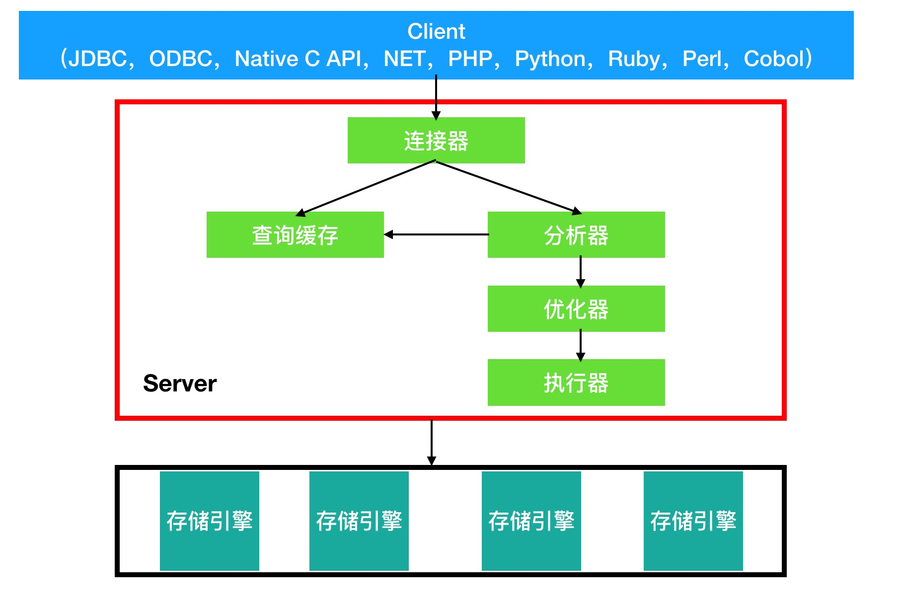

#week0 ARTS
## [Algorithm](algorithm/Algorithm.md)  Leetcode [3. Longest Substring Without Repeating Characters](https://leetcode.com/problems/longest-substring-without-repeating-characters/)
* 求字符串的最长子串，要求子串中没有重复的字符（不考虑中文）

#### 算法1——暴力法
1. 从start(初始为0)字符开始遍历整个字符串的字符——O(n)
2. 从end（初始值end=star+1）个字符开始遍历——O(n<sup>2</sup>)
3. 获取substr = str.substring(start,end) 
4. 遍历substr 查看第j个字符是否在substr中，如果以存在则跳出2的循环，
否则计算最大值len=max(len, substr.length + 1) ——O(n<sup>3</sup>)

* 算法时间复杂度： O(n<sup>3</sup>)
* 算法空间复杂度： O(n) 存储substr需要最大可能需要n个字符

#### 算法2 —— 窗口切片法
* 算法1时间复杂度太高，性能太低
* 用2个指针（start，end）指向字符所在的位置，可以考虑记录每个字符的出现的最后位置，
如果发现之前已经出现的字符，则可以将start指针调整到此位置+1即可。
不需要每次将start+1的方式遍历

1. 用一个map（HashMap）存储 字符-字符位置信息，如果是多线程环境则需要使用ConcurrentHashMap
2. start和end都指向str的第一个字符,即start,end=0
3. 从头到尾遍历str
4. 如果map中不存在，则将此字符put到map中，同时end++，并计算len=max(len,end - start + 1)
5. 如果map中存在，则start=max(start,map.get(此字符)) ，然后将此字符put到map中

* 时间复杂度 O(n) ,只遍历了一次str
* 空间复杂度 O(n)
#### 算法3 ——优化算法2
* 此题目不需要考虑中文，str的每个字符都是ascii码，ascii码总共包含256个字符，
其中可见字符128个，所以HashMap可以用一个int数组代替
* 时间复杂度 O(n),但是int数组比HashMap更轻量级，HashMap如果有Hash冲突，则查找时间会比int数组更长
* 空间复杂度 O(1),因为是一个常数128 （int[128]) 
* 算法2的空间复杂度实际也可以认为是常数，因为字符是有范围的
## Review
* 阅读文章 [Why should you learn Go?](https://medium.com/@kevalpatel2106/why-should-you-learn-go-f607681fad65)

    * 为什么要学习Golang？
    
    1. 硬件的发展已经进入了缓慢期，10年间cpu的主频变化不大
    2. 未来的趋势是增加CPU的核心数
    3. 基于以上两条，未来软件性能提升主要需要靠软件层面去实现, 并发编程是未来的趋势
    
    * Go的协程
        * 协程 vs 线程
            1. 协程比线程更轻量级，启动更快： 协程创建时只需要2K的栈内存，而Java的线程创建时需要大约1M的栈内存空间
            2. Java中的线程与操作系统的线程是1：1的关系，
             而Go的协程与操作系统的线程是M:N的关系，
             即一个协程可以在不同的线程中运行，一个系统线程可以运行多个协程
        * 协程的优势：
            1. 可增长的堆栈内存，只有在需要的时候才会分配更多的内存
            2. 比线程的启动速度更快
            3. 天生的安全通讯机制（使用channel通讯）
            4. 避免记录锁状态
            5. 与系统线程之间的关系是多对多的，方便调度
   * Go编译成二进制，直接在硬件上运行
        * Go的性能更好，因为它像C/C++一样直接编译成二进制，然后直接在硬件上运行
        * 而其他语言如Java、Python，需要经过虚拟机(如：JVM)解释执行
   * Go更易于维护
        * Go既让人类易写、易读、易懂、易维护，同时也让机器易懂易执行，执行效率更高
        * Go的语法更加简单，写出来的代码更加易读、易维护
        * Go移除了很多面向对象的特性
            * 没有类,只有结构体
            * 不支持继承
            * 没有构造器
            * 没有注解
            * 没有泛型
            * 没有异常
   * Go有Google做后盾 
   * 结论
        * 虽然Go和面向对象语言有很大的区别，但它依然是最好的。
        Go提供了像C/C++一样的高性能，像Java一样的更强的并发控制,像Python/Perl一样好玩的代码
        * 一个优秀的软件可以运行在更便宜和更慢的硬件上，并且同时提供更好的用户体验
## Tip
* 分享一个Go的协程调度
    * 名词解释
        * M 系统线程
        * P Go语言的协程处理器
        * G 协程
    * 每一个P对应一个待运行的协程队列
    * 当某个协程被系统中断，则P切换到另外的M进行下一个协程的执行
    * 当协程被唤醒后，协程随机加入到P中，或加入到全局等待队列中



## Share
#### MySQL架构，一条查询SQL的执行过程



* MySQL的整体架构由客户端（Client）、服务层（Server）和 存储引擎(Storage Engine)层组成
    * Client负责连接到Server，向Server层发起查询请求
    * Server负责校验权限、分析SQL语句并优化、调用Storage Engine的接口获取数据，封装后返回给Client
    * Storage Engine负责数据的组织和存储，对Server提供数据查询接口，提供事务、锁粒度控制等查询特性
* Server层分成如下几个模块：
    * 连接器：管理Client的连接，权限校验等
    * 查询缓存：已key-value的形式将查询数据缓存到内存中，如果命中则直接返回，key是查询语句，value是查询结果
    * 分析器：对sql语句做词法分析（识别关键词select等、识别表名、列名等）和语法分析（分析sql是否符合语法规则）
    * 优化器：对sql进行优化，决定使用哪个索引，多表关联时使用什么顺序进行关联
    * 执行器：校验用户对表的权限（如果命中缓存，则在返回之前校验权限），然后通过调用Storage Engine层的接口获取数据
* 存储引擎层：负责组织并存储数据到磁盘上，同时提供事务、锁等保障。存储引擎有很多种，且各有特点。常用的存储引擎如下：
    * InnoDB: 最常用的存储引擎。支持事务、行锁、外键。主要面向OLTP（在线事务处理）方面的应用
    * MyISAM: 是MySQL官方提供的存储引擎。不支持事务，支持表锁和全文索引，比较适合OALP（在线分析处理）业务。
    * Memory：内存存储引擎，将数据存储在内存中。重启后数据消失。
    * Archive：归档存储引擎，将数据压缩后存储
    * NDB: 集群存储引擎，提供集群能力

* 一条查询SQL的执行顺序：
1. Client端发起连接，请求Server建立连接
    ```mysql
    mysql -h $ip -P $port -u $user -p
    ```
2. 连接器收到请求后，校验用户名密码、获取权限，创建并维持连接。
    * 用户密码认证通过后，连接器会从权限表中读取用户权限。之后这个连接里的权限判断都将依赖于此时的权限。
    因此连接建立成功后，即便你用admin修改这个用户的权限也是不生效的，只有断开重新连接才会生效。
3. Client发起查询请求
4. Server接到请求后先去查询缓存中查看是否已存在，如果已经在缓存中则直接返回
5. 如果不在缓存中则由分析器接手，对SQL进行词法分析和语法分析
6. 然后优化器对SQL进行优化
7. 最后执行器通过调用存储引擎接口获取数据并返回客户端

* 注意连接的建立比较耗费资源，且费时，所以通常我们使用长连接，而非短连接
* 但是长连接过多可能导致OOM，MySQL进程被操作系统kill掉，异常重启。
    * 这是因为MySQL的执行过程中使用的临时内存是在连接对象中管理的，这些内存只有等连接断开时才会被释放
* 如何解决长连接太多导致的内存占用问题：
    * 定期断开连接，重连
    * MySQL5.7或以上版本，可以通过mysql_reset_connection 来重新初始化连接。
    此操作不需要重连，也不会重新做权限校验。
