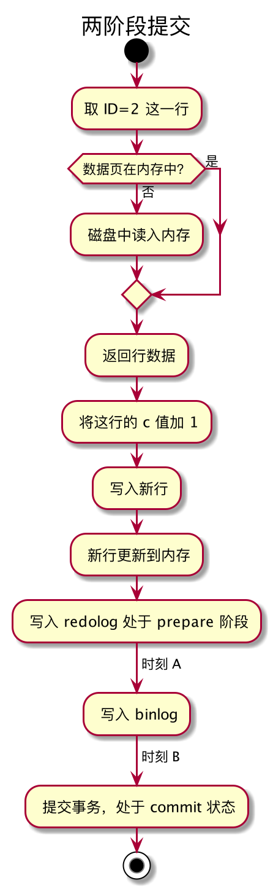

#week13

---

## Algorithm [1079. Letter Tile Possibilities](https://leetcode.com/problems/letter-tile-possibilities/)
### 1. 问题描述
字母瓷砖的可能性问题

你有一组瓷砖，每个瓷砖上印有一个字母。返回可以制作的非空字母序列的数量。

例子1：
* 输入："AAB"
* 输出：8
* 解释：可能的序列有 "A" "B" "AA" "AB" "BA" "AAB" "ABA" "BAA"

例子2：
* 输入："AAABBC"
* 输出：188

注意：
1. 1 <= tiles.length <= 7
2. tiles 由大写英文字母组成


### 2. 解题思路
dfs（深度优先搜素），参考[https://leetcode.com/problems/letter-tile-possibilities/discuss/308284/Concise-java-solution](https://leetcode.com/problems/letter-tile-possibilities/discuss/308284/Concise-java-solution)

由于 tiles 中只包含大写英文字母，所以可以设置一个长度为 26 的 int 型数组，其中每个元素存储的是对应字母出现的次数。

递归地遍历数组，记录次数。

1. 我们只需要计数，不需要记住每个字符串
2. 如果我们计算每个长度的字符串的个数，那我们必须要记住之前已经出现过的字符串
3. 所以我们使用递归。这样每次递归返回后，我们只需要再将减去的字母加回来就好了。

### 3. 代码
```go
func dfs(arr []int) int {
	sum := 0
	for i := 0; i < 26; i++ {
		if arr[i] == 0 {
			continue
		}
		arr[i]--
		sum = sum + 1 + dfs(arr)
		arr[i]++
	}
	return sum
}

func numTilePossibilities(tiles string) int {
	var arr []int = make([]int,26)
	for i := 0; i < len(tiles); i++ {
		arr[tiles[i] - 'A']++
	}
	return dfs(arr)
}
```

### 4. 复杂度分析
* 时间复杂度：O(n<sup>n</sup>), 其中n是字符串的长度。

最坏情况，假设字符串中每个字母各不相同，且长度为n。
* 计算长度为n的字符串的排列情况是 n*(n-1)*(n-2)...1 = n! , 需要递归的次数是 n!
* 计算长度为 n-1 的长度的字符串的排列情况 n*(n-1)...2
* 计算长度为 n-2 的长度的字符串的排列情况 n*(n-1)...3
* ...
* 计算长度为 1 的长度的字符串的排列情况 n

综上，计算所有可能需要遍历的次数是 n<sup>n</sup> 数量级的

* 空间复杂度： O(1) 只需要一个长度为 26 的 int 型数组

---

## Review []()

---

## Tip

### 

---
    
## Share
### 15 答疑文章（一）：日志和索引相关问题 —— 极客时间 MySQL实战45讲
### 日志相关问题
#### 问题1: 两阶段提交的不同瞬间，MySQL 如果发生异常重启，是怎么保证数据完整性的？


```sql
update T set c=c+1 where ID=2;
```
上图是该语句的执行步骤

这里的 commit 并非 MySQL 语法中的 commit 语句，而是 commit 步骤，是指事务提交过程中的一个小步骤，也是最后一步，
当这个步骤执行完成后，这个事务就提交完成了。

commit 语句执行的时候，会包含 commit 步骤。

在两阶段提交的不同时刻，MySQL异常重启会出现什么现象。


