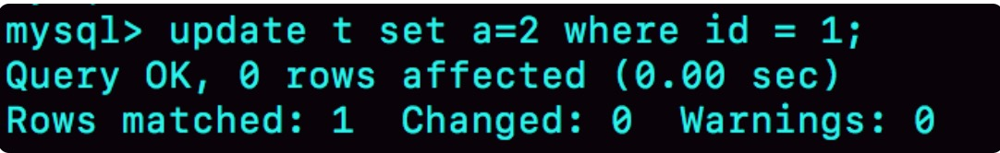
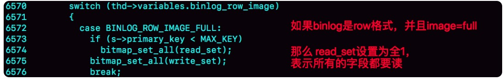

#week13

---

## Algorithm [1079. Letter Tile Possibilities](https://leetcode.com/problems/letter-tile-possibilities/)
### 1. 问题描述
字母瓷砖的可能性问题

你有一组瓷砖，每个瓷砖上印有一个字母。返回可以制作的非空字母序列的数量。

例子1：
* 输入："AAB"
* 输出：8
* 解释：可能的序列有 "A" "B" "AA" "AB" "BA" "AAB" "ABA" "BAA"

例子2：
* 输入："AAABBC"
* 输出：188

注意：
1. 1 <= tiles.length <= 7
2. tiles 由大写英文字母组成


### 2. 解题思路
dfs（深度优先搜素），参考[https://leetcode.com/problems/letter-tile-possibilities/discuss/308284/Concise-java-solution](https://leetcode.com/problems/letter-tile-possibilities/discuss/308284/Concise-java-solution)

由于 tiles 中只包含大写英文字母，所以可以设置一个长度为 26 的 int 型数组，其中每个元素存储的是对应字母出现的次数。

递归地遍历数组，记录次数。

1. 我们只需要计数，不需要记住每个字符串
2. 如果我们计算每个长度的字符串的个数，那我们必须要记住之前已经出现过的字符串
3. 所以我们使用递归。这样每次递归返回后，我们只需要再将减去的字母加回来就好了。

### 3. 代码
```go
func dfs(arr []int) int {
	sum := 0
	for i := 0; i < 26; i++ {
		if arr[i] == 0 {
			continue
		}
		arr[i]--
		sum = sum + 1 + dfs(arr)
		arr[i]++
	}
	return sum
}

func numTilePossibilities(tiles string) int {
	var arr []int = make([]int,26)
	for i := 0; i < len(tiles); i++ {
		arr[tiles[i] - 'A']++
	}
	return dfs(arr)
}
```

### 4. 复杂度分析
* 时间复杂度：O(n<sup>n</sup>), 其中n是字符串的长度。

最坏情况，假设字符串中每个字母各不相同，且长度为n。
* 计算长度为n的字符串的排列情况是 n*(n-1)*(n-2)...1 = n! , 需要递归的次数是 n!
* 计算长度为 n-1 的长度的字符串的排列情况 n*(n-1)...2
* 计算长度为 n-2 的长度的字符串的排列情况 n*(n-1)...3
* ...
* 计算长度为 1 的长度的字符串的排列情况 n

综上，计算所有可能需要遍历的次数是 n<sup>n</sup> 数量级的

* 空间复杂度： O(1) 只需要一个长度为 26 的 int 型数组

---

## Review []()

---

## Tip

### 

---
    
## Share
### 15 答疑文章（一）：日志和索引相关问题 —— 极客时间 MySQL实战45讲
### 日志相关问题
#### 问题1: 两阶段提交的不同瞬间，MySQL 如果发生异常重启，是怎么保证数据完整性的？


```sql
update T set c=c+1 where ID=2;
```
上图是该语句的执行步骤

这里的 commit 并非 MySQL 语法中的 commit 语句，而是 commit 步骤，是指事务提交过程中的一个小步骤，也是最后一步，
当这个步骤执行完成后，这个事务就提交完成了。

commit 语句执行的时候，会包含 commit 步骤。

在两阶段提交的不同时刻，MySQL异常重启会出现什么现象。

* 如果在时刻 A 崩溃

也就是在 redo log 处于 prepare 阶段之后，写入 binlog 之前的时间点。

此时 binlog 还没有写，redo log 还没有提交，所以崩溃恢复的时候这个事务会回滚。这时候 binlog 还没写，所以不会传到备库。

* 在时刻 B 崩溃

也就是 binlog 写完了， redo log 还没有 commit 前的时间点。

崩溃恢复时的判断规则：
1. 如果 redo log 里的事务是完整的，也就是已经有了 commit 标识，则直接提交
2. 如果 redo log 里面的事务只有完整的 prepare，则判断对应的事务 binlog 是否存在并完整：
    * a. 如果是，则提交事务
    * b. 否则，回滚事务

时刻 B 对应的是 2.a 的情况，所以崩溃恢复过程中事务会被提交。

#### 追问1： MySQL 怎么知道 binlog 是完整的
回答：一个事务的 binlog 是有完整格式的
* statement 格式的 binlog，最后会有 COMMIT
* row 格式的 binlog，最后会有一个 XID event

在 MySQL 5.6.2 版本之后，引入了 binlog-checksum 参数，用来验证 binlog 的内容的正确性。
对于 binlog 日志由于磁盘的原因，可能会在日志中间出错，MySQL 可以通过校验 checksum 的结果来发现。

#### 追问2：redo log 和 binlog 是怎么关联起来的
回答：它们有一个共同的数据字段，叫 XID。崩溃恢复的时候，会按顺序扫描 redo log
* 如果碰到既有  prepare，又有 commit 的 redo log，就直接提交
* 如果碰到只有 prepare，而没有 commit 的 redo log， 就拿着 XID 去 binlog 找对应的事务
#### 追问3： 处于 prepare 阶段的 redo log 加上完整的 binlog， 重启就能恢复， MySQL 为什么要这么设计
回答：这个主要与数据和备份的一致性有关。在时刻 B，也就是 binlog 写完以后 MySQL 发生崩溃，这时 binlog 已经写入了，之后就会被从库
（或者用 binlog 恢复出来的库）使用。所以，在主库上也要提交这个事务，采用这个策略，主库和备库的数据就保证了一致性。
#### 追问4：如果这样的话，为什么还要两阶段提交呢？干脆先 redo log 写完，再写 binlog。崩溃恢复的时候，必须得两个日志完整才可以。是不是一样的逻辑？
回答:两阶段提交是经典的分布式系统问题，并不是 MySQL 独有的。

事务的持久性问题，是说明这么做必要性的一个很好的例子。

对于 InnoDB 引擎来说，如果 redo log 提交完成了，事务就不能回滚（如果这还允许回滚，就可能覆盖掉别的事务的更新）。
而如果 redo log 直接提交，然后 binlog 写入的时候失败，InnoDB 又回滚不了，数据和 binlog 日志又不一致了。

两阶段提交就是为了给所有人一个机会，当每个人都说"我 ok"的时候，再一起提交。
#### 追问5： 不引入两个日志，也就没有两阶段提交的必要了。只用 binlog 来支持崩溃恢复，又能支持归档，不就可以了？
回答：只保留 binlog，然后把提交流程改成：…… -> "数据更新到内存" -> "写 binlog" -> "提交事务"， 是不是也能提供崩溃恢复能力？

不可以。

历史原因：InnoDB 并不是 MySQL 原生的存储引擎。 MySQL 原生的存储引擎是 MyISAM，设计之初就没有支持崩溃恢复。

InnoDB 在加入 MySQL 之前就已经支持崩溃恢复了。

InnoDB 加入 MySQL 之后，既然 binlog 没有崩溃恢复能力，那就用 InnoDB 原有的 redo log 好了。

实现原因：只用 binlog 不能支持崩溃恢复。因为 binlog 没有能力恢复"数据页"。

如果优化一下 binlog 的内容，让它来记录数据页的更改，那其实就是又做了一个 redo log 出来。

#### 追问6：那能不能反过来，只用 redo log，不用 binlog
回答：如果只从崩溃恢复的角度来讲是可以的。关掉binlog，这样就没有两阶段提交了，但是依然是 cash-safe 的。

但是 binlog 有 redo log 无法替代的功能：
* 归档：redo log 是循环写的，所以无法保留历史，也就不能归档。
* MySQL 系统依赖于 binlog：MySQL 系统高可用的基础，就是 binlog 复制。
* 还有很多公司有异构系统（比如一些数据分析系统），这些系统靠消费 MySQL 的 binlog 来更新自己的数据。

#### 追问7：redo log 一般设置多大？
回答： 设置太小，就会被很快写满，这样 WAL 机制的能力就发挥不出来。

所以，如果在常见的几个 TB 的磁盘上，将 redo log 设置为 4 个文件、每个文件 1GB

#### 追问8：正常运行中的实例，数据写入后的最终落盘，是从 redo log 更新过来的还是从 buffer pool 更新过来的呢？
回答：此问题涉及到了 redo log 里面到底是什么

redo log 并没有记录数据页的完整数据，所以它并没有能力自己去更新磁盘数据页：
1. 如果正常运行的实例的话，数据页被修改以后，跟磁盘的数据页不一致，称为脏页。最终数据落盘，就是把内存中的数据页写盘。这个过程与 redo log 无关。
2. 在崩溃场景中，InnoDB 如果判断到一个数据页可能在崩溃恢复的时候丢失了更新，就会将它读到内存，然后让 redo log 更新内存内容。更新完成后，
内存页变成脏页，就回到了第一种状况了。

#### 追问9： redo log buffer 是什么？是先修改内存，还是先写 redo log 文件？
回答：在一个事务的过程中，日志要写多次。比如
```sql
begin;
insert into t1 ...
insert into t2 ...
commit;
```
这个事务要往两个表中插入记录，插入数据的过程中，生成的日志都得先保存起来，但又不能在还没有 commit 的时候就直接写到 redo log 文件里。

所以，redo log buffer 是一块内存，用来先存 redo 日志的。在执行第一条 insert 的时候，数据的内存被修改了，redo log buffer 也写入了。

但是，是在执行 commit 语句的时候，才真正把日志写到 redo log 文件（文件名：ib_logfile+数字）。

这里说的是事务执行过程中不会"主动去刷盘"，以减少不必要的 IO 消耗。但是可能会出现"被动写入磁盘"，比如内存不够、其他事务提交的情况。

### 业务设计问题
#### 问题
业务上有这样的需求，A、B 两个用户，如果互相关注，则成为好友。设计上是有两张表，一个是 like 表，一个是 friend 表，like 表有 
user_id、like_id 两个字段，我设置为复合唯一索引，即 uk_user_id_like_id。语句执行逻辑如下：

以 A 关注 B 为例：
第一步，先查询对方有没有关注自己（B 有没有关注 A):
```sql
select * from like where user_id = B and liker_id = A;
```
如果有，则成为好友
```sql
insert into friend;
```
没有，则只单向关注关系
```sql
insert into like;
```
但是如果 A、B 同时关注对方，会出现不会成为好友的情况。因为上面第一步，双方都没有关注对方。第一步即使使用了排他锁也不行，因为记录不存在，
行锁无法生效。请问这种情况，在 MySQL 锁层面有没有办法处理？

#### 回答
建表
```sql
CREATE TABLE `like` (
  `id` int(11) NOT NULL AUTO_INCREMENT,
  `user_id` int(11) NOT NULL,
  `liker_id` int(11) NOT NULL,
  PRIMARY KEY (`id`),
  UNIQUE KEY `uk_user_id_liker_id` (`user_id`,`liker_id`)
) ENGINE=InnoDB;

CREATE TABLE `friend` (
  id` int(11) NOT NULL AUTO_INCREMENT,
  `friend_1_id` int(11) NOT NULL,
  `firned_2_id` int(11) NOT NULL,
  UNIQUE KEY `uk_friend` (`friend_1_id`,`firned_2_id`)
  PRIMARY KEY (`id`)
) ENGINE=InnoDB;
```
在并发场景下，同时有两个人，设置为关注对方，就可能导致无法成功加为朋友关系。

时刻顺序表如下：

| session1(操作逻辑：A 喜欢 B)|session2(操作逻辑：B 喜欢 A)|
| --- | --- |
| begin;| |
| select * from \`like\` where user_id = B and liker_id = A;（返回空）| |
| | begin;|
| | select * from \`like\` where user_id = A and liker_id = B; （返回空)|
| | insert into \`like\` (user_id, liker_id) values(B,A);|
|insert into \`like\`(user_id,liker_id) values(A,B);| |
| commit;| |
| | commit;|
由于一开始 A 和 B 之间没有关注关系，所以两个事务里的 select 语句查出来都是空。

解决此问题的办法：

给 like 表加一个字段 relation_ship, 并设为整型，取值 1、2、3
* 1 表示 user_id 关注了 liker_id
* 2 表示 liker_id 关注了 user_id
* 3 表示互相关注

当 A 关注 B 的时候：

应用在代码中比较 A 和 B 的大小，如果 A < B 则执行
```sql
mysql> begin; /* 启动事务 */
insert into `like`(user_id, liker_id, relation_ship) values(A, B, 1) on duplicate key update relation_ship=relation_ship | 1;
select relation_ship from `like` where user_id=A and liker_id=B;
/* 代码中判断返回的 relation_ship，
  如果是 1，事务结束，执行 commit
  如果是 3，则执行下面这两个语句：
  */
insert ignore into friend(friend_1_id, friend_2_id) values(A,B);
commit;
```
如果 A > B， 则执行
```sql
mysql> begin; /* 启动事务 */
insert into `like`(user_id, liker_id, relation_ship) values(B, A, 2) on duplicate key update relation_ship=relation_ship | 2;
select relation_ship from `like` where user_id=B and liker_id=A;
/* 代码中判断返回的 relation_ship，
  如果是 2，事务结束，执行 commit
  如果是 3，则执行下面这两个语句：
*/
insert ignore into friend(friend_1_id, friend_2_id) values(B,A);
commit;
```

这个设计中，like 表中数据保证了 user_id < liker_id,这样无论 A 关注 B，还是 B 关注 A，在操作 like 表时，如果反向关系已存在，就会出现行锁冲突。

然后，insert ... on duplicate 语句，确保了在事务内部，执行这个 SQL 语句后，就强行占住了这个行锁，之后的 select 判断 relation_ship 
这个逻辑时就确保了是在行锁的保护下的读操作。

操作符"|"是按位或，连同最后一句 insert 语句里的 ignore，是为了保证重复调用时的幂等性。

这样，即使在双方同时执行关注操作，最终数据库里的结果，也是 like 表里面有一条关于 A 和 B 的记录，而且 relation_ship 的值是 3， 并且 
friend 表里也有了 A 和 B 的记录。

### 思考题
创建一个表 t ，并插入一行，然后对这一行进行修改
```sql
mysql> CREATE TABLE `t` (
`id` int(11) NOT NULL primary key auto_increment,
`a` int(11) DEFAULT NULL
) ENGINE=InnoDB;
insert into t values(1,2);
``` 
这时候，表 t 中有唯一一条数据 (1,2)。 假设，我现在执行：
```sql
mysql> update t set a=2 where id=1;
```
执行结果


结果显示，匹配（rows matched）了一行，修改（Changed）了 0 行。

仅从现象上看，MySQL 内部在处理这个命令的时候，可以有以下三种选择：
1. 更新都是先读后写的，MySQL 读出数据，发现 a 的值本来就是 2， 不更新，直接返回，执行结束
2. MySQL 调用了 InnoDB 引擎提供的"修改为(1,2)"这个接口，但是引擎发现值与原来的相同，不更新，直接返回
3. InnoDB 认证执行了"把这个值修改成（1，2）"这个操作，该加锁的加锁，该更新的更新。

回答：

* 1 可以用锁的实验来验证

|session A|session B|
| --- | --- |
| begin; | |
| update t set a=2 where id=1;| |
| | update t set a=2 where id=1;(blocked)|

session B 的 update 语句被 blocked 了，加锁这个动作是 InnoDB 才能做的，所以排除选项1

* 2 用可见性实验来验证

| session A|session B|
| --- | --- |
| begin; | |
| select * from t where id=1;<br> /* 返回（1，2）*/ | |
| | update t set a=3 where id=1;|
| update t set a=3 where id=1;<br><br> Query OK, 0 row affected(0.00 sec)<br> Rows matched: 1 Changed:0 Warnings:0| |
| select * from t where id=1; <br> /* 返回（1，3）*/| |
session A 的第二个 select 语句是一致性读（快照读),它是不能看见 session B 的更新的。

现在它返回（1，3），表示它看见了某个新的版本，这个版本只能是 session A 自己的 update 语句做更新的时候生成的。

所以答案应该是 3，即：InnoDB 认真执行了"把这个值修改成（1，2）"这个操作，该加锁的加锁，该更新的更新。

MySQL 在更新前如果判断一下值是不是相同，那就不用浪费 InnoDB 的操作了，那 MySQL 为什么判断？

其实 MySQL 是判断了，只是在这个语句里，MySQL 认为读出来的值，只有一个确定的（id=1），而要写入的是（a=3),只从这两个信息是看不出来"不需要修改"的。

作为验证，可以看下面这个例子：

| session A|session B|
| --- | --- |
| begin; | |
| select * from t where id=1;<br> /* 返回（1，2）*/ | |
| | update t set a=3 where id=1;|
| update t set a=3 where id=1 and a=3;<br><br> Query OK, 0 row affected(0.00 sec)<br> Rows matched: 1 Changed:0 Warnings:0| |
| select * from t where id=1; <br> /* 返回（1，2）*/| |

#### 补充说明
以上验证都是在 binlog_format=statement 格式下进行的

如果 binlog_format=row 并且 binlog_row_image=FULL 的时候，由于 MySQL 需要在 binlog 里面记录所有的字段，所以在读数据的时候就会把所有的数据都读出来。

根据上面的规则，"既然读了数据就会判断"，因此在这个时候， select * from t where id=1,结果就是返回（1，2）

同理，如果 binlog_row_image=NOBLOB,会读出除 blob 外的所有字段，在我们这个例子里，结果还是返回（1，2）

对应代码，如下，这是 MySQL 5.6 版本引入的

