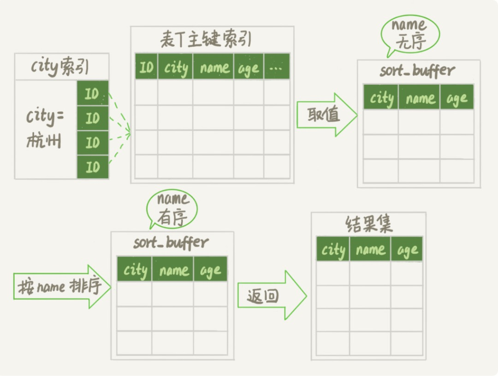
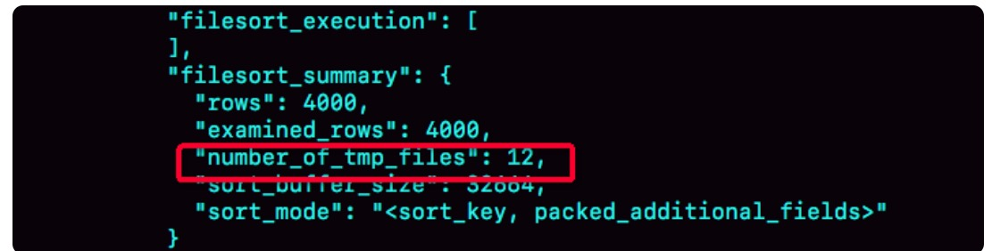
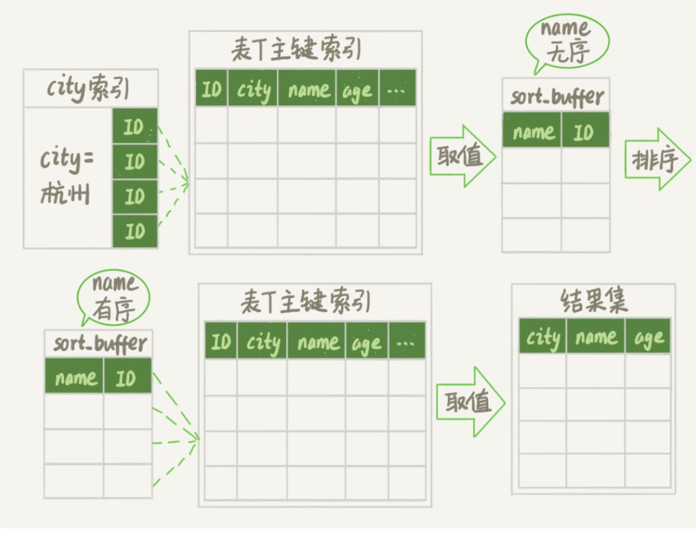
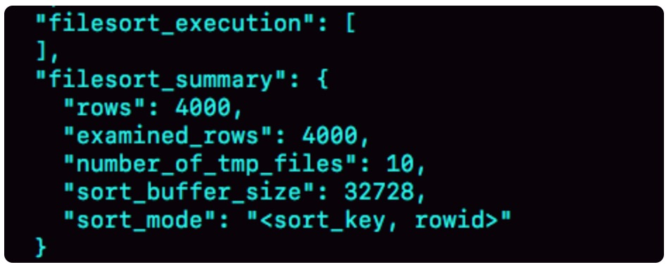
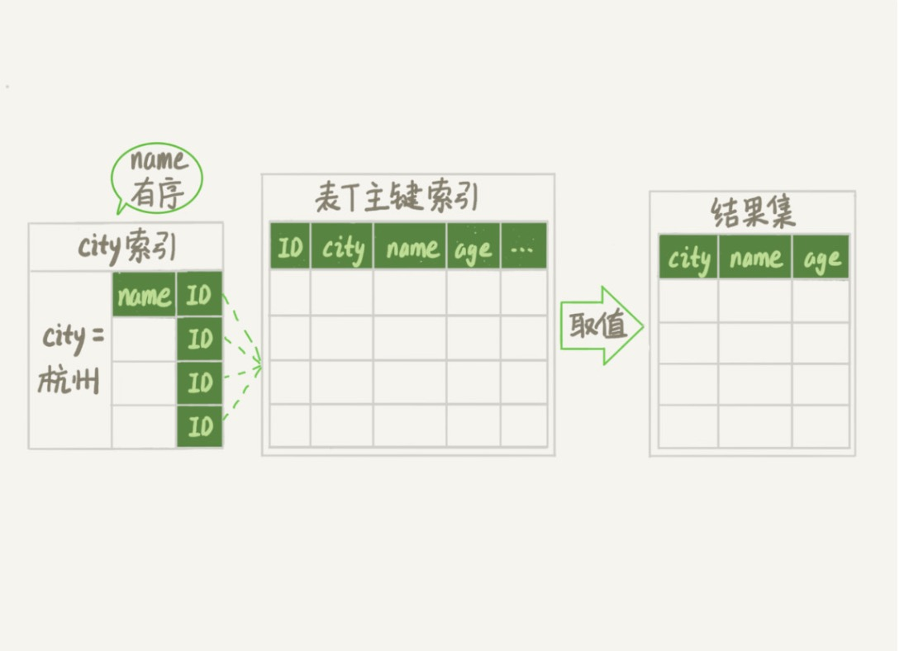
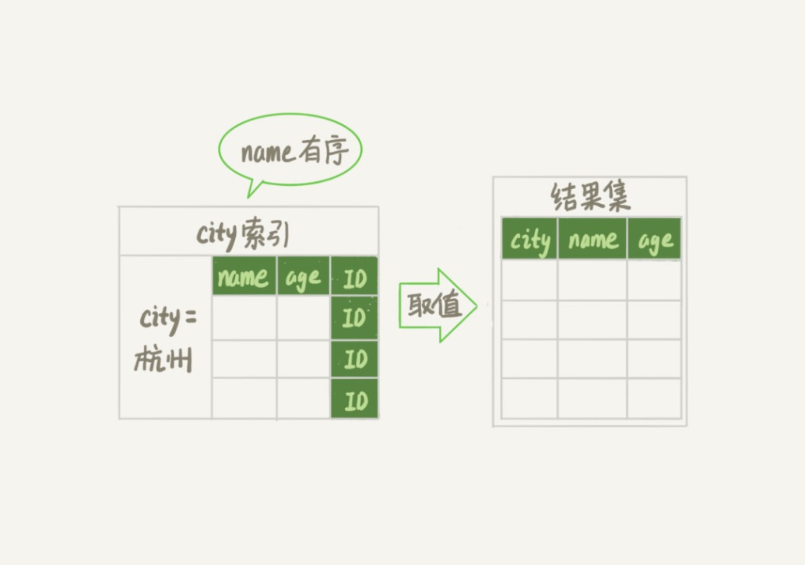

#week14

---

## Algorithm [961. N-Repeated Element in Size 2N Array](https://leetcode.com/problems/n-repeated-element-in-size-2n-array/)
### 1. 问题描述
在长度为 2N 的数组中，找出重复 N 次的元素

给定一个数组 A 长度为 2N，其中包含 N + 1 个非重复元素，其中有且仅有一个元素重复了 N 次。

找到这个重复了 N 次的元素。

示例1：
* 输入：[1,2,3,3]
* 输出：3

示例2：
* 输入：[2,1,2,5,3,2]
* 输出：2

示例3：
* 输入：[5,1,5,2,5,3,5,4]
* 输出：5
### 2. 解题思路
####算法1：计数法
1. 从头开始遍历数组
2. 用一个 hashmap 记录下所有出现过的元素
3. 遍历的时候在 hashmap 中查找该元素是否在 hashmap中
    * 如果在 hashmap 中，则该元素就是要找的那个元素
####算法2：比较法
* 将原数组分成长度为 4 的子数组，则至少在其中一个子数组中包含 2 个要找的元素。

证明：
1. 将原数组分成长度为 2 的子数组，共可以分成 N 个 2 元组
2. 有以下2种情况：
* (1) 每个 2 元组中都包含都包含且只包含一个要找的元素，那么组成 4 元组后，则每个 4 元组中都有 2 个要找的元素
* (2) 有一个 2 元组中不包含要找的元素，那么至少有另一个 2 元组中全是要找的元素（因为要找的元素有 N 个），那么组成 4 元组后，至少有一个 4 元组中包含了 2 个要找的元素

因此可以：
1. 遍历数组
2. 比较当前元素与其前边相邻的 3 个元素中是否有相同的，如果有则返回
### 3. 代码
#### 算法1： 计数法
```go
func repeatedNTimes(A []int) int {
	dict := make([]int, 10000)
	for i := 0; i < len(A); i++ {
		if dict[A[i]] == 0 {
			dict[A[i]] = 1
		} else {
			return A[i]
		}
	}
	return -1
}
```
#### 算法2：比较法
```go
func repeatedNTimes2(A []int) int {
	a := -1
	b := -1
	c := -1
	for i := 0; i < len(A); i++ {
		if A[i] == a {
			return a
		}
		if A[i] == b {
			return b
		}
		if A[i] == c {
			return c
		}
		a = b
		b = c
		c = A[i]
	}
	return -1
}
```
### 4. 复杂度分析
#### 算法1：计数法
* 时间复杂度： O(N)
* 空间复杂度： O(N)
#### 算法2：比较法
* 时间复杂度：O(N)
* 空间复杂度：O(1)

---

## Review []()

---

## Tip

### 

---
    
## Share
### 16 “order by”是怎么工作的？ —— 极客时间 MySQL实战45讲
表定义：
```sql
CREATE TABLE `t` (
  `id` int(11) NOT NULL,
  `city` varchar(16) NOT NULL,
  `name` varchar(16) NOT NULL,
  `age` int(11) NOT NULL,
  `addr` varchar(128) DEFAULT NULL,
  PRIMARY KEY (`id`),
  KEY `city` (`city`)
) ENGINE=InnoDB;
```
查询语句
```sql
select city,name,age from t where city='杭州' order by name limit 1000;
```
#### 全字段排序
为了避免全表扫描，需要在 city 字段上建立索引。

用 explain 命令查看，Extra 字段中的 "Using filesort" 表示需要排序，MySQL 会给每个线程分配一块内存用于排序，称为 "sort_buffer"

查询语句的执行流程：
1. 初始化 sort_buffer, 确定放入 name、city、age 这三个字段
2. 从索引 city 找到第一个满足 city='杭州' 条件的主键 id
3. 到主键 id 索引取出整行，取 name、city、age 三个字段的值，存入 sort_buffer 中
4. 从索引 city 取下一个记录的主键 id
5. 重复步骤 3、4 直到 city 的值不满足查询条件为止
6. 对 sort_buffer 中的数据按照字段 name 做快速排序
7. 按照排序结果取前 1000 行返回给客户端

将此过程称为全字段排序


排序的过程是在内存中完成还是需要使用外部排序，取决于所需的内存大小和参数 sort_buffer_size

sort_buffer_size 就是 MySQL 开辟的 sort_buffer 的大小。

如果要排序的数据量小于 sort_buffer_size ,则排序在内存中完成，否则需要使用磁盘临时文件

可以使用如下方法确认是否使用了临时文件
```sql
/* 打开 optimizer_trace，只对本线程有效 */
SET optimizer_trace='enabled=on'; 

/* @a 保存 Innodb_rows_read 的初始值 */
select VARIABLE_VALUE into @a from  performance_schema.session_status where variable_name = 'Innodb_rows_read';

/* 执行语句 */
select city, name,age from t where city='杭州' order by name limit 1000; 

/* 查看 OPTIMIZER_TRACE 输出 */
SELECT * FROM `information_schema`.`OPTIMIZER_TRACE`\G

/* @b 保存 Innodb_rows_read 的当前值 */
select VARIABLE_VALUE into @b from performance_schema.session_status where variable_name = 'Innodb_rows_read';

/* 计算 Innodb_rows_read 差值 */
select @b-@a;
```
查询结果:

此方法可以通过查看 OPTIMIZER_TRACE 的结果来确认：
* number_of_tmp_file 表示排序时用了多少个临时文件。外部排序使用的是归并排序法。
* examined_rows : 4000 表示参与排序的行数是 4000 行
* sort_mode : <sort_key, packed_additional_fields> 其中 packed_additional_fields 表示排序时对字符串做了紧凑处理。
即使 name 字段的定义是 varchar(16), 在排序时按照实际长度来分配空间

另外 执行以上查询是使用的参数 internal_tmp_disk_storage_engine=MyISAM ，所以返回的 @b - @a = 4000 ，否则会返回 4001.
因为 internal_tmp_disk_storage_engine 默认值是 InnoDB，而查询 OPTIMIZER_TRACE 这个表时，需要用到临时表，把数据从临时表取出来的时候会让 innodb_rows_read 的值加 1

#### rowid 排序
如果 MySQL 认为排序的单行长度太大就会改变排序算法，当单行长度超过 max_length_for_sort_data 时就会换一种算法
```sql
SET max_length_for_sort_data = 16;
```
新算法放入 sort_buffer 的字段，只有排序的列（name 字段）和主键 id

执行流程如下：
1. 初始化 sort_buffer, 确定放入两个字段，即 name 和 id
2. 从索引 city 找到第一个满足 city='杭州'条件的主键 id
3. 到主键 id 索引取出整行，取 name、id 这两个字段，存入 sort_buffer 中
4. 从索引 city 取下一个记录的主键 id
5. 重复步骤 3、4 直到不满足 city='杭州' 条件为止
6. 对 sort_buffer 中的数据按照字段 name 进行排序
7. 遍历排序结果，取前 1000 行，并按照 id 的值回到原表中取出 city、name 和 age 三个字段，返回给客户端

我们称其为 rowid 排序

OPTIMIZER_TRACE 结果

* examined_rows : 4000  表示排序的数据是 4000 行
* select @b - @a : 5000 因为排序之后还要去原表中取出 1000 条数据，所以会多出来 1000 条
* sort_mode: <sort_key, rowid> 表示参与排序的只有 name 和 id
* number_of_tmp_files : 10 因为参与排序的行数仍然是 4000 行，但是每一行都变小了，因此需要排序的总数据量就变小了，需要的临时文件数量就少了

#### 全字段排序 VS rowid 排序
* MySQL 的设计原则之一：<b>如果内存够，就要多利用内存，尽量减少磁盘的访问</b>

如果想让 MySQL 执行 order by 时不需要做排序操作，则可以给排序字段建立索引
```sql
alter table t add index city_user(city, name);
```
执行流程如下：
1. 从索引(city,name)找到第一个满足 city='杭州' 条件的主键 id
2. 到主键 id 索引取出整行，取 name、city、age 三个字段的值，作为结果集的一部分直接返回
3. 从索引(city,name) 取下一个记录的主键 id
4. 重复步骤 2、3 直到查到第 1000 条记录，或者是不满足 city='杭州' 条件时循环结束



explain 结果中不包含 Using filesort 了

可以进一步优化查询 —— 建立覆盖索引
```sql
alter table t add index city_user_age(city, name, age);
```

执行流程如下：
1. 从索引 (city,name,age) 找到第一个满足 city='杭州' 条件的记录，取出其中的 city、name 和 age 这三个字段的值，作为结果集的一部分直接返回
2. 从索引 (city,name,age) 取下一个记录，同样取出这三个字段的值，作为结果集的一部分直接返回
3. 重复步骤 2，直到查到第 1000 条记录，或者是不满足 city='杭州' 条件时循环结束


explain 中 Extra 字段中多了 "Using index"，表示使用了覆盖索引，性能上会快很多。

但是并不是每个查询都要建立覆盖索引，因为索引是有维护代价的，这是需要权衡的。

#### 思考题
假设表中已经存在了联合索引 city_name(city,name),然后需要查询杭州和苏州两个城市中所有的市民的姓名，并且按照名字排序，显示前 100 条。
如果查询语句如下：
```sql
mysql> select * from t where city in ('杭州'," 苏州 ") order by name limit 100;
```
这个语句执行的时候会有排序过程吗？为什么？

如果需要实现一个在数据库端不需要排序的方案，业务端代码该怎么写？

进一步，如果有分页需求，需要显示 101 页，也就是要改成 limit 10000,100 , 怎么实现？


 


