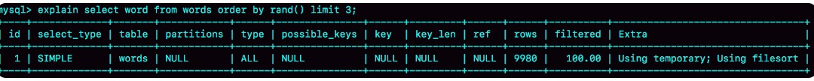
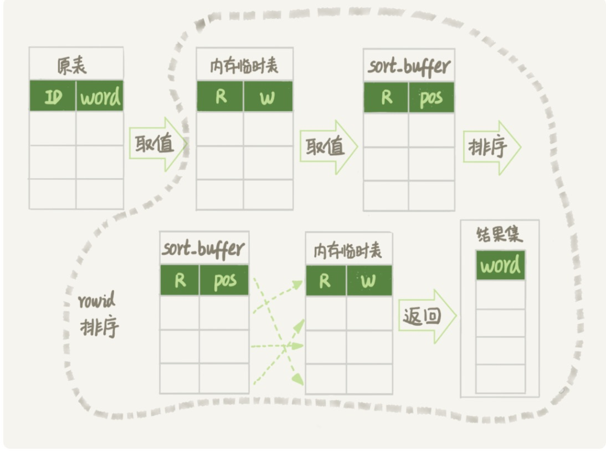
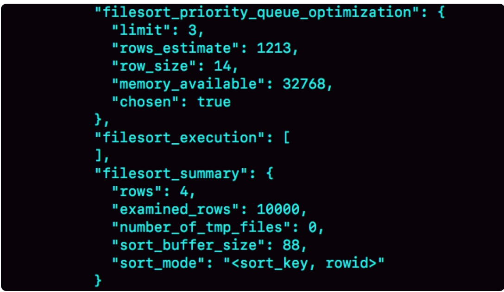

# week15

---

## Algorithm [950. Reveal Cards In Increasing Order](https://leetcode.com/problems/reveal-cards-in-increasing-order/)
### 1. 问题描述
升序显示卡片

最初，所有的卡片都是背面朝上

重复以下步骤，直至所有卡片都翻开
1. 从牌堆中翻开最上边的一张卡片，并将其从牌堆中移走
2. 如果牌堆中仍然有牌，把当前的第一张卡片放到牌堆底部
3. 如果仍然有未翻开的牌，则重复第 1 步；否则，停止。

返回可以以升序显示卡片的卡片顺序数组

答案中的第一张卡片被认为在牌堆的顶部

示例：
* 输入： [17, 13, 11, 2, 3, 5, 7]
* 输出： [2, 13, 3, 11, 5, 17, 7]
* 解释： 我们拿到牌堆的顺序是 [17,13,11,2,3,5,7] （这个顺序不重要），然后对其重排序。
重排序之后为 [2,13,3,11,5,17,7] (题目就是要求要找到这个重排序后的顺序数组)， 2 在牌堆顶
1. 翻开 2，将 13 放到 牌堆底部，牌堆为 [3,11,5,17,7,13]
2. 翻开 3，将 11 放到底部, 牌堆为 [5,17,7,13,11]
3. 翻开 5，将 17 放到底部，牌堆为 [7,13,11,17]
4. 翻开 7，将 13 放到底部，牌堆为 [11,17,13]
5. 翻开 11，将 17 放到底部，牌堆为 [13,17]
6. 翻开 13，将 17 放到底部，牌堆为 [17]
7. 翻开 17，牌堆已无牌，结束

翻开的顺序是升序数组, [2,3,5,7,11,13,17]

### 2. 解题思路
可以反过来看问题，将数组排序，然后由大到小依次加入牌堆

给定一个有序数组，从大到小排列

1. 将最大的数从数组中拿出，放到牌堆中
2. 如果牌堆中有牌，则将最底下的牌放到最上边，然后将新加入的牌放到牌堆的最上边
3. 如果数组中仍然有牌，则重复第 1 步，否则结束

验证: 给定数组 [17,13,11,7,5,3,2]
1. 将 17 放入牌堆，数组为 [13,11,7,5,3,2], 牌堆为 [17]
2. 将 13 放入牌堆，数组为 [11,7,5,3,2], 将最底下的牌放到最上边 [17],将新加入的牌放到最上边[13,17]
3. 将 11 放入牌堆，数组为 [7,5,3,2], 将最底下的牌放到最上边 [17,13],将新加入的牌放到最上边[11,17,13]
4. 将 7 放入牌堆，数组为 [5,3,2], 将最底下的牌放到最上边 [13,11,17],将新加入的牌放到最上边[7,13,11,17]
5. 将 5 放入牌堆，数组为 [3,2], 将最底下的牌放到最上边 [17,7,13,11],将新加入的牌放到最上边[5,17,7,13,11]
6. 将 3 放入牌堆，数组为 [2], 将最底下的牌放到最上边 [11,5,17,7,13],将新加入的牌放到最上边[3,11,5,17,7,13]
7. 将 2 放入牌堆，数组为 [], 将最底下的牌放到最上边 [13,3,11,5,17,7],将新加入的牌放到最上边[2,13,3,11,5,17,7]

最终获取答案顺序数组为 [2,13,3,11,5,17,7]

### 3. 代码
```go
func deckRevealedIncreasing(deck []int) []int {
	N := len(deck)
	if N < 2 {
		return deck
	}
	sort.Ints(deck)
	res := []int{deck[N - 1]}
	for i := N - 2; i >= 0; i-- {
		tmp := res[len(res) - 1]
		res = res[:len(res) - 1]
		res = append([]int{deck[i], tmp}, res...)
	}
	return res
}
```
### 4. 复杂度分析
* 时间复杂度：O(NlogN) 排序时间
* 空间复杂度：O(N)

---

## Review [The Secret to Being a Top Developer Is Building Things! Here’s a List of Fun Apps to Build!](https://medium.com/better-programming/the-secret-to-being-a-top-developer-is-building-things-heres-a-list-of-fun-apps-to-build-aac61ac0736c)
成为顶级开发者的秘诀就是建立事物！这是一个有趣的应用程序列表！

你不可能通过阅读大量的健身书籍，就能拥有一个好的身材。你需要去锻炼。写代码也是一个道理。以下是 8 个很棒的项目，可以训练你的代码肌肉。

### 项目 1. Trello Clone
* 路径规划
* 拖放
* 创建新的对象（看板，列表，卡片）
* 处理输入和验证
* 客户端路径：如何使用本地存储，将数据保存到本地存储，以及从本地存储读取数据。
* 服务器端路径：如何使用数据库，将数据保存到数据库以及从数据库中读取数据。

[这是一个例子](https://github.com/indreklasn/simple-trello)
### 项目 2. User Admin Dashboard
简单的 CRUD 应用，非常适合基础知识。你可以学到：
* 创建并管理用户
* 与数据库交互——创建、读取、编辑、删除用户
* 输入验证以及如何使用表单

[Github 地址](https://github.com/wesharehoodies/laravel-5.4-crud-example)
### 项目 3. Cryptocurrency Tracker (Native Mobile App)
[项目地址](https://github.com/wesharehoodies/react-native-redux-crypto-tracker)

必须是本机应用——允许使用 Swift，Objective-C，React Native，Java 和 Kotlin

你可以学到：
* 本地应用如何工作
* 从 API 获取数据
* 原生布局如何工作
* 如何使用模拟器
 
### 项目 4. Setup Your Very Own Webpack Config From Scratch
从技术上讲，这不是一个应用程序，但它仍然非常有用，可以使你了解webpack如何在后台工作。它不再是一个“黑盒”，而是一个强大的工具。

要求：
* 将 es7 编译为 es5 （基础）
* 将.jsx编译为.js，或.vue编译为.js（你将了解加载器）。
* 设置webpack dev服务器和热模块重新加载。 （需要使用到vue-cli和create-react-app。）
* 进行生产就绪的构建，并使用Heroku，now.sh或GitHub页面进行部署。（你将学习如何部署webpack项目。） 
* 设置您最喜欢的预处理器以编译为纯CSS  -  SCSS，Less，Stylus。
* 了解如何在webpack中使用图像和SVG

[这有一些绝对初学者入门而言的绝佳资源](https://codeburst.io/easy-guide-for-webpack-2-0-from-scratch-fe508a3ce44e)
### 项目 5. Hacker News Clone
每个人都建立了自己的黑客新闻版本 - 让我们不例外。

你将学到以下内容：
* 与Hacker News API交互
* 创建单页应用程序
* 如何实现功能，例如查看注释，单个注释和配置文件
* 路由

[这是Hacker News API文档](https://github.com/HackerNews/API)

### 项目 6. To-do App
[TodoMVC](http://todomvc.com/examples/react/#/)

待办事项应用是你学习基础知识的好方法。尝试使用普通的vanilla JavaScript构建它，然后使用你喜欢的框架/库构建它。

你会学到什么：
* 创建新任务
* 验证字段
* 过滤任务（已完成，已激活，全部）。 利用过滤器和减少功能。
* 了解JavaScript的基础知识

### 项目 7. A Sortable Drag and Drop List
[项目地址](https://github.com/atlassian/react-beautiful-dnd)

了解拖拽 API 非常有用。如果您能够创建复杂的应用程序，它会让你真正脱颖而出。

你将学到：
* 拖拽 API
* 创建丰富的 UI
### 项目 8. A Messenger Clone (Native App)
了解原生应用和网络应用如何运作，将使你脱颖而出。

你将学到：
* Web套接字（即时消息）。
* 原生应用如何运作
* 原生布局如何工作
* 本地应用路由

### 结论
这些应该让你忙上一两个月，选择一些东西，然后构建它！

---

## Tip
### Java 中使用 RedisTemplate 执行 multi 操作（事务）
```java
public class RedisService {
    @Resource
    private RedisTemplate<String, Object> redisTemplate;
    
    public List multi(List<CommandModel> commandModels) {
        if (commandModels == null || commandModels.size() == 0) {
            return null;
        }
        log.debug("redis multi commands = " + JSON.toJSONString(commandModels));
        List res = (List)redisTemplate.execute(
                new RedisCallback<Object>() {
                    @Override
                    public Object doInRedis(RedisConnection redisConnection) throws DataAccessException {
                        redisConnection.multi();
                        for (CommandModel commandModel : commandModels) {
                            String command = commandModel.getCommand();
                            String key = commandModel.getKey();
                            switch (command) {
                                case "del":
                                    redisConnection.del(key.getBytes());
                                    break;
                                case "expire":
                                    redisConnection.expire(key.getBytes(), Long.parseLong(commandModel.getValue1()));
                                    break;
                                case "hdel":
                                    redisConnection.hDel(key.getBytes(), commandModel.getValue1().getBytes());
                                    break;
                                case "hmset":
                                    redisConnection.hMSet(key.getBytes(), commandModel.getMap());
                                case "hset":
                                    redisConnection.hSet(key.getBytes(), commandModel.getValue1().getBytes(), commandModel.getValue2().getBytes());
                                    break;
                                case "hvals":
                                    redisConnection.hVals(key.getBytes());
                                    break;
                                case "setnx":
                                    redisConnection.setNX(key.getBytes(), commandModel.getValue1().getBytes());
                                    break;
                                case "zadd":
                                    redisConnection.zAdd(key.getBytes(), Long.parseLong(commandModel.getValue1()), commandModel.getValue2().getBytes());
                                    break;
                                case "zrangebyscore":
                                    redisConnection.zRangeByScore(key.getBytes(), Long.parseLong(commandModel.getValue1()), Long.parseLong(commandModel.getValue2()));
                                    break;
                                case "zrem":
                                    redisConnection.zRem(key.getBytes(), commandModel.getValue1().getBytes());
                                    break;
                                case "zremrangebyscore":
                                    redisConnection.zRemRangeByScore(key.getBytes(), Long.parseLong(commandModel.getValue1()), Long.parseLong(commandModel.getValue2()));
                                    break;
                                default:
                                    break;
                            }
                        }
                        return redisConnection.exec();
                    }
                }
        );
        log.debug("redis multi res = " + JSON.toJSONString(res));
        return res;
    }
}
```

---
    
## Share
### 17 如何正确地显示随机消息？ —— 极客时间 MySQL实战45讲
如何从一个单词表中，随机选出3个单词。

建表和初始化sql如下：
```sql
mysql> CREATE TABLE `words` (
  `id` int(11) NOT NULL AUTO_INCREMENT,
  `word` varchar(64) DEFAULT NULL,
  PRIMARY KEY (`id`)
) ENGINE=InnoDB;

delimiter ;;
create procedure idata()
begin
  declare i int;
  set i=0;
  while i<10000 do
    insert into words(word) values(concat(char(97+(i div 1000)), char(97+(i % 1000 div 100)), char(97+(i % 100 div 10)), char(97+(i % 10))));
    set i=i+1;
  end while;
end;;
delimiter ;

call idata();
```
#### 内存临时表
使用 order by rand() 实现
```sql
mysql> select word from words order by rand() limit 3;
```
explain 结果

Extra 显示 Using temporary 表示需要使用临时表， Using filesort 表示需要执行排序操作

对于 InnoDB 表来说，执行全字段排序会减少磁盘访问，因此会被优先选择。

对于内存表，回表过程只是简单地根据数据行的位置，直接访问内存得到的数据，根本不会导致多访问磁盘。
所以优化器这时会选择 rowid 排序。

因此，语句的执行流程如下：
1. 创建一张临时表。这个临时表使用的是 memory 引擎，表里有两个字段，第一个字段是 double 类型，记为 R，第二个字段是 varchar(64) 类型，
记为 W。并且这个表没有建索引。
2. 从 words 表中，按主键顺序取出所有的 word 值。对于每一个 word 值，调用 rand() 函数生成一个大于 0 小于 1 的随机小数，并把这个随机小数
和 word 分别存入临时表的 R 和 W 字段中，到此，扫描行数是 10000
3. 现在临时表中有 10000 行记录，接下来要在这张没有索引的临时表上，按照 R 字段排序
4. 初始化 sort_buffer。 sort_buffer 中有两个字段，一个是 double 类型， 另一个是整型。
5. 从内存临时表中一行一行地取出 R 值和位置信息，分别存入 sort_buffer 中的两个字段里。这个过程对内存临时表做全表扫描，此时扫描行数增加 
10000，变成 20000
6. 在 sort_buffer 中根据 R 的值进行排序。注意，这个过程没有涉及到表操作，所以不会增加扫描行数
7. 排序完成后，取出前三个结果的位置信息，一次到内存临时表中取出 word 值，返回给客户端。这个过程中，访问了三行数据，总扫描行数变成了 20003

通过慢查询日志：
```sql
# Query_time: 0.900376  Lock_time: 0.000347 Rows_sent: 3 Rows_examined: 20003
SET timestamp=1541402277;
select word from words order by rand() limit 3;
```
Rows_examined:20003 表示扫描了 20003 行。

图中的 pos 就是位置信息

MySQL 的表是用什么方法来定位"一行数据"的

如果你创建的表没有主键，或者把一个表的主键删掉，那么 InnoDB 会自己生成一个长度为 6 字节的 rowid 来作为主键
* 对于有主键的 InnoDB 表来说，这个 rowid 就是主键 ID
* 对于没有主键的 InnoDB 表来说，这个 rowid 由系统生成
* MEMORY 引擎不是索引组织表。你可以认为它就是一个数组，这个 rowid 其实就是数组下标

order by rand() 使用了内存临时表，内存临时表排序的时候使用了 rowid 排序方法

#### 磁盘临时表
tmp_table_size 限制了内存临时表的大小，默认是 16M。如果临时表大小超过了 tmp_table_size，那么内存临时表就会转成磁盘临时表

磁盘临时表使用的引擎默认是 InnoDB, 由参数 internal_tmp_disk_sotrage_engine 控制

使用磁盘临时表的时候，对应的就是一个没有显示索引的 InnoDB 表的排序过程

为了复现这一个过程，设置 tmp_talbe_size=1024, sort_buffer_size=32768, max_length_for_sort_data=16
```sql
set tmp_table_size=1024;
set sort_buffer_size=32768;
set max_length_for_sort_data=16;
/* 打开 optimizer_trace，只对本线程有效 */
SET optimizer_trace='enabled=on'; 

/* 执行语句 */
select word from words order by rand() limit 3;

/* 查看 OPTIMIZER_TRACE 输出 */
SELECT * FROM `information_schema`.`OPTIMIZER_TRACE`\G
```

max_length_for_sort_data 设置成 16, 小于 word 字段的长度定义，所以 sort_mode 显示的 rowid 排序，参与排序的是随机值 R 和 rowid

R 8个字节，rowid 6个字节，数据总行数 10000， 总共 140000 字节，超过了 sort_buffer_size 定义的 32768 字节，但是 
number_of_tmp_files 的值是 0 

这个主要是因为并非采用的归并排序算法，而是采用了 MySQL 5.6 引入的优先级队列排序算法。主要是因为只需要取出前 3 个最小值即可。

执行流程如下：
1. 对于这 10000 个准备排序的 (R,rowid) 先去三行，构造一个堆（最大堆）
2. 取下一行 (R',rowid') 跟当前堆里最大的 R 比较，如果 R' 小于 R，把这个 (R,rowid) 从堆中去掉，换成 (R',rowid')
3. 重复第 2 步，直到第 10000 个 (R',rowid') 完成比较

optimize_trace 结果中的 filesort_priority_queue_optimization 这个部分的 chosen=true, 就表示使用了优先队列排序算法

#### 随机排序方法
只随机选择 1 个 word 值，如何做？
算法1：
1. 取这个表的主键 id 的最大值 M 和最小值 N
2. 用随机函数生成一个最大值和最小值之间的数 X = (M - N)*rand() + N
3. 取不小于 X 的第一个 ID 的行

代码如下：
```sql
mysql> select max(id),min(id) into @M,@N from t ;
set @X= floor((@M-@N+1)*rand() + @N);
select * from t where id >= @X limit 1;
```
这个方法效率很高，因为 max(id) 和 min(id) 都不需要扫描索引，第三步的 select 也可以用索引快速定位，可以认为只扫描了 3 行。

但实际上 ID 中间可能有空洞，因此选择不同行的概率不同，不是真正的随机。

为了得到严格的随机结果，设计算法2：
1. 取得整个表的行数，并记为 C 
2. 取得 Y = floor(C*rand())。floor 表示取整数部分
3. 再用 limit Y,1 取得一行
```sql
mysql> select count(*) into @C from t;
set @Y = floor(@C * rand());
set @sql = concat("select * from t limit ", @Y, ",1");
prepare stmt from @sql;
execute stmt;
DEALLOCATE prepare stmt;
```
limit 后面参数不能直接跟变量，所以使用 prepare + execute 的方法，也可以直接在代码拼接 sql 语句

处理 limit Y,1 的过程是按顺序一个一个地读出来，丢掉前 Y 个，然后把下一个记录作为结果返回，因此这一步共扫描了 Y + 1 行。第一步扫描 C 行，
所以总共扫描 C + Y + 1 行，比算法 1 的代价要高，但是比 order by rand() 代价要小很多

算法3：
1. 取得整个表的行数，记为 C
2. 根据相同的随机方法得到 Y1, Y2, Y3
3. 再执行三个 limit Y,1 语句得到三行数据
```sql
mysql> select count(*) into @C from t;
set @Y1 = floor(@C * rand());
set @Y2 = floor(@C * rand());
set @Y3 = floor(@C * rand());
select * from t limit @Y1，1； // 在应用代码里面取 Y1、Y2、Y3 值，拼出 SQL 后执行
select * from t limit @Y2，1；
select * from t limit @Y3，1；
``` 
#### 思考题
##### 问题：
算法 3 中总的扫描行数是 C + (Y1 + 1) + (Y2 + 1) + (Y3 + 1), 怎么继续优化，减少扫描行数？
##### 回答：
* 方法一：
取 Y1, Y2, Y3 中的最大数 M 和最小数 N ，然后执行如下sql：
```sql
mysql> select * from t limit N, M-N+1;
```
再加上取的整个表的总行数 C ，总扫描行数为 C + M + 1

* 方法二：
先取回 id 值，然后再执行三次 where id=X
