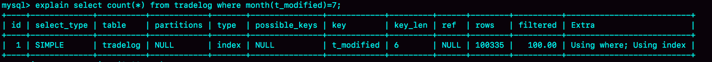
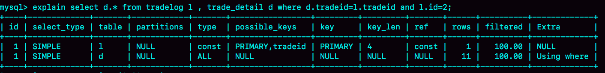
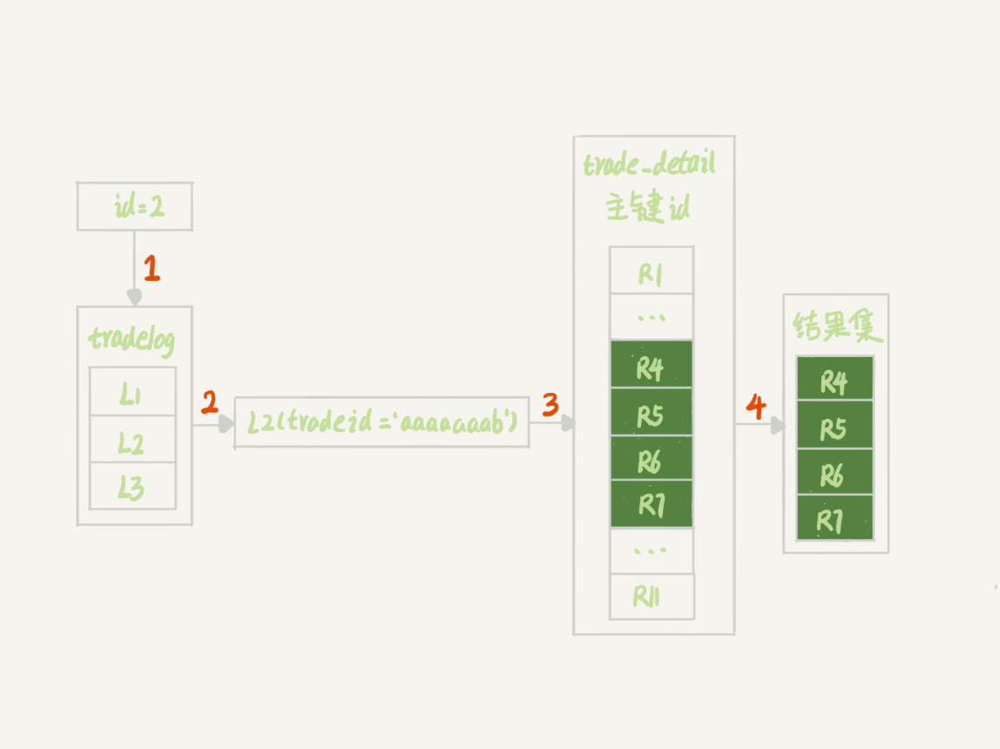
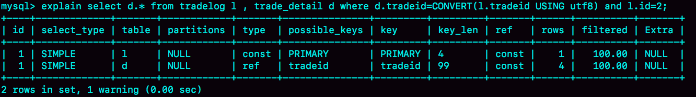

# week16

---

# Algorithm [977. Squares of a Sorted Array](https://leetcode.com/problems/squares-of-a-sorted-array/)
## 1. 问题描述
对一个有序数组求平方。

给定一个按照递增顺序排序的整数数组 A，返回一个递增数组，其中元素是 A 中元素的平方。

示例1:
* 输入: [-4,-1,0,3,10]
* 输出: [0,1,9,16,100]

示例2:
* 输入: [-7,-3,2,3,11]
* 输出: [4,9,9,49,121]

## 2. 解题思路
1. 遍历数组 A,对每个元素求平方，并找到平方后最小数的位置 m。
此时数组 A 的[0...m)的顺序是递减的，(m...len(A) - 1]的顺序是递增的。
2. 设置两个指针 p,q ,分别指向位置 m-1,m+1
3. 将最小值加入到结果数组中
4. 比较 A[p] 和 A[q] 将其中较小的值加入到结果数组中
5. 如果 A[p] < A[q]，则 p--, 否则 q++
6. 重复 4、5 步，直到 p < 0 或 q > len(A) 
7. 如果 p > 0 则将 A[p]...A[0] 依次加入到结果数组中，如果 q < len(A),则将A[q]...A[len(A) - 1] 依次加入到结果数组中
## 3. 代码
```go
func sortedSquares(A []int) []int {
	N := len(A)
	min,minpos := math.MaxInt32,0
	for i := 0; i < N; i++ {
		A[i] = A[i]*A[i]
		if min > A[i] {
			min = A[i]
			minpos = i
		}
	}
	res := []int{A[minpos]}
	low := minpos - 1
	large := minpos + 1
	for low >= 0 && large < N {
		if A[low] < A[large] {
			res = append(res, A[low])
			low--
		} else {
			res = append(res, A[large])
			large++
		}
	}
	for low >= 0 {
		res = append(res, A[low])
		low--
	}
	if large < N {
		res = append(res, A[large:]...)
	}
	return res
}
```
## 4. 复杂度分析
* 时间复杂度： O(N) N为数组A的长度，整个过程共遍历了2遍数组 A
* 空间复杂度：O(N) 结果集的存储使用了长度为N的数组空间

---

# Review [RESTful API Design — Step By Step Guide](https://medium.com/better-programming/restful-api-design-step-by-step-guide-2f2c9f9fcdbf)
RESTful API 设计——循序渐进指南

Jeff Bezos’ (成功的关键) 任务：
1. 所有的团队都将通过接口的形式暴露他们的数据和函数
2. 团队之间必须通过这些接口互相交互
3. 不允许其他任何形式的进程间通讯——不能直接链接，不能直接读取另一个团队的存储，不能使用共享内存模型，不能有任何后门。
唯一被允许的通讯方式就是通过网络进行接口调用。
4. 使用什么技术并不重要。HTTP,Corba,Pubsub,自定义协议——都无所谓，Bezos 不在乎。
5. 毫无例外地，所有的接口必须从头开始设计为可以被外部使用。也就是说，团队必须规划和设计，可以对公司外部开发者暴露的接口。没有例外。
6. 任何不这样做的人都将被开除。

### RESTful API 的设计原则
* 保持简单
* 使用名词而非动词
* 使用恰当的 HTTP 方法 
    * GET - 获取资源
    * POST - 创建资源
    * PUT/PATCH - 修改已存在的资源
    * DELETE - 删除资源
* 使用复数
* 使用参数
* 使用正确的 HTTP 返回状态码
    * 200 OK - 操作成功
    * 201 CREATED - POST 创建资源成功
    * 202 ACCEPTED - 服务器端已经收到请求，一般用于异步处理请求，比如发送mq消息
    * 400 BAD REQUEST - 客户端错误
    * 401 UNAUTHORIZED / 403 FORBIDDEN - 认证失败，权限不够
    * 404 NOT FOUND - 资源不存在
    * 500 INTERNAL SERVER ERROR - 这永远不应该被显式地抛出，但是在系统失败时可能会发生
    * 502 BAD GATEWAY - 如果服务器收到来自上游服务器的无效响应，则可以使用此选项
* 版本信息
* 使用分页
* 支持格式（JSON，XML）
* 使用正确的错误信息
* 使用OpenAPI规范 

---

# Tip

## Shenandoah GC 概述
Shenandoah是一种垃圾收集（GC）算法，旨在保证低延迟（10 - 500 ms的下限）。 它通过在运行Java工作线程的同时执行GC操作减少GC暂停时间。 使用Shenandoah，暂停时间不依赖于堆的大小。 这意味着无论堆的大小如何，暂停时间都是差不多的。

这是一个实验性功能，不包含在默认（Oracle）的OpenJDK版本中。

从原理的角度，我们可以参考该项目官方的示意图，其内存结构与 G1 非常相似，都是将内存划分为类似棋盘的 region。整体流程与 G1 也是比较相似的，最大的区别在于实现了并发的 Evacuation 环节，引入的 Brooks Forwarding Pointer 技术使得 GC 在移动对象时，对象引用仍然可以访问。

---
    
# Share
## 18 为什么这些SQL语句逻辑相同，性能却差异巨大？ —— 极客时间 MySQL实战45讲
分享3个看上去逻辑相同，但是性能差异巨大的 SQL 的案例。
### 案例一：条件字段函数操作
一个交易系统，交易记录表 tradelog 如下
```sql
mysql> CREATE TABLE `tradelog` (
  `id` int(11) NOT NULL,
  `tradeid` varchar(32) DEFAULT NULL,
  `operator` int(11) DEFAULT NULL,
  `t_modified` datetime DEFAULT NULL,
  PRIMARY KEY (`id`),
  KEY `tradeid` (`tradeid`),
  KEY `t_modified` (`t_modified`)
) ENGINE=InnoDB DEFAULT CHARSET=utf8mb4;
```
假设表中存在 2016~2018 年的所有数据，要统计发生在所有年份中 7月的交易记录总数。

sql写法一：
```sql
mysql> select count(*) from tradelog where month(t_modified)=7;
```
虽然 t_modified 字段上有索引，但是对字段做了函数计算之后就用不上索引了。

对于索引字段做函数操作，可能会破坏索引值的有序性，因此优化器就决定放弃走树搜索功能。

虽然优化器放弃了树搜索功能，但是可以选择遍历主键索引，也可以遍历 t_modified 索引，优化器对比索引大小，发现 t_modified 更小，所以会遍历
这个索引。

使用 explain 命令：

key="t_modified"表示的是，使用了 t_modified 索引

如果要使用索引的快速定位能力，可以如些写 sql，sql 写法二：
```sql
mysql> select count(*) from tradelog where
    -> (t_modified >= '2016-7-1' and t_modified<'2016-8-1') or
    -> (t_modified >= '2017-7-1' and t_modified<'2017-8-1') or 
    -> (t_modified >= '2018-7-1' and t_modified<'2018-8-1');
```

### 案例二：隐式类型转换
sql语句如下：
```sql
mysql> select * from tradelog where tradeid=110717;
```
tradeid 是有索引的，但是 explain 结果显示需要走全表扫描。

注意，tradeid 是 varchar(32) 而输入的类型是整型，所以需要做类型转换。

数据类型转换的规则，可以用 select "10" > 9 来测试：
1. 如果规则是"将字符串转成数字"，那么就是做数字比较，结果应该是 1
2. 如果规则是"将数字转成字符串"，那么就是做字符串比较，结果应该是 0

结果是 1 表示，字符串转数字

对于优化器来说，这个语句相当于：
```sql
mysql> select * from tradelog where  CAST(tradid AS signed int) = 110717;
``` 

### 案例三：隐式字符编码转换
假设系统中还有交易的操作细节表 trade_detail 
```sql
mysql> CREATE TABLE `trade_detail` (
  `id` int(11) NOT NULL,
  `tradeid` varchar(32) DEFAULT NULL,
  `trade_step` int(11) DEFAULT NULL, /* 操作步骤 */
  `step_info` varchar(32) DEFAULT NULL, /* 步骤信息 */
  PRIMARY KEY (`id`),
  KEY `tradeid` (`tradeid`)
) ENGINE=InnoDB DEFAULT CHARSET=utf8;

insert into tradelog values(1, 'aaaaaaaa', 1000, now());
insert into tradelog values(2, 'aaaaaaab', 1000, now());
insert into tradelog values(3, 'aaaaaaac', 1000, now());

insert into trade_detail values(1, 'aaaaaaaa', 1, 'add');
insert into trade_detail values(2, 'aaaaaaaa', 2, 'update');
insert into trade_detail values(3, 'aaaaaaaa', 3, 'commit');
insert into trade_detail values(4, 'aaaaaaab', 1, 'add');
insert into trade_detail values(5, 'aaaaaaab', 2, 'update');
insert into trade_detail values(6, 'aaaaaaab', 3, 'update again');
insert into trade_detail values(7, 'aaaaaaab', 4, 'commit');
insert into trade_detail values(8, 'aaaaaaac', 1, 'add');
insert into trade_detail values(9, 'aaaaaaac', 2, 'update');
insert into trade_detail values(10, 'aaaaaaac', 3, 'update again');
insert into trade_detail values(11, 'aaaaaaac', 4, 'commit');
```
如果要查询 id=2 的交易的所有操作步骤信息，SQL 语句如下：
```sql
mysql> select d.* from tradelog l, trade_detail d where d.tradeid=l.tradeid and l.id=2; /* 语句 Q1*/
```

1. 第一行显示优化器会先在交易记录表 tradelog 上查到 id=2 的行，这个步骤用上了主键索引，rows=1 表示只扫描了一行
2. 第二行 key = NULL 表示没有用上交易详情表 trade_detail 上的 tradeid 索引，进行了全表扫描

Q1 的执行过程

1. 根据 id 在 tradelog 表中找到 L2 这一行
2. 从 L2 中取出 tradeid 字段的值
3. 根据 tradeid 值到 trade_detail 表中查找条件匹配的行。 explain 的结果里面第二行的 key=NULL 表示的就是，
这个过程是通过遍历主键索引的方式，一个一个地判断 tradeid 的值是否匹配

第3步中没有用到 tradeid 主要原因是因为字符集不同导致的，一个是 utf8，一个是 utf8mb4

第3步单独写成sql
```sql
mysql> select * from trade_detail where tradeid=$L2.tradeid.value;
```
实际上语句为
```sql
select * from trade_detail  where CONVERT(traideid USING utf8mb4)=$L2.tradeid.value; 
```
CONVERT()函数，是将字符串转成 utf8mb4 字符集

字符集不同只是条件之一，连接过程中要求在被驱动表的索引字段上加上函数操作，是直接导致对被驱动表做全表扫描的原因。

查找 trade_detail 表里 id=4 的操作，对应的操作者是谁
```sql
mysql>select l.operator from tradelog l , trade_detail d where d.tradeid=l.tradeid and d.id=4;
```


这里也是两个 tradeid 的 join 操作，为什么这次能用上被驱动表的 tradeid 的索引呢？

分析 sql: 假设驱动表 trade_detail 中 id=4 的行记为 R4
```sql
select operator from tradelog  where traideid =$R4.tradeid.value; 
```
这时 $R4.tradeid.value 的字符集是 utf8 ，需要转成 utf8mb4
```sql
select operator from tradelog  where traideid =CONVERT($R4.tradeid.value USING utf8mb4); 
```
这里的 CONVERT 函数是加在输入参数上的，这样就可以用被驱动表 tradeid 索引了。

因此可以优化语句
```sql
select d.* from tradelog l, trade_detail d where d.tradeid=l.tradeid and l.id=2;
```
的执行过程，有两种做法：
* 比较常见的优化方法是，把 trade_detail 表上的 tradeid 字段的字符集也改成 utf8mb4，这样就没有字符集转换的问题了。
```sql
alter table trade_detail modify tradeid varchar(32) CHARACTER SET utf8mb4 default null;
```
* 如果能够修改字段的字符集的话，是最好不过了。但是如果数据量比较大，或者业务上暂时不能做这个 DDL 的话，那就只能采用修改 SQL 语句的方法了。
```sql
mysql> select d.* from tradelog l , trade_detail d where d.tradeid=CONVERT(l.tradeid USING utf8) and l.id=2; 
```

主动把 l.tradeid 转成 utf8，就避免了被驱动表上的字符编码的转换，从 explain 结果可以看到，这次索引走对了。

### 问题：是否遇到过类似问题
表结构
```sql
mysql> CREATE TABLE `table_a` (
  `id` int(11) NOT NULL,
  `b` varchar(10) DEFAULT NULL,
  PRIMARY KEY (`id`),
  KEY `b` (`b`)
) ENGINE=InnoDB;
```
假设表中有 100 万行数据，其中 10 万行 b 的值是 '1234567890', 现在执行sql
```sql
mysql> select * from table_a where b='1234567890abcd';
```
MySQL 会怎么执行能？
1. 看到 b 的定义，长度是 10，直接返回为空，但是 MySQL 并没有这么做
2. 用 '1234567890abcd' 拿到索引树中做匹配，肯定没有，快速判断出索引树中无此值，快速返回空，但是 MySQL 也没有这么做

实际上，这条 SQL 执行很慢，具体流程如下：
1. 在传给执行引擎的时候，做了字符串截断。因为引擎里面这个行只定义了长度是 10，所以只截了前 10 个字节，就是 '1234567890' 进去做匹配
2. 这样满足条件的数据有 10 万行
3. 因为是 select *，所以要做 10 次回表
4. 但是每次回表以后查出整行，到 server 层一判断，b 值都不是 '1234567890abcd'
5. 返回结果为空

虽然执行过程中可能经过了函数操作，但是最终在拿到结果后，server 层还是要做一轮判断的。
