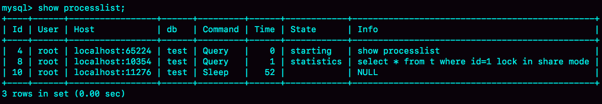
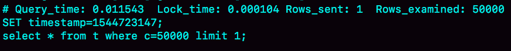
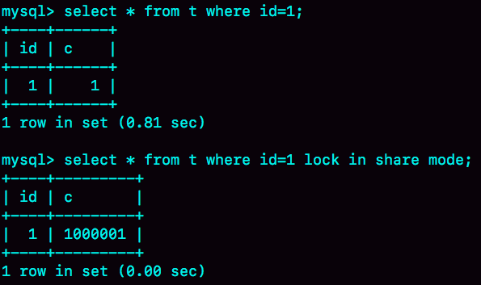

# week17

---

# Algorithm [1108. Defanging an IP Address](https://leetcode.com/problems/defanging-an-ip-address/)
## 1. 问题描述
IP 地址无效化

用 [.] 替换 IP 地址中的 .

## 2. 解题思路
直接用库函数
## 3. 代码
```go
func defangIPaddr(address string) string {
	return strings.Replace(address, ".", "[.]", -1)
}
```
## 4. 复杂度分析
* 时间复杂度：O(N) N为字符串长度，只需要遍历一遍字符串，并替换
* 空间复杂度：O(1)

---

# Review []()

---

# Tip

## 

---
    
# Share
## 19 为什么我只查一行的语句，也执行这么慢？—— 极客时间 MySQL实战45讲

构造一张表并插入 10 万行数据
```sql
mysql> CREATE TABLE `t` (
  `id` int(11) NOT NULL,
  `c` int(11) DEFAULT NULL,
  PRIMARY KEY (`id`)
) ENGINE=InnoDB;

delimiter ;;
create procedure idata()
begin
  declare i int;
  set i=1;
  while(i<=100000) do
    insert into t values(i,i);
    set i=i+1;
  end while;
end;;
delimiter ;

call idata();
```
### 第一类：查询长时间不返回
```sql
mysql> select * from t where id=1;
```
这种情况，大概率是表 t 被锁住了。使用 show processlist 命令来查看语句当前的状态。

#### 等 MDL 锁

使用 show processlist 命令查看 Waiting for table metadata lock 

这个状态表示的是，现在有一个线程正在表 t 上请求或者持有 MDL 写锁，把 select 语句堵住了。

在 MySQL 5.7 中复现此场景

| session A | session B |
| --- | --- |
| lock table t write;| |
| | select * from t where id=1;|

session A 通过 lock table 持有 t 的 MDL 写锁，而 session B 的查询需要 MDL 的读锁。所以 session B 进入等待状态。

这类问题的处理方式是，找到谁持有 MDL 写锁，然后把它 kill 掉。

但是，由于 show processlist 的结果里，session A 的 Command 列是 "Sleep", 导致查找起来很不方便。不过有了 performance_schema 和 
sys 系统库以后，就方便多了。（MySQL 启动时需要设置 performance_schema=on, 相比于 off 会有 10% 左右的性能损失）

通过查询 sys.schema_table_lock_waits 这张表，我们就可以直接找出造成阻塞的 process id，把这个连接用 kill 命令断开即可。
```sql
select blocking_pid from sys.schema_table_lock_waits;
```

| blocking_pid |
|---|
| 4|

#### 等 flush
```sql
mysql> select * from information_schema.processlist where id=1;
```

MySQL 中 flash 的用法有
```sql
flush tables t with read lock;

flush tables with read lock;
```
复现步骤

| session A | session B | session C |
| --- | --- | --- |
| select sleep(1) from t;| | |
| | flush tables t; | |
| | | select * from t where id=1; |

show processlist 结果


kill 掉 4 即可

#### 等行锁
```sql
mysql> select * from t where id=1 lock in share mode; 
```
此语句需要对 id=1 的行加读锁，如果此时有其他语句持有写锁，则会被阻塞

复现步骤

| session A | session B |
| --- | --- |
| begin; | |
| update t set c=c+1 where id=1; | |
| | select * from t where id=1 lock in share mode;|

show processlist 结果

如果是 MySQL 5.7 可以通过 sys.innodb_lock_waits 表查询
```sql
mysql> select * from t sys.innodb_lock_waits where locked_table=`'test'.'t'`\G
```

用 kill 4 ，停止正在占用行锁的语句，从而释放 id=1 上的行锁

### 第二类 慢查询
```sql
mysql> select * from t where c=50000 limit 1;
```
c 字段上没有索引，所以需要全表扫描，扫描 50000 行记录

查询慢查询日志（需要 set long_query_time=0, 将慢查询日志的时间阈值设置为 0）

执行用了11.5毫秒，坏查询不一定是慢查询，此条查询会随着数据量的增大而线性增长。

```sql
mysql> select * from t where id=1；
```

只扫描了 1 行，但却执行了 800 毫秒。

看其下一条语句

select * from t where id=1 lock in share mode 加了锁，执行时间却只有 0.2 毫秒。

执行结果如下

复现步骤

| session A | session B |
| --- | --- |
| start transaction with consistent snapshot; | |
| | update t set c=c+1 where id=1; // 执行 100 万次 |
| select * from t where id=1; | |
| select * from t where id=1 lock in share mode; | | 
A 先启动事务，然后 B 才开始执行 update。
B 执行完 100 万次之后 id=1 的状态如下

B 更新了 100 万次，生成了 100 万条回滚日志（undo log）

带 lock in share mode 的 SQL 语句，是当前读，因此直接读到 1000001 这个结果，所以速度很快。

而 select * from t where id=1 这个语句，是一致性读，因此需要从 1000001 开始，依次执行 undo log，执行 100 万次以后，才将 1 这个结果返回。

注意：undo log 里记录的其实是"把2改成1"，"把3改成2"这样的操作逻辑，画成减1是为了方便阅读

### 问题
select * from t where id=1 lock in share mode; 由于 id 上有索引，所以直接定位到 id=1 这一行，因此读锁只加在这一行上。

如果 SQL 如下
```sql
begin;
select * from t where c=5 for update;
commit;
```
这个语句序列是怎么加锁的？加的锁又是什么时候释放的？
### 回答
在读提交隔离级别下，在语句执行完成后，是只有行锁的。而且语句执行完成后，InnoDB 就会把不满足条件的行的行锁去掉。
当然，c=5 这一行的行锁，还是会等到 commit 的时候才会释放。

可重复读的隔离级别下，请看下篇文章。
