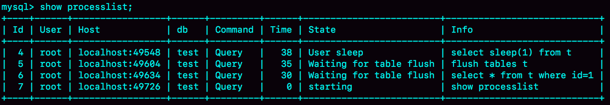
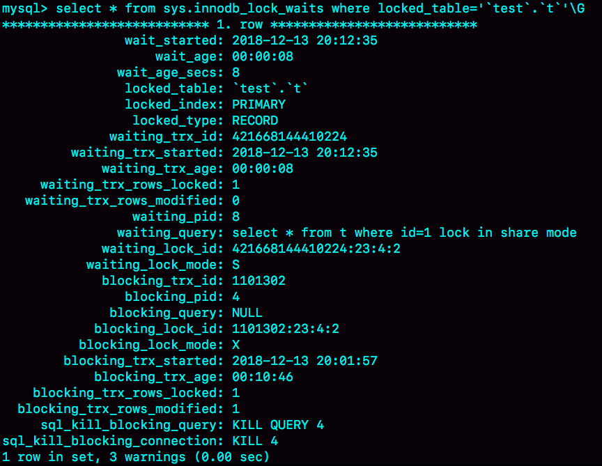
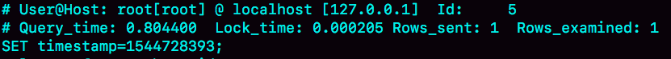

# week17

---

# Algorithm [1108. Defanging an IP Address](https://leetcode.com/problems/defanging-an-ip-address/)
## 1. 问题描述
IP 地址无效化

用 [.] 替换 IP 地址中的 .

## 2. 解题思路
直接用库函数
## 3. 代码
```go
func defangIPaddr(address string) string {
	return strings.Replace(address, ".", "[.]", -1)
}
```
## 4. 复杂度分析
* 时间复杂度：O(N) N为字符串长度，只需要遍历一遍字符串，并替换
* 空间复杂度：O(1)

---

# Review [Key Kubernetes Concepts](https://towardsdatascience.com/key-kubernetes-concepts-62939f4bc08e)
Kubernetes 核心概念.

Kubernetes 又简称为 K8s

## K8s 的 6 层

Kubernetes 抽象的6层

1. Deployment
2. ReplicaSet
3. Pod
4. Node Cluster
5. Node Processes
6. Docker Container

* Deployment 创建并管理 ReplicaSet
* ReplicaSet 创建并管理 Pods
* Pods 运行 Nodes
* Nodes 拥有运行时的容器
* 运行时的容器中运行着 app 的代码，拉取自你的 Docker 镜像


6 层的细节

蓝色的代表高层抽象，绿色的代表节点和节点子流程。

K8s实例通常包含多个 Pods，这些 Pods 运行在同一个节点上。

### Deployment
通常用于运行无状态应用，如 HTTP server
### ReplicaSet
Deployment 创建 ReplicaSet，确保你的 app 有期望数量的 Pods
### Pod
Pod 是 Kubernetes 的基本构建单元。一个 Pod 包含一组容器（可以是一个或多个）。

Pod 负责管理容器的容量、安全和配置。

当 ReplicationSet 水平扩展 app 是，Pod 负责复制 app

Pod 部署在 工作节点上

### Cluster level
#### Cluster
一个 K8s 的集群包含一个 Cluster Master（Master节点） 和 多个 Worker Node(工作节点)

#### Worker Node
工作节点是对一台服务器的抽象。

一个或多个 Pod 运行在一个工作节点上。

一个 Pod 只会在一个工作节点中，不会被分开到不同的节点中。

Master 控制工作节点的工作。
#### Cluster Master
Master 负责管理工作节点，调度决策，响应事件，实施变更，监控节点。

Master 和工作节点都包含子组件。
### Node Processes
#### Master Components

* API Server - 暴露 K8s 的 API。这是 K8s 控制的前端。
* etcd - 用于存储集群状态数据的分布式 kv 存储。
* Scheduler - 调度器，为新的 Pod 分配节点
* kube-controller-manager - 集群控制器，用于处理集群的后台任务
* cloud-controller-manger - 运行与云提供商交互的控制器
#### Worker Node Components

* kubelet - 负责worker节点的所有工作。与master的API进行交互。是worker的大脑。
* kube-proxy - 负责路由到正确的 Pod。还可以跨服务的 Pod 执行负载均衡。
* Container Runtime - 下载镜像并运行容器。
### Docker Container Level
#### ReplicaSets, StatefulSets, and DaemonSets

##### StatefulSet
StatefulSet 与 ReplicaSet 一样管理一组 Pod 的部署和扩展。
Stateful 的 Pod 不可互换。每个 Stateful 的 Pod 都有一个唯一的持久标示符。Stateful 适用于持久的有状态的后端，如 数据库。
##### DaemonSet
DaemonSet 用于连续处理。每个节点上运行一个 Pod。DaemonSet 通常用于运行后台进程，例如监控器和日志收集器。
### Jobs 和 CronJobs
#### Job
Job 是运行批处理的 Pod。如果一个程序只运行一次，请使用 Job。
#### CronJob
定时运行 Job
### Service
K8s 服务为一组 Pod 创建单个访问点。
### Volumes, PersistentVolumes, and PersistentVolume Claims
#### Volumes
卷是用来保存数据的目录。卷是 Pod 的一个组件，并不独立于 Pod。在Pod规范中创建卷。 卷无法自行删除。

一个卷对一个 Pod 中的所有容器都可见。只要容器 mount 它。

卷可以提供对本地磁盘存储，内存存储或云存储的访问。 Pod可以同时使用它们的组合。

K8s卷类型包括空目录，工作节点的文件系统和云提供商特定的存储。

#### PersistentVolumes and PersistentVolumeClaims
PersisententVolumes（PV）和PersisentVolumeClaims（PVC）与单独使用Volumes相比增加了复杂性。

对于pv, K8s用户仍然需要使用卷，但首先需要两个步骤：
1. PersistentVolume由群集管理员（或动态配置）供应。
2. 需要Pod存储的单个Cluster用户创建PersistentVolumeClaim清单。 它指定了他们需要多少和什么类型的存储。 然后K8s找到并保留所需的存储空间。

然后，用户创建具有使用PVC的卷的Pod。

PersistentVolumes具有独立于任何Pod的生命周期。 事实上，Pod甚至不知道PV，只知道PVC。

PVC消耗PV资源，类似于Pod消耗节点资源的方式。

## 总结
K8s 的 6 层：
* Deployment：管理 ReplicaSets。用于持久的和无状态的应用（例如 HTTP server）
* ReplicaSet: 创建和管理 Pods
* Pod: K8s 的基本单元
* Node Cluster : 
    * 工作节点： Pods 的机器
    * master节点：管理工作节点
* Node Processes
    * Master 子组件
        * API server
        * etcd
        * scheduler
        * kube-controller-manager
        * cloud-controller-manager
    * 工作节点子组件：
        * kubelet
        * kube-proxy
        * container-runtime
* Docker Container: app 代码的运行环境

7个额外的高级K8s API对象：
* StatefulSet: 就像有状态进程的ReplicaSet一样。 类似于国家
* DaemonSet: 每个节点一个自动Pod。 类似于监视器。
* Job: 运行容器以完成任务。 类似于批处理
* CronJob: 定时运行 Job。类似于定时器
* Service: Pods的接入点。 类似于接入点
* Volume: 保存数据。类似于磁盘
* PersistentVolume, PersistentVolumeClaim: 用于分配存储的系统。 类似于存储声明

---

# Tip 

## Consul 简介
Consul包含多个组件,但是作为一个整体,为你的基础设施提供服务发现和服务配置的工具。包含以下特性：
* 服务发现： Consul的客户端可以注册服务，例如api或mysql，其他客户端可以使用Consul来发现给定服务的提供者。 使用DNS或HTTP，应用程序可以轻松找到它们所依赖的服务。
* 健康检查： Consul客户端可以提供任意数量的运行状况检查，这些检查可以与给定服务相关联（“比如Web服务器返回200 OK”），也可以与本地节点相关联（“比如，内存利用率低于90％”）。 运营商可以使用此信息来监控群集运行状况，服务发现组件使用该信息将流量路由远离不健康的主机。
* kv存储：应用程序可以将Consul的分层键/值存储用于任何用途，包括动态配置，功能标记，协调，领导者选举等。 简单的HTTP API使其易于使用。
* 安全服务交互：Consul可以为服务生成和分发TLS证书，以建立相互的TLS连接。 意图可用于定义允许哪些服务进行通信。 可以使用可以实时更改的意图轻松管理服务分段，而不是使用复杂的网络拓扑和静态防火墙规则。
* 多数据中心：Consul支持开箱即用的多个数据中心。 这意味着Consul的用户不必担心构建额外的抽象层以扩展到多个区域。

Consul旨在对DevOps社区和应用程序开发人员友好，使其成为现代，弹性基础架构的理想选择。

---
    
# Share
## 19 为什么我只查一行的语句，也执行这么慢？—— 极客时间 MySQL实战45讲

构造一张表并插入 10 万行数据
```sql
mysql> CREATE TABLE `t` (
  `id` int(11) NOT NULL,
  `c` int(11) DEFAULT NULL,
  PRIMARY KEY (`id`)
) ENGINE=InnoDB;

delimiter ;;
create procedure idata()
begin
  declare i int;
  set i=1;
  while(i<=100000) do
    insert into t values(i,i);
    set i=i+1;
  end while;
end;;
delimiter ;

call idata();
```
### 第一类：查询长时间不返回
```sql
mysql> select * from t where id=1;
```
这种情况，大概率是表 t 被锁住了。使用 show processlist 命令来查看语句当前的状态。

#### 等 MDL 锁

使用 show processlist 命令查看 Waiting for table metadata lock 

这个状态表示的是，现在有一个线程正在表 t 上请求或者持有 MDL 写锁，把 select 语句堵住了。

在 MySQL 5.7 中复现此场景

| session A | session B |
| --- | --- |
| lock table t write;| |
| | select * from t where id=1;|

session A 通过 lock table 持有 t 的 MDL 写锁，而 session B 的查询需要 MDL 的读锁。所以 session B 进入等待状态。

这类问题的处理方式是，找到谁持有 MDL 写锁，然后把它 kill 掉。

但是，由于 show processlist 的结果里，session A 的 Command 列是 "Sleep", 导致查找起来很不方便。不过有了 performance_schema 和 
sys 系统库以后，就方便多了。（MySQL 启动时需要设置 performance_schema=on, 相比于 off 会有 10% 左右的性能损失）

通过查询 sys.schema_table_lock_waits 这张表，我们就可以直接找出造成阻塞的 process id，把这个连接用 kill 命令断开即可。
```sql
select blocking_pid from sys.schema_table_lock_waits;
```

| blocking_pid |
|---|
| 4|

#### 等 flush
```sql
mysql> select * from information_schema.processlist where id=1;
```

MySQL 中 flash 的用法有
```sql
flush tables t with read lock;

flush tables with read lock;
```
复现步骤

| session A | session B | session C |
| --- | --- | --- |
| select sleep(1) from t;| | |
| | flush tables t; | |
| | | select * from t where id=1; |

show processlist 结果


kill 掉 4 即可

#### 等行锁
```sql
mysql> select * from t where id=1 lock in share mode; 
```
此语句需要对 id=1 的行加读锁，如果此时有其他语句持有写锁，则会被阻塞

复现步骤

| session A | session B |
| --- | --- |
| begin; | |
| update t set c=c+1 where id=1; | |
| | select * from t where id=1 lock in share mode;|

show processlist 结果

如果是 MySQL 5.7 可以通过 sys.innodb_lock_waits 表查询
```sql
mysql> select * from t sys.innodb_lock_waits where locked_table=`'test'.'t'`\G
```

用 kill 4 ，停止正在占用行锁的语句，从而释放 id=1 上的行锁

### 第二类 慢查询
```sql
mysql> select * from t where c=50000 limit 1;
```
c 字段上没有索引，所以需要全表扫描，扫描 50000 行记录

查询慢查询日志（需要 set long_query_time=0, 将慢查询日志的时间阈值设置为 0）

执行用了11.5毫秒，坏查询不一定是慢查询，此条查询会随着数据量的增大而线性增长。

```sql
mysql> select * from t where id=1；
```

只扫描了 1 行，但却执行了 800 毫秒。

看其下一条语句

select * from t where id=1 lock in share mode 加了锁，执行时间却只有 0.2 毫秒。

执行结果如下

复现步骤

| session A | session B |
| --- | --- |
| start transaction with consistent snapshot; | |
| | update t set c=c+1 where id=1; // 执行 100 万次 |
| select * from t where id=1; | |
| select * from t where id=1 lock in share mode; | | 
A 先启动事务，然后 B 才开始执行 update。
B 执行完 100 万次之后 id=1 的状态如下

B 更新了 100 万次，生成了 100 万条回滚日志（undo log）

带 lock in share mode 的 SQL 语句，是当前读，因此直接读到 1000001 这个结果，所以速度很快。

而 select * from t where id=1 这个语句，是一致性读，因此需要从 1000001 开始，依次执行 undo log，执行 100 万次以后，才将 1 这个结果返回。

注意：undo log 里记录的其实是"把2改成1"，"把3改成2"这样的操作逻辑，画成减1是为了方便阅读

### 问题
select * from t where id=1 lock in share mode; 由于 id 上有索引，所以直接定位到 id=1 这一行，因此读锁只加在这一行上。

如果 SQL 如下
```sql
begin;
select * from t where c=5 for update;
commit;
```
这个语句序列是怎么加锁的？加的锁又是什么时候释放的？
### 回答
在读提交隔离级别下，在语句执行完成后，是只有行锁的。而且语句执行完成后，InnoDB 就会把不满足条件的行的行锁去掉。
当然，c=5 这一行的行锁，还是会等到 commit 的时候才会释放。

可重复读的隔离级别下，请看下篇文章。
