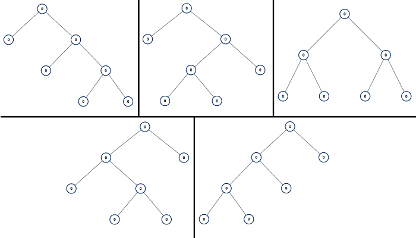

# week19

---

# Algorithm [894. All Possible Full Binary Trees](https://leetcode.com/problems/all-possible-full-binary-trees/)
## 1. 问题描述
给出所有可能的完全二叉树。

完全二叉树是指一棵二叉树的每个节点要么没有子节点，要么有2个子节点。

对于有 N 个节点的二叉树，给出所有可能的完全二叉树。

每个节点的值都为 0

示例1：
* 输入：7
* 输出：[[0,0,0,null,null,0,0,null,null,0,0],[0,0,0,null,null,0,0,0,0],[0,0,0,0,0,0,0],[0,0,0,0,0,null,null,null,null,0,0],[0,0,0,0,0,null,null,0,0]]
* 解释：


其中 1 <= N <=20

## 2. 解题思路
采用递归的方式。

假设函数 FBT(N) 返回所有完全二叉树的列表
1. 如果 N == 1 那么返回只有一个节点组成的完全二叉树
2. 如果 N % 2 == 0 那么返回空的二叉树，因为完全二叉树的节点数必须是奇数
3. 如果 N >= 3, 那么可以递归的调用 FBT(N),其中左子树 FBT(x),右子树为 FBT(N-1-x) (循环调用 x 从 1 到 N)

## 3. 代码
```go
func allPossibleFBT(N int) []*TreeNode {
	res := []*TreeNode{}
	if N % 2 == 0 {
    		return res
    }
	if N == 1 {
		res = append(res, &TreeNode{0,nil,nil})
		return res
	}
	N -= 1
	for i := 1; i < N; i += 2 {
		left := allPossibleFBT(i)
		right := allPossibleFBT(N - i)
		for _,nl := range left {
			for _,nr := range right {
				cur := &TreeNode{0,nl,nr}
				res = append(res, cur)
			}
		}
	}
	return res
}
```
## 4. 复杂度分析
* 时间复杂度：2<sup>N</sup> 递归调用 N/2 次，且每次循环 N 次
* 空间复杂度：2<sup>N</sup>

---

# Review [Key Kubernetes Commands](https://towardsdatascience.com/key-kubernetes-commands-741fe61fde8)
## 在本地运行 K8s
已 Mac 为例，首先下载带有 K8s 的 [Docker Desktop](https://www.docker.com/products/docker-desktop?source=post_page---------------------------)

安装成功后，启动 docker， 在状态栏会有一个 docker icon


然后安装 Kubernetes,选择 Preferences...


如果在国内最好先设置代理，否则很难安装成功


安装 kubernetes


安装成功后会看到 docker 和 kubernetes 都在运行中的状态


## 运行第一个 K8s App
在命令行中运行如下命令
```jshelllanguage
kubectl create deployment hello-node --image=gcr.io/hello-minikube-zero-install/hello-node
```
查看 kubernetes 资源的状态
```jshelllanguage
kubectl get all
```
查看 K8s 目前正在做什么的命令
```jshelllanguage
kubectl get events
```


目前 Pod 已经起来了，下一步需要将这个 Pod 发布成 service，这样才能访问到容器内部的服务
```jshelllanguage
kubectl expose deployment hello-node --type=LoadBalancer --port=8080
```
查看 service 的创建情况
```jshelllanguage
kubectl get services
```


服务发布成功后就可以通过 8080 端口访问服务了, [http://localhost:8080/](http://localhost:8080/)

除了有命令行之外，还可以通过 YAML 文件创建服务

## kubectl
kubectl 是 K8s 的命令行工具
* kubectl 包括 get、create 和  describe 等操作
* 以上操作需要针对 Deployment, StatefulSet, Service 等资源进行
* kubectl 命令格式：
```jshelllanguage
kubectl an_action a_resource a_resource_name --flags
```
name 和 flags 是可选的

获取所有 Pods 
```jshelllanguage
kubectl get pods
```
## 常用的 kubectl Resources
* pods, po
* nodes, no
* deployments, deploy
* replicasets, rs
* daemonsets, ds
* statefulsets, sts
* jobs
* cronjobs, cj
* services, svc
* persistentvolumes, pv
* persistentvolumeclaims, pvc

all 表示所有资源，获取所有资源
```jshelllanguage
kubectl get all
```
查看所有 kubenetes 的历史事件
```jshelllanguage
kubectl get events
```

## kubectl 的常用操作
* help - 获取帮助信息
* get - 显示资源信息
* describe - 显示资源的详细信息
* logs - 显示容器日志
* exec - 进入一个容器并执行进程
* apply - 创建或修改一个资源
* delete - 删除资源

例如：
```jshelllanguage
kubectl get pods --help
kubectl get all
kubectl describe all
kubectl logs hello-node-7f5b6bd6b8-gr7m7
kubectl logs hello-node-7f5b6bd6b8-gr7m7 -c my-container
kubectl exec -it my_pod bash
kubectl delete pod my_pod
kubectl delete rs --all
```
使用 apply 命令式可以使用 YAML 或者 JSON 配置文件来创建或修改资源。

apply 是创建和更新资源的瑞士军刀。

如果想要了解更多，可以查看 [Kubernetes 的官网文档](https://kubernetes.io/docs?source=post_page---------------------------)


---

# Tip 使用 ChatterBot 运行一个聊天机器人
1. 下载并安装 python3 [下载地址](https://www.python.org/downloads/)
2. 从 [Github](https://github.com/gunthercox/ChatterBot) 上下载源码 
3. 编译 ChatterBot
    ```jshelllanguage
    pip3 install ./ChatterBot
    ```
4. 安装依赖
    ```jshelllanguage
    python3 -m spacy download en
    pip3 install chatterbot-corpus
    ```
5. 运行官方示例
    ```jshelllanguage
    from chatterbot import ChatBot
    from chatterbot.trainers import ChatterBotCorpusTrainer
    
    chatbot = ChatBot('Ron Obvious')
    
    # Create a new trainer for the chatbot
    trainer = ChatterBotCorpusTrainer(chatbot)
    
    # Train the chatbot based on the english corpus
    trainer.train("chatterbot.corpus.english")
    
    # Get a response to an input statement
    chatbot.get_response("Hello, how are you today?")
    ```
6. 开始聊天
    

---
    
# Share : 21 为什么我只改一行的语句，锁这么多？—— 极客时间 MySQL实战45讲
间隙锁和行锁的加锁规则。

规则前提：MySQL 5.x 系列 <=5.7.24，8.0 系列 <=8.0.13

间隙锁只有在可重复读的隔离级别下才有效。以下默认都在可重复隔离级别下。

## 加锁规则
两个"原则"，两个"优化"，一个"bug"
1. 原则1：加锁的基本单位是 next-key lock (前开后闭)
2. 原则2：查找过程中访问到的对象才会加锁
3. 优化1：索引上的等值查询，给唯一索引加锁的时候，next-key lock 退化为行锁
4. 优化2：索引上的等值查询，向右遍历时且最后一个值不满足等值条件的时候，next-key lock 退化为间隙锁
5. 一个 bug：唯一索引上的范围查询会访问到不满足条件的第一个值为止

建表语句
```sql
CREATE TABLE `t` (
  `id` int(11) NOT NULL,
  `c` int(11) DEFAULT NULL,
  `d` int(11) DEFAULT NULL,
  PRIMARY KEY (`id`),
  KEY `c` (`c`)
) ENGINE=InnoDB;

insert into t values(0,0,0),(5,5,5),
(10,10,10),(15,15,15),(20,20,20),(25,25,25);
```
## 案例一：等值查询间隙锁
| session A | session B | session C |
| --- | --- | --- |
| begin; <br> update t set d=d+1 where id=7; | | |
| | insert into t values(8,8,8); <br> (blocked) | | 
| | | update t set d=d+1 where id=10; <br> (Query OK) |

1. 根据原则1，A 加锁 (5,10]
2. 根据优化2，这是一个等值查询，且 id=10 不满足条件，所以 netx-key lock 退化为间隙锁 (5,10)

因此 B 往间隙 (5,10) 中插入会被锁住，而 C 修改 id=10 这一行是可以的

## 案例二：非唯一索引等值锁
| session A | session B | session C |
| --- | --- | --- |
| begin; <br> select id from t where c=5 lock in share mode; | | |
| | update t set d=d+1 where id=5; <br> (Query OK) | |
| | | insert into t values(7,7,7); <br> (blocked) |

A 要给索引 c 上的 c=5 这一行加上读锁。
1. 根据原则1，给 (0,5] 加上 next-key lock
2. 注意 c 是普通索引，因此仅访问到 c=5 这一条记录是不能马上停下来的（因为可能存在重复值），需要向右遍历，查到 c=10 才放弃。
根据原则2，访问到的都要加锁，因此要给 (5,10] 加 next-key lock
3. 根据优化2，等值判断，向右遍历，最后一个值不满足 c=5 这个等值条件，因此退化成间隙锁 (5,10)
4. 根据原则2，只有访问到的对象才会加锁，这个查询使用覆盖索引，并不需要访问主键索引，所以主键索引上没有加任何锁，这就是为什么 B 的 update 语句可以执行完成

C 插入 (7,7,7) 会被 A 的间隙锁 (5,10) 锁住

* lock in share mode 只锁覆盖索引。但是 for update 时，系统会认为你接下来要更新数据，因此会顺便给主键索引上满足条件的行加上行锁。
* 锁是加在索引上的
* 如果要用 lock in share mode 给行加读锁避免数据被更新的话，就必须绕过覆盖索引优化，在查询字段中加入索引中不存在的字段。
比如，将 A 中的查询改为 select d from t where c=5 lock in share mode

## 案例三：主键索引范围锁
下面这两条语句加锁范围相同吗？
```sql
mysql> select * from t where id=10 for update;
mysql> select * from t where id>=10 and id<11 for update;
```
这两条语句的加锁规则不同

| session A | session B | session C |
| --- | --- | --- |
| begin; <br> select * from t where id>=10 and id<11 for update; | | |
| | insert into t values(8,8,8); <br> (Query OK) <br> insert into t values(13,13,13); <br> (blocked) | | 
| | | update t set d=d+1 where id=15; <br> (blocked) |

1. 开始执行时，要找到 id=10 的行，因此加 next-key lock (5,10]。根据优化1，主键 id 上的等值条件，退化成行锁，只加了 id=10 这一行的行锁。
2. 范围查找就往后继续查找，找到 id=15 这一行停下来，因此需要加上 next-key lock (10,15]

所以 A 此时的锁在主键索引上，行锁 id=10 和 next-key lock (10,15]
## 案例四：非唯一索引范围锁
| session A | session B | session C |
| --- | --- | --- |
| begin; <br> select * from t where c >= 10 and c < 11 for update; | | |
| | insert into t values(8,8,8); <br> (blocked) | |
| | | update t set d=d+1 where c=15; <br> (blocked) |

加锁规则与案例三唯一不同是：在第一次用 c=10 定位记录的时候，在索引 c 上加了 (5,10] 这个 next-key lock 后，由于索引 c 是非唯一索引，
没有优化规则，所以不会蜕变为行锁，因此最终 A 加的锁是 (5,10] 和 (10,15]

## 案例五：唯一索引范围锁 bug
| session A | session B | session C |
| --- | --- | --- |
| begin; <br> select * from t where id>10 and id<=15 for update; | | |
| | update t set d=d+1 where id=20; <br> (blocked) | | 
| | | insert into t values(16,16,16); <br> (blocked) |

A 是一个范围查询，按照原则1，在索引 id 上只加 (10,15] 这个 next-key lock，并且因为 id 是唯一索引，所以判断到 id=15 这一行就应该停止。

但是，InnoDB 会扫描到第一个不满足条件的行为止，也就是 id=20，而且由于这是范围扫描，因此索引 id 上的 (15,20] 这个 next-key lock 也会被锁上。

因此 B 更新 id=20 会被锁住，C 要插入 id=16 也会被锁住。
## 案例六：非唯一索引上存在"等值"的例子
首先插入一条记录
```sql
mysql> insert into t values(30,10,30);
```
索引 c 

第一行表示 c 的索引值，第二行表示对应的主键值

两个 c=10 的记录之间也是有间隙的

delete 语句的加锁逻辑和 select ... for update 是类似的

| session A | session B | session C |
| --- | --- | --- |
| begin; <br> delete from t where c=10; | | |
| | insert into t values(12,12,12); <br> (blocked) | |
| | | update t set d=d+1 where c=15; <br> (Query OK) |

A 在遍历的时候，先访问第一个 c=10 的记录。根据原则 1， 这里加的是 (c=5,id=5) 到 (c=10,id=10) 这个 next-key lock

然后 A 继续向右查找，直到碰到 (c=15,id=15) 这一行，循环结束。根据优化 2，这是一个等值查询，向右查找到了不满足条件的行，
所以会退化成 (c=10,id=10) 都 (c=15,id=15) 的间隙锁。

也就是说 delete 在索引 c 上的加锁范围如下图所示

虚线表示开区间，即在(c=5,id=5) 和(c=15,id=15) 这两行上没有锁。
## 案例七：limit 语句加锁
| session A | session B |
| --- | --- |
| begin; <br> delete from t where c=10 limit 2; | |
| | insert into t values(12,12,12); <br> (Query OK) |
由于表 t 中只有 2 条 c=10 的记录，所以是否加 limit 2 对最终结果是没有影响的，但是加锁效果却不同。

可以看到 B 中的 insert 语句通过了，与案例六不同。

因为加了 limit 2 之后，遍历到 (c=10,id=30) 这一行之后，满足条件的语句已经有两条了，所以循环就结束了。

索引 c 上的加锁范围就变成了从 (c=5,id=5) 到 (c=10,id=30) 这个前开后闭区间，如下图所示


因此，在删除数据的时候尽量加 limit。这样不仅可以控制删除数据的条数，让操作更安全，还可以减小加锁的范围。
## 案例八：一个死锁的例子
| session A | session B |
| --- | --- |
| begin; <br> select id from t where c=10 lock in share mode; | |
| | update t set d=d+1 where c=10; <br> (blocked) |
| insert into t values(8,8,8); | |
| | ERROR 1213 (40001); <br> Deadlock found when trying to get lock; try restarting transaction |

1. A 启动事务后执行查询语句加 lock in share mode，在索引 c 上加上 next-key lock (5,10] 和间隙锁 (10,15)
2. B 的 update 语句也要在索引 c 上加上 next-key lock (5,10], 进入所等待
3. A 插入 (8,8,8)，被 B 的间隙锁锁住。所以出现了死锁。

session B 的 next-key lock 不是还没申请成功吗？

其实，B 的"加 next-key lock (5,10]"操作，实际上分成了两步，先是加 (5,10) 的间隙锁，加锁成功；然后加 c=10 的行锁，这时候才被锁住的。

也就是说我们分析加锁规则的时候可以用 next-key lock 来分析。但是，具体执行的时候，要分成间隙锁和行锁两段来执行。

## 思考题
| session A | session B |
| --- | --- |
| begin; <br> select * from t where c>=15 and c<=20 order by c desc lock in share mode; | |
| | insert into t values(6,6,6); <br> (blocked) |

分析：

1. 由于是 order by c desc，第一个要定位的是索引 c 上"最右边的" c=20 的行，所以会加上间隙锁 (20,25) 和
next-key lock (15,20]
2. 在索引 c 上向左遍历，要扫描到 c=10 才停止，所以 next-key lock 会加到 (5,10],这正是阻塞 session B 的 insert 语句的原因
3. 在扫描过程中，c=20,c=15,c=10 这三行都存在值，由于是 select *，所以会在主键 id 上加两个行锁。

因此，A 的 select 语句锁范围是：
1. 索引 c 上的 (5,25)
2. 主键索引上的 id=15,20 两行锁

