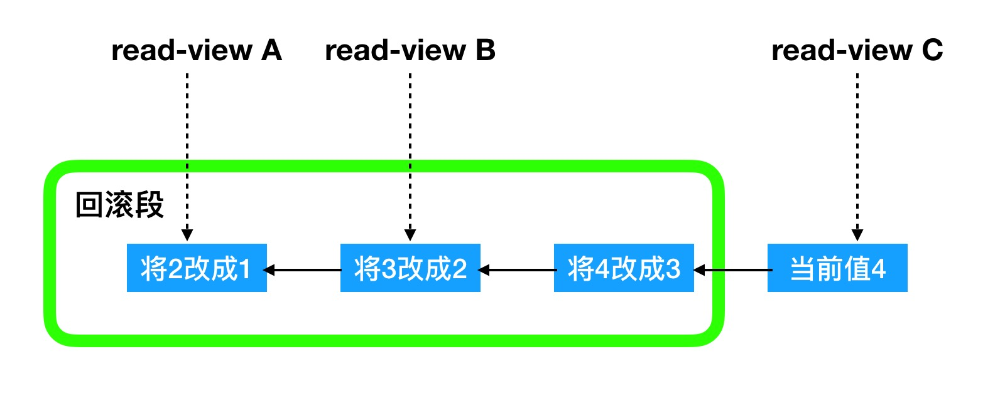

# week2 ARTS
## [Algorithm](algorithm/Algorithm.md)  Leetcode [807. Max Increase to Keep City Skyline](https://leetcode.com/problems/max-increase-to-keep-city-skyline/)
### 问题描述 
* 给定一个二维数组grid[i][j] 存储的内容为：坐标(i,j)建筑的高度。
  你可以增加任何建筑的高度，并且可以增加任意高度。但是要求从任意方向看要跟原始的该方向看过去"skyline"必须是一样的。
  skyline(天际线)是从远处看一个城市的矩形轮廓。即你从一个方向能够看到的这一行（列）的最高的那个楼。
  举例：原始grid：
  ```java
  [ [3, 0, 8, 4],
    [2, 4, 5, 7],
    [9, 2, 6, 3],
    [0, 3, 1, 0]]
  ```
  * 从上到下(或从下到上)的skyline: [9, 4, 8, 7]
  * 从左到右(或从右到左)的skyline: [8, 7, 9, 3]
### 分析
  * 数学建模：skyline 实际上就是找到这栋建筑所在这一排建筑中的最高的那一个和所在这一列最高的那一个中最小的那一个。
             用数学公式表示就是： 
```java
    skyline[i][j] = min(maxrow[i], maxcol[j])
```
             
   其中 n 是最大行数，m 是最大列数。
   建筑(i,j)可以增加的最大高度为
```java
    maxIncrease[i][j] = skyline[i][j] - grid[i][j]
``` 
   最终结果只需对maxIncrease求和
#### 解题
1. 遍历一遍grid二维数组，得到maxrow和maxcol数组
```java
        for (int i = 0; i < grid.length; i++) {
            for (int j = 0; j < grid[i].length; j++) {
                maxrow[i] = Math.max(maxrow[i], grid[i][j]);
                maxcol[j] = Math.max(maxcol[j], grid[i][j]);
            }
        }
```
2. 再次遍历grid数据，计算sumMaxIncrease
```java
        int maxInc = 0;
        for (int i = 0; i < grid.length; i++) {
            for (int j = 0; j < grid[i].length; j++) {
                maxInc += Math.min(maxrow[i], maxcol[j]) - grid[i][j];
            }
        }
```

* 时间复杂O(N<sup>2</sup>),其中N是grid数组的行数（列数）
## Review
* 阅读文章 [“The Pragmatic Programmer” Is Essential Reading for Software Developers](https://blog.usejournal.com/the-pragmatic-programmer-is-essential-reading-for-software-developers-443940b8ef9f)
* 《程序员修炼之道：从小工到专家》是软件开发者的必读物

  此篇文章主要介绍为什么每个开发者都要阅读这本书。
1. 心态

    前两章主要讨论哲学、心理学和编码方法。在你写代码之前一定要先想清楚。
    * 对你的代码拥有所有权
    * 做一些垫脚石，以获取更多的资源
    * 在今天开发好的软件比明天开发更完美的软件更好，所以今日事今日做
2. 工具
    
    磨刀不误砍柴工，写代码之前准备好你的工具和环境。以下有一些建议：
    * 使用一些好用的文本编辑器工具，比如Vim或者Emacs
    * 在shell中增加一些个性化的命令和配置，以便于你使用命令行更高效
    * 使用版本管理工具，如git，可以使你更简单地回滚、协作、分享
    * 思考问题是最难的部分，大量练习你的主语言基础，使得代码实现的部分变得更简单
    * 深刻的理解你平时所使用的代码库和模块的整体架构，做到信手拈来
    
3. 写代码
    
    很多写代码的建议都出自本书：
    * “lazy” 和 “shy”代码的概念都出自此书。严格定义函数的输入输出参数。
    * 处理错误和异常的最佳实践
    * 撰写清晰、线程安全的代码
    * 仔细地权衡所使用的数据结构和数据的存储方式
    * 用O评估算法的时间复杂度
    * 如何撰写测试已到达更大的覆盖率
    * 你什么时候应该重构？什么使得花时间重构代码是更值得的？
4. 项目管理
    * 在项目启动之前设定好期望和需求
    * 让你的团队有更务实的文化
    * 撰写文档并且与团队和用户沟通
    
#### 评论

  作者写此篇文章的目的是为了推荐大家阅读《程序员修炼之道》这本书。作者介绍了这本书的整体概况。
  但是我觉得此篇文章确实能让读者眼前一亮的亮点，能够让读者看到之后就像马上开始阅读此书的冲动。
  我觉得如果能够结合一些案例，比如作者读完此书之后的一些变化来说明效果会更好。
    
## Tip

qmake可以使用 qmake CONFIG+=debug 来编译c++代码，使得编译后的二进制文件拥有调试信息。

## Share
### 学习极客时间MySQL实战45讲——03 事务隔离
* 事务指的是保证一组操作，要么全部成功，要么全部失败
* MySQL中的事务是在引擎层实现的

数据库事务的四大特性(ACID)：
* Atomicity 原子性，一个事务中的所有操作，或全部完成，或者全部不完成，不会结束在中间某个环节。
事务在执行过程中发生错误，会被回滚到事务开始前的状态，就像这个事务从来没有执行过一样。即，事务
不可分割，不可约简。
* Consistency 一致性，在事务开始之前和事务结束以后，数据库的完整性没有被破坏。这表示写入的资料必须完全符合所有的预设约束、触发器、
级联回滚等。
* Isolation 隔离性，数据库允许多个并发事务同时对其数据进行读写和修改的能力，隔离性可以防止多个事务并发执行时由于交叉执行而导致数据的
不一致。事务隔离分为不同级别，包括读未提交、读提交、可重复读和串行化。
* Durability 持久性：事务处理结束后，对数据的修改就是永久的，即便系统故障也不会丢失。

当数据库中有多个事务并行执行时有可能出现脏读(dirty read)、不可重复读(non-repeatable read)、幻读(phantom read)的问题。为了解决这些问题，就有了"隔离级别"的概念。

4个隔离级别：
* 读未提交(read uncommitted): 一个事务还没有提交，它做的变更就能被别的事务看到
* 读提交(read committed): 一个事务提交之后，它做的变更才会被其他事务看到。
* 可重复读(repeatable read): 一个事务执行过程中看到的数据，总是跟这个事务在启动时看到的数据是一致的。
当然在可重复读隔离级别下，未提交变更对其他事务也是不可见的。
* 串行化(serializable): 所有事务顺序执行。对于同一行记录，"写"会加"写锁"，"读"会加"读锁"。当出现读写冲突的时候，
后访问的事务必须等待前一个事务执行完成，才能继续执行。

隔离级别对应问题出现的可能性：

隔离级别 | 脏读(dirty read) | 不可重复读(non-repeatable read) | 幻读(phantom read)
---     | ---             | ---                            | ---
未提交读(read uncommitted) | 可能 | 可能 | 可能
提交读(read committed) | 不可能 | 可能 | 可能
可重复读(repeatable read) | 不可能 | 不可能 | 可能
可串行化(serializable) | 不可能 | 不可能 | 不可能

举例：
```sql
create table test(a int) engine= InnoDB;
insert into test(a) values(1);

```
事务A、B分别查询a的值：

| 事务A | 事务B |
| ---  | --- |
| 启动事务，查询a得到值1 | 启动事务 |
|      |  查询a得到值1 |
|      | 将a的值从1改为2 |
| 查询a得到值V1 | |
|      | 提交事务B |
| 查询a得到值V2 |  |
| 提交事务A | |
| 查询a得到值V3 | |

* 读未提交： V1=2，V2=2，V3=2，在此隔离级别下虽然B尚未提交，但是A也能看到B的修改
* 读提交：V1=1， V2=2, V3=2, 在此隔离级别下，只有当B提交了，A才能看到B的修改
* 可重复读：V1=1， V2=1， V3=2， 在此隔离级别下在A提交事务之前，A看到的a的值始终与A启动时看到的a的值相同
* 串行化：在此隔离级别下，B在执行更新a的值从1改为2这步时会被锁住，只有当A提交事务之后才会继续执行，因此V1=1，V2=1，V3=2

<b>事务的隔离级别是通过视图来实现的。数据库会里面会创建一个视图，访问的时候以视图的逻辑结果为准：</b>
* 读未提交：直接返回记录上的最新值，没有视图的概念
* 读提交：每个SQL语句开始执行的时候创建一个视图
* 可重复读：事务启动的时候创建一个视图，整个事务存在期间都用这个视图
* 串行化：直接用加锁的方式避免并行访问。

Oracle的默认隔离级别是"读提交"，所以从Oracle迁移到MySQL时，为了保证隔离级别一致，要将MySQL的隔离级别设置成"读提交"

设置MySQL的隔离级别需要设置transaction-isolation参数，如transaction-isolation = READ-COMMITTED

可以通过以下命令查看当前的隔离级别：
```sql
show variables like 'transaction_isolation';
```

#### 事务隔离的实现

在MySQL中，每条记录在更新的时候都会同时记录一条回滚操作。记录上的最新值都可以通过回滚操作得到前一个状态。

假设一个值从 1 被顺序改成2、3、4，在回滚日志中会有类似下面的记录。



不同时刻启动的事务有不同的read-view。同一条记录在系统中可以存在多个版本，这就是数据库的多版本并发控制(MVCC).
在read-view A要得到1，就必须将当前的值4依次执行图中所有的回滚操作。

回滚日志只有在不需要的时候才会被删除，就是当系统中没有比这个回滚日志更早的read-view时，才会被删除。
因此一定要避免长事务。

长事务意味着系统中存在着很多很老的事务视图。这些事务可能随时访问任意数据，所以这个事务提交之前，数据库中所有它
有可能用到的回滚记录都需要保留，因此会占用大量的存储空间。

在MySQL5.5及其以前版本中，回滚日志跟字典一起放在ibdata中，即使长事务提交，回滚段被清理，文件也不会变小。

长事务除了占用大量的空间外，还会占用锁资源，可能会拖垮这个数据库。

#### 事务的开启方式
1. 显示启动事务。使用 begin 或 start transaction。 配套的提交语句是 commit， 回滚语句是rollback
2. set autocommit=0 这个命令会将这个线程的自动提交关闭。意味着你只执行一个select语句，这个事务就启动了，
并且不会自动提交。这个事务会一直存在，直到你主动commit 或 rollback，或者断开连接，这个事务才会结束。
这就导致了长事务。

* 强烈建议总是使用 set autocommit=1，通过显示语句的方式开启事务。

#### commit work and chain
* 在autocommit=1的情况下，用begin显示启动事务，如果执行commit则提交事务。如果执行commit work and chain, 则提交事务并自动启动下一个事务。
* commit work and chain 可以减少交互次数，可以省略begin语句的交互开销

#### 如何查询长事务
在 information_schema 库的innodb_trx这个表中查询长事务，查询持续时间大于60s的事务：
```sql
select * from information_schema.innodb_trx where TIME_TO_SEC(timediff(now(),trx_started)) > 60;
```
                                        
     