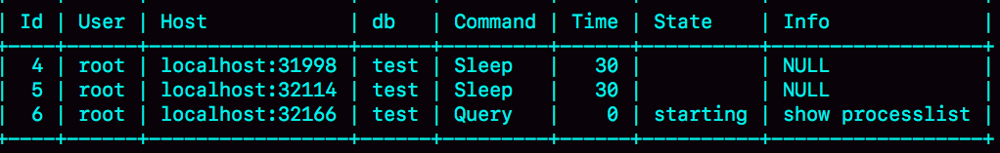

# week20

---

# Algorithm [814. Binary Tree Pruning](https://leetcode.com/problems/binary-tree-pruning/)
## 1. 问题描述
修剪二叉树

给一个二叉树的根 root，且二叉树中节点的值只包含 0,1

要求剪掉所不包含值为 1 的节点的所有子树，并返回新树的树根 root

## 2. 解题思路
后序遍历：
1. 递归计算左子树中所有节点的和，如果等于 0 ，则剪掉
2. 递归计算右子树中所有节点的和，如果等于 0， 则剪掉

## 3. 代码
```go
type TreeNode struct {
	Val int
	Left *TreeNode
	Right *TreeNode
}

func prunceTree(root *TreeNode) *TreeNode {
	sum := sumTree(root)
	if sum == 0 {
		return nil
	}
	return root
}

func sumTree(root *TreeNode) int {
	if root == nil {
		return 0
	}
	leftSum := sumTree(root.Left)
	rightSum := sumTree(root.Right)
	if leftSum == 0 {
		root.Left = nil
	}
	if rightSum == 0 {
		root.Right = nil
	}
	return root.Val + leftSum + rightSum
}
```
## 4. 复杂度分析
* 时间复杂度: O(N), N 为树中节点个数，需要全遍历一遍
* 空间复杂度: O(logN) 需要树的高度的栈深度

---

# Review [How a Googler solves coding problems](https://blog.usejournal.com/how-a-googler-solves-coding-problems-ec5d59e73ec5)
## 一步一步地
## 1）画出来
不要急于写代码，甚至不要想代码应该怎么写。先构思，在纸上画一画。

把想法用算法和形式化的方式写出来。
## 2）用文字写出来
把你的算法一步一步的写出来
## 3）写伪代码
先写伪代码
## 4）将伪代码翻译成代码
尽可能的把伪代码翻译成代码
## 5）不要猜测
你不确定的事情越多，你的程序出错的概率就越大。

其遵循如下公式： a(n)=2<sup>n</sup> - 1

通过 Google 搜索，不确定部分的代码，并进行测试

---

# Tip

## 

---
    
# Share 22 MySQL有哪些“饮鸩止渴”提高性能的方法？ —— 极客时间 MySQL实战45讲
## 短连接风暴
MySQL 建立连接的成本是很高的。

短连接模型中，如果数据库处理的慢一些，连接数就会暴涨。

max_connections 参数，用来控制 MySQL 实例同时存在的连接数的上限，超过这个值，系统会拒绝连接，并返回
“Too many connections”错误。

遇到这种情况，如果只是单纯的调大 max_connections 的值的话，是有风险的，MySQL 很有可能会耗尽系统资源，如 CPU、内存等

那么是否还有其他办法呢? 这里还有两种方法，但都是有损的。

### 第一种方法：先处理掉那些占着连接但是不工作的线程
* 可以通过 kill connection 主动踢掉
* 设置 wait_timeout，一个线程空闲 wait_timeout 这么多秒之后，就会被 MySQL 直接断开

在 show processlist 的结果中，踢掉 sleep 的线程，可能是有损的

| | session A | session B | session C |
| --- | --- | --- | --- |
| T | begin; <br> insert into t values(1,1); | select * from t where id=1; | |
| T +30s | | | show processlist; |

如果断掉 A 的连接，因为 A 还没有提交，所以 MySQL 会回滚事务，而断开 B 则不会有太大影响。所以应该优先断开 B 的连接。

怎么判断哪些事务外空闲的呢？ C 是在 T 时刻之后 30 秒执行的 show  processlist

要看事务具体状态的话，可以查看 information_schema 库的 innodb_trx 表

trx_mysql_thread_id=4 表示 id=4 的线程还处在事务中

因此，如果连接数过多，可以优先考虑断开事务外空闲太久的连接，如果还不行，再考虑断开事务内空闲太久的连接。

从服务端断开连接的命令是 kill connection +id 。处于 sleep 状态的客户端不会感知到服务器端的断开，直到客户端再次发起下一个请求，会收到
报错 "ERROR 2013 (HY000): Lost connection to MySQL server during query"

服务端主动断开连接可能是有损的，尤其是有的应用端收到这个错误后，不重新连接，而是直接用这个已经不能用的句柄重试查询。

### 第二种方法：减少连接过程的消耗
有的业务代码会在短时间内先申请大量的连接备用，如果确认数据库是被连接行为打挂了，可以先让数据库跳过权限验证阶段。

重启数据库，并使用 --skip-grant-tables 启动，来跳过权限验证

MySQL 8.0 版本中，如果启用了 --skip-grant-tables 参数，MySQL 会默认把 --skip-networking 参数打开，表示这时候数据库只能被本地的客户端连接。

## 慢查询性能问题
MySQL 中会引发性能问题的慢查询，大体有三种可能：
1. 索引没有设计好
2. SQL 语句没写好
3. MySQL 选错了索引
### 索引没有设计好
紧急创建索引，MySQL 5.6 之后创建索引都支持 Online DDL，直接执行 alter table

比较理想的是在备库先执行，假设你有一主一备，主库 A ，备库 B，流程如下：
1. 备库 B 上执行 set sql_log_bin=off; 也就是不写 binlog，然后执行 alter table 语句加上索引
2. 执行主备切换
3. 这时候主库是 B， 备库是 A。在 A 上执行 set sql_log_bin=off, 然后执行 alter table 语句加上索引

平时做变更时，应该考虑类似 gh-ost 这样的方案

### 语句没写好
改写 SQL 语句， MySQL 5.7 提供了 query_rewrite 功能，可以把输入的一种语句改写成另一种模式

比如，错误语句 select * from t where id+1=10000,你可以增加语句改写规则
```sql
mysql> insert into query_rewrite.rewrite_rules(pattern, replacement, pattern_database) values ("select * from t where id + 1 = ?", "select * from t where id = ? - 1", "db1");

call query_rewrite.flush_rewrite_rules();
```


### MySQL 选错了索引
应急方案就是加上 force index

也可以使用重写功能，给原来的语句加上 force index

预先发现问题，从而避免问题：
1. 上线前，在测试环境，把慢查询日志(show log)打开，并且把 long_query_time 设置成 0，确保每个语句都会被记录入慢查询日志
2. 在测试表里插入模拟线上的数据，做一遍回归测试
3. 观察慢查询日志里的每类语句的输出，特别留意 Rows_examined 字段是否与预期一致。

可以使用一些开源工具，如 [pt-query-digest](https://www.percona.com/doc/percona-toolkit/3.0/pt-query-digest.html)

## QPS 突增问题
业务突发高峰，或者 bug，都有可能导致 QPS 突增，从而导致 MySQL 压力过大，影响业务。

如果由于新功能上线的 bug 导致，最好就是让业务把这个功能下线

如果从数据库端处理的话，对应不同的背景，有不同的方法可用：
1. 一种是由全新业务的 bug 导致的。假设你的 DB 运维是比较规范的，也就是说白名单是一个个加的。在这种情况下，如果你能够确定业务方会下掉
这个功能，只是时间上没那么快，那么就可以从数据库端直接把白名单去掉。
2. 如果这个新功能使用的是单独的数据库用户，可以用管理员账号把这个用户删掉，然后断开现有连接。
这样，这个新功能的连接不成功，由它引发的QPS就会变成 0.
3. 如果这个新增的功能跟主功能是部署在一起的，那么我们只能通过处理语句来限制。这时，我们可以使用查询重写功能，把压力最大的 SQL 语句直接
重写成 "select 1" 返回

当然，这些操作风险也很高，需要你特别细致。它可能存在以下副作用：
1. 如果别的功能里也用到了这个 SQL 语句模板，会有误伤
2. 很多业务并不能靠这一个语句就能完成逻辑的，所以如果单独把这一个语句以 select 1 的结果返回的话，可能会导致后面的业务逻辑一起失败


