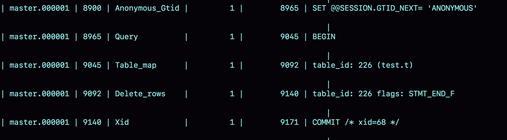
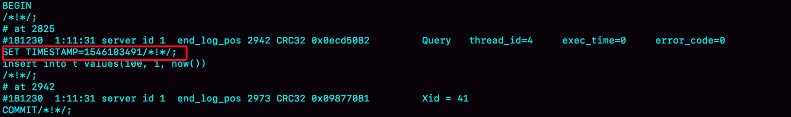
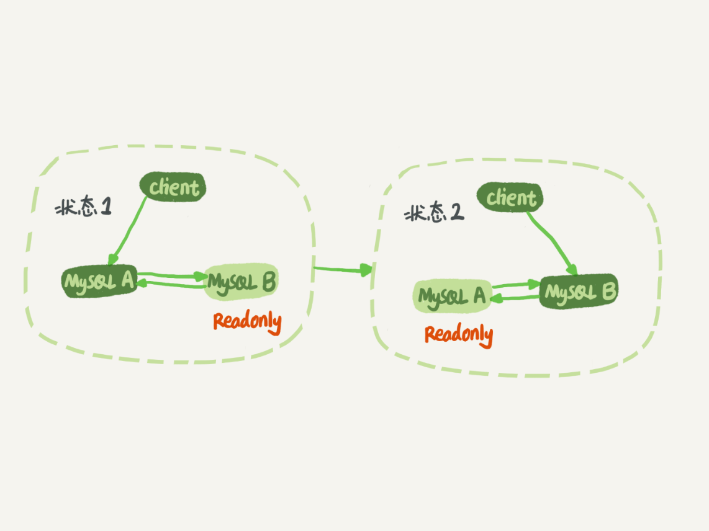

# week22

---

# Algorithm [1161. Maximum Level Sum of a Binary Tree](https://leetcode.com/problems/maximum-level-sum-of-a-binary-tree/)
## 1. 问题描述
找到二叉树中层中节点和最大的那一层

给定一个二叉树的根 root，root 的层是 1，root 的左右儿子的层是 2，以此类推。

将节点按照层进行分类，计算每一层所有节点的和，返回和最大的那个层的层号，如果有和相同的层，则返回最小的那层的层号。

示例 1：

* 输入：[1,7,0,7,-8,null,null]
* 输出：2
* 解释：
    * 第 1 层 sum = 1
    * 第 2 层 sum = 7 + 0 = 7
    * 第 3 层 sum = 7 + (-8) = -1
    * 所以和最大的层的层号为 2

## 2. 解题思路
广度优先搜索，计算每一层的所有节点的和。

## 3. 代码
```go
type Element struct {
	node *TreeNode
	Level int
}
func maxLevelSum(root *TreeNode) int {
    if root == nil {
		return 0
	}
	maxSum := 0
	maxLevel := 1
	curSum := 0
	curLevel := 1
	elements := []*Element{&Element{root, 1}}

	for len(elements) > 0 {
		ele := elements[0]
		elements = elements[1:]
		node := ele.node
		level := ele.Level
		if node.Left != nil {
			elements = append(elements, &Element{node.Left, level + 1})
		}
		if node.Right != nil {
			elements = append(elements, &Element{node.Right, level + 1})
		}

		if level == curLevel {
			curSum += node.Val
		} else {
			if curSum > maxSum {
				maxSum = curSum
				maxLevel = curLevel
			}
			curSum = node.Val
			curLevel = level
		}
	}

	return maxLevel
}
```
## 4. 复杂度分析
* 时间复杂度： O(N) N 为树的节点个数，只需遍历一遍树的所有节点
* 空间复杂度： O(2<sup>H</sup>) H 为树高，root 的高为 1，因为数组 elements 最多需要存储一层的所有节点。
一个满二叉树的最后一层的节点数最多，为 2<sup>H</sup> 个。

---

# Review [How to Read 2 Books a Week](https://forge.medium.com/how-to-read-two-books-a-week-414f4d3148e8)
如何一年读 100 本书？如何一周读 2 本书？

大部分人每小时大概可以读 50 页。如果你一周花 10 个小时读书，那么一年的时间，你可以读 26000 页。
假设每本书 250 页，那么一年可以读 104 本书。

如何做？

## 批量购书
在家里存大量书，这样你就没有借口说没有书可以读了。

根据自己的感觉走，喜欢读哪本书就读哪本，不要把时间都花在纠结先读哪本书上。

只有当你不读那本书的时候，花钱买那本书才是浪费。

## A(always) B(be) R(reading) 保持一直读书

每个工作日至少花一个小时读书，周末要花更多的时间。不要总是抱怨自己没时间：
* 可以在地铁上读
* 吃饭时读
* 看病时读
* 上厕所时读
* 工作休息时读

## Don’t force it 顺其自然
不要出于责任感去读书，也不要强迫自己去读自己不想读的东西。
## 同时阅读多本书
可以并行读多本书，比如早晨读 50 页 A，晚上读 50 页 B，等等
## 记住你读过的东西
如何记住读过的东西：
* 阅读时，标记重要的行。
* 如果读到你想要记住的东西，叠上这一页的角
* 读完这本书时，回到折页，浏览笔记
* 写下读后感
* 复制你认为最经典的句子

愚人从经验中学习，我更喜欢从别人的经验中学习。


---

# Tip

## 

---
    
# Share 24 MySQL是怎么保证主备一致的？ —— 极客时间 MySQL实战45讲
binlog 可以用来归档，也可以用来做主备同步。
## MySQL 主备的基本原理

状态1 ，客户端读写 A，B 是 A 的备库，只是将 A 的更新都同步过来，到本地执行。

状态2，A 是 B 的备库。

状态 1 中，虽然 B 没有被直接访问，但是依然建议设置成 readonly 模式，因为：
1. 有时候一些运营类的语句会放到 B 库上去查，设置为 readonly 可以防止误操作
2. 防止切换逻辑有 bug， 比如切换时造成双写，造成主备不一致
3. 可以用 readonly 状态，来判断节点的角色

readonly 设置对超级（super）权限用户是无效的，而用于同步更新的线程是拥有超级权限的。所以 readonly 不影响同步。

同步的详细流程：

B 和 A 直接维持一个长连接。A 内部有一个线程，专门用于服务备库 B 的这个长连接。

一个事务日志同步的完整流程如下：
1. 在备库 B 上通过 change master 命令，设置主库 A 的 IP、端口、用户名、密码，以及要从哪个位置开始请求 binlog，这个位置包含文件名和日志偏移量。
2. 在备库 B 上执行 start slave 命令，这时候备库会启动两个线程，就是图中的 io_thread 和 sql_thread。其中 io_thread 负责与主库建立连接。
3. 主库 A 校验完用户名、密码后，开始按照备库 B 传过来的位置，从本地读取 binlog，发给 B
4. 备库 B 拿到 binlog 后，写到本地文件，称为中转日志(relay log)
5. sql_thread 读取中转日志，解析出日志里的命令，并执行

后来由于多线程方案的引入，sql_thread 演化成为了多个线程。

## binlog 的三种格式对比
binlog 有三种格式
* statement : 记录sql语句
* row : 记录数据行
* mixed : 以上两种格式的混合

建表和初始化：
```sql
mysql> CREATE TABLE `t` (
  `id` int(11) NOT NULL,
  `a` int(11) DEFAULT NULL,
  `t_modified` timestamp NOT NULL DEFAULT CURRENT_TIMESTAMP,
  PRIMARY KEY (`id`),
  KEY `a` (`a`),
  KEY `t_modified`(`t_modified`)
) ENGINE=InnoDB;

insert into t values(1,1,'2018-11-13');
insert into t values(2,2,'2018-11-12');
insert into t values(3,3,'2018-11-11');
insert into t values(4,4,'2018-11-10');
insert into t values(5,5,'2018-11-09');

```
用 MySQL 客户端做实验的话需要加上 -c 参数。

当 binlog_format=statement 时，binlog 中记录的是 SQL 的原文：
```sql
mysql> delete from t /*comment*/  where a>=4 and t_modified<='2018-11-10' limit 1;
mysql> show binlog events in 'master.000001';
```

* 第一行 SET @@SESSION.GTID_NEXT='ANONYMOUS' 后续文章会介绍
* 第二行 BEGIN，跟第四行 COMMIT 对应，表示中间是一个事务
* 第三行 是真实的执行语句。在 delete 之前还有一个 use test ，这条命令是 MySQL 自行添加的，这条语句可以防止备库在其他库上执行。
后边的 delete 就是我们执行的 delete 语句。
* 最后一行是 COMMIT。其中还有一个 xid=61。
XID 用于关联 redo log 和 binlog，redo log 和 binlog 有一个共同的数据字段，xid。崩溃恢复的时候，会按顺序扫描 redo log，
如果碰到只有 prepare 而没有 commit 的 redo log ，就拿着 xid 去 binlog 中找对应的事务。

为了说明 statement 和 row 的区别，我们来看一下 delete 语句的执行效果：

产生了一个 warning，原因是当前 binlog 设置的是 statement 格式，并且语句中有 limit，所以这个命令是 unsafe 的。

delete 带 limit 可能会导致主备不一致：
1. 如果 delete 语句使用的是索引 a，那么会根据索引 a 找到第一个满足条件的行，也就是说删除的是 a=4 这一行
2. 但如果使用的是索引 t_modified ，那么删除的就是 t_modified='2018-11-09' 也就是 a=5 的这一行。

由于 statement 记录的是语句原文，因此可能会出现这样一种情况：在主库执行 SQL 的时候，用的是索引 a；而在备库执行这条 SQL 的时候却使用的是索引 t_modified.

设置 binlog_format='row'

binlog 里没有 SQL 语句的原文，而是替换成了两个 event： Table_map 和 Delete_rows

1. Table_map event, 用于说明接下来要操作的表是 test 库的表 t
2. Delete_rows event, 用于定义删除的行为

需要使用 mysqlbinlog 工具，才能查看 binlog 内容，binlog 是从 8900 这个位置开始的，可以用 start-position 参数来指定从这个位置开始解析。
```sql
mysqlbinlog  -vv data/master.000001 --start-position=8900;
```

* server id 1, 表示这个事务是在 server_id=1 的这个库上执行的
* 每个 event 都有 CRC32 的值，这是因为设置了参数 binlog_checksum 为 CRC32
* Table_map event 显示了接下来要打开的表，map 到数字 226。如果操作了多张表，每张表都有一个对应的 Table_map event,
都会 map 到一个单独的数字，用于区分对不同表的操作
* 我们在 mysqlbinlog 的命令中，使用 -vv 参数是为了把内容都解析出来，所以从结果里面可以看到各个字段的值（比如，@1=4，@2=4）
* binlog_row_image 的默认配置是 FULL，因此 Delete_event 里面，包含了删掉的行的所有字段的值。
如果把 binlog_row_image 设置成 MINIMAL，则只会记录必要的信息，在这个例子里，就只会记录 id=4 这个信息。
* Xid event，用于表示事务被正确的提交了

当 binlog_format='row' 时，binlog 里记录了真实删除行的主键 id，这样 binlog 传到备库时，就肯定会删除 id=4 的行，不会有主备不一致的问题了。

## 为什么会有 mixed 格式的 binlog
mixed 是 statement 和 row 格式的混合格式
* 因为 statement 格式的 binlog 可能会导致主备不一致，所以要用 row 格式
* 但 row 格式的缺点是占用空间。比如 delete 掉 10万行数据，用 statement 只需记录一条语句，占用十几个字节的空间，如果用 row 格式，
则需要记录 10 万条数据，不仅占用大量的空间，同时也会消耗 IO 资源，影响执行速度。
* MySQL 的折中方案：mixed 格式。MySQL 会判断语句是否可能引起主备不一致，如果可能，就用 row 格式，否则就用 statement 格式

设置成 row 格式的好处：恢复数据
* delete : row 格式的 binlog 记录了 delete 的整行的数据，恢复时，直接将 delete 转成 insert 语句即可
* insert : insert 语句的 binlog 记录所有字段，这些信息可以精确地定位到刚刚被插入的哪一行，恢复时，直接转成 delete
* update : binlog 中记录修改前的整行数据和修改后的整行数据，恢复时，把这个 event 前后两行信息对调一下执行即可

MariaDB 的 Flashback 工具就是基于上面介绍的原理来回滚数据的

mixed 格式，执行如下语句：
```sql
mysql> insert into t values(10,10, now());
```
执行效果

MySQL 记录的是 statement 格式，但是如果过了 1 分钟再传给备库如何保证数据一致性呢？

查看 binlog

在 binlog 的 event 中有一条命令 SET TIMESTAMP=1546103491，用来约定 now() 的返回值

用 binlog 恢复数据的标准做法是，用 mysqlbinlog 工具解析 binlog，然后把解析结果整个发给 MySQL 执行。

例如，将 master.000001 文件中从第 2738 字节到第 2973 字节中间这段内容解析出来，放到 MySQL 中执行：
```sql
mysqlbinlog master.000001  --start-position=2738 --stop-position=2973 | mysql -h127.0.0.1 -P13000 -u$user -p$pwd;
```

## 循环复制问题
log_slave_updates=on 表示备库执行 relay log 后生成 binlog， 建议开启此配置

双 M 结构

A 上执行一条更新语句，然后将 binlog 发给节点 B， B 执行完这条语句后生成 binlog，将 binlog 发给 A，行程死循环。

MySQL 在 binlog 中记录了这个命令第一次执行时所在实例的 server id。用如下逻辑解决死循环问题：
1. 规定两个库的 server id 必须不同，如果相同，则它们之间不能设定主备关系
2. 一个备库连接到 binlog 并在重放的过程中，生成与原 binlog 的 server id 相同的新的 binlog
3. 每个库在收到从自己的主库发过来的日志后，先判断 server id， 如果跟自己的相同，表示这个日志是自己生成的，就直接丢弃这个日志

按照以上逻辑，双 M 结构，日志执行流程如下：
1. 从节点 A 更新的事务，binlog 里面记的都是 A 的 server id
2. 传到节点 B 执行一次以后，节点 B 生成的 binlog 的 server id 也是 A 的 server id
3. 再传回给节点 A， A 判断到这个 server id 与自己的相同，就不会再处理这个日志。所以，死循环在这里就断了

## 问题 ：通过 server id 断掉死循环并不完备，那在什么场景下会出现死循环呢？
* 场景一：在主库更新事务后，用命令 set global server_id=x 修改了 server_id,等日志再传回来的时候，
发现 server_id 跟自己的不同，就只能执行了。

* 场景二：有三个节点的时候，trx1 是在节点 B 执行的，因此 binlog 上的 server_id 是 B，binlog 传给节点 A ，
然后节点 A 和 A' 搭建了双 M 结构，就会出现死循环。


这种三节点复制的场景，做数据库迁移的时候会出现。

如果出现了循环复制，可以在 A 或 A' 上，执行如下命令：
```sql
stop slave；
CHANGE MASTER TO IGNORE_SERVER_IDS=(server_id_of_B);
start slave;
```
这样这个节点收到日志后就不会再执行。过一段时间后，再执行下面的命令把这个值改回来：
```sql
stop slave；
CHANGE MASTER TO IGNORE_SERVER_IDS=();
start slave;
```


