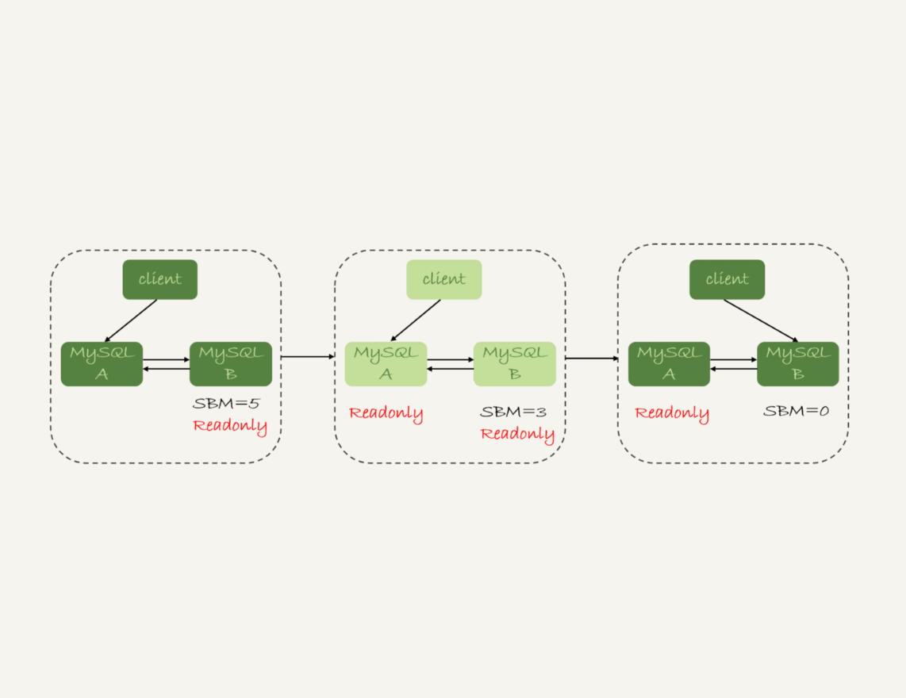
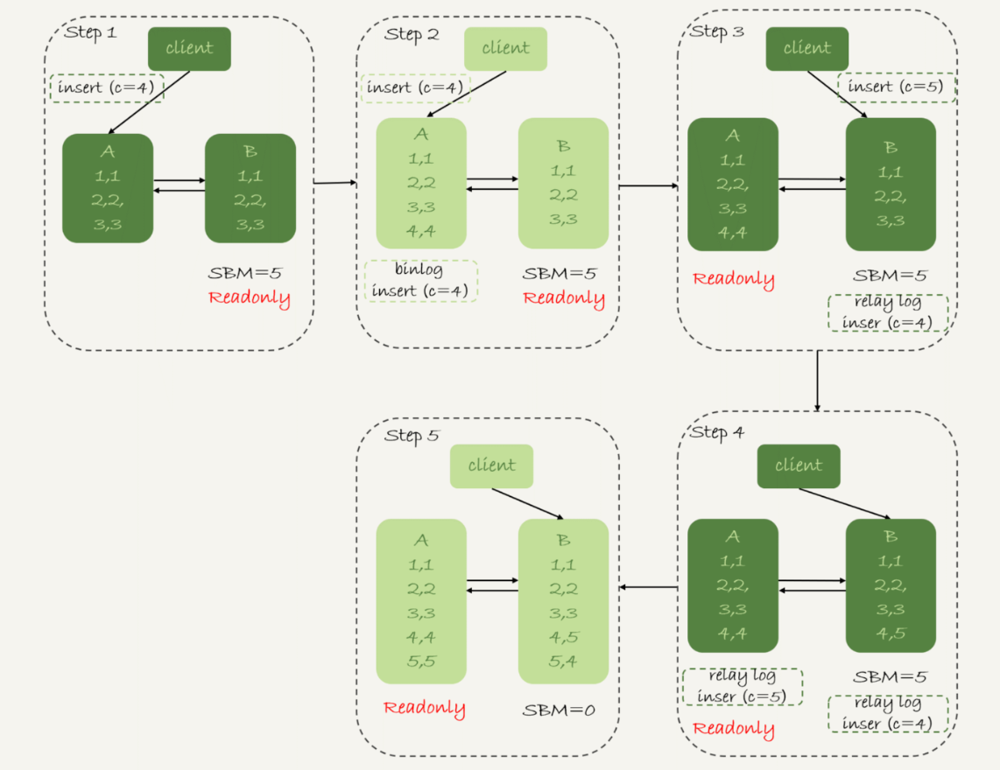
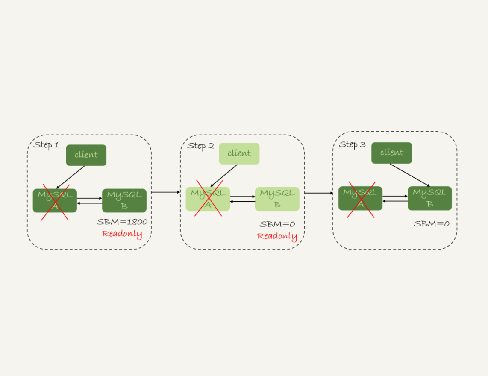

# week

---

# Algorithm [890. Find and Replace Pattern](https://leetcode.com/problems/find-and-replace-pattern/)
## 1. 问题描述
给一个单词列表，给一个模式，找出符合模式的单词。

返回符合模式的所有单词列表。

示例：
* 输入: words = ["abc","deq","mee","aqq","dkd","ccc"], pattern = "abb"
* 输出: ["mee","aqq"]
* 解释: "mee" {a -> m, b -> e}, "aqq" {a -> a, b -> q}

## 2. 解题思路
用两个 map : m,n 分别记录 word -> pattern 和 pattern -> word 的映射。

* m 可以校验 "aa" -> "xy" 类型的错误，m[a] = x, m[a] = y
* n 可以校验 "ab" -> "xx" 类型的错误, n[x] = a, n[x] = b

## 3. 代码
```go
func findAndReplacePattern(words []string, pattern string) []string {
	res := []string{}
	lp := len(pattern)
	for _,word := range words {
		var m = make(map[uint8]uint8)
		var n = make(map[uint8]uint8)
		l := len(word)
		if  l != lp {
			continue
		}
		flg := true
		for i := 0; i < l; i++ {
			if m[pattern[i]] == 0 && n[word[i]] == 0 {
				m[pattern[i]] = word[i]
				n[word[i]] = pattern[i]
			} else if m[pattern[i]] == word[i] && n[word[i]] == pattern[i] {
				continue
			} else {
				flg = false
				break
			}
		}
		if flg {
			res = append(res, word)
		}
	}
	return res
}
```
## 4. 复杂度分析
* 时间复杂度: O(N*K) N 是单词个数，K 是单词长度
* 空间复杂度: O(N*K) res 使用的空间

---

# Review []()

---

# Tip

## 

---
    
# Share 25 MySQL是怎么保证高可用的？—— 极客时间 MySQL实战45讲
最终一致性：正常情况下，主库执行的更新操作生成的所有 binlog，都可以正确地传到备库执行，备库就能达到跟主库一致的状态。
## 主备延迟
主备切换：
* 主动切换：运维、软件升级、主库所在机器按计划下线等
* 被动切换：主库所在机器掉电

同步延迟

数据同步有关的时间点：
1. 主库 A 执行完成一个事务，写入 binlog， 此时刻记为 T1
2. 之后传给备库 B，B 库接收完这个 binlog，此时刻记为 T2
3. 备库 B 执行完成这个事务，此时刻记为 T3

主备延迟即 T3 - T1

在备库上执行 show slave status 命令，返回结果中的 seconds_behind_master 表示主备延迟多少秒

seconds_behind_master 的计算方法：
1. 每个事务的 binlog 里都有一个时间字段，用于记录主库上写入的时间
2. 备库取出当前正在执行的事务的时间字段的值，计算它与当前系统时间的差值，得到 seconds_behind_master, 即 T3 - T1

备库连接到主库的时候，会通过执行 select unix_timestamp() 来获取当前主库的系统时间。如果这时候发现主库的系统时间与自己不一致，
备库在执行 seconds_behind_master 计算的时候会自动扣掉这个差值。

网络正常的情况下，日志从主库传给备库所需的时间很短，即 T2 - T1 的值很小。即网络正常时，主备延迟主要来源是备库接收完 binlog 和执行完
这个事务之间的时间差。

主备延迟最直接的表现是，备库消费中转日志（relay log）的速度，比主库生产 binlog 的速度要慢

## 主备延迟的来源
### 首先，有些部署条件下，备库所在的机器的性能要比主库所在机器的性能差
如此部署的想法：
1. 备库无请求（实际和主库的请求时一样的）
2. 20个主库放在4台机器上，而备库放在一台机器上

更新过程中触发大量的读操作，所以，当备库主机上的多个备库都在争抢资源的时候，就可能会导致主备延迟

现在比较常见的部署方式是 对称部署，即主备机器一样

对称部署也会有主备延迟，原因如下

### 备库的压力大
主库提供写能力，备库提供读能力。或者一些运营后台需要的分析语句，不能影响正常业务，所以只能在备库上执行。

这样就会导致备库上的查询耗费大量的 CPU 资源，影响了同步速度，造成主备延迟。

解决方案：
1. 一主多从。除了备库外，可以多接几个从库，让这些从库来分担读的压力
2. 通过 binlog 输出到外部系统，比如 Hadoop 这类系统，让外部系统提供统计类查询的能力

### 大事务
如果一个事务在主库上执行 10 分钟，那这个事务很可能就会导致从库延迟 10 分钟。
常见的大事物：
1. 一次性地用 delete 语句删除太多数据
2. 大表的 DDL 

### 备库的并行复制能力
后续文章讨论

## 由于主备延迟的存在，所以在主备切换时，就相应的有不同的策略。
## 可靠性优先策略

图中从 状态1 到 状态2 的详细过程：
1. 判断备库 B 现在的 seconds_behind_master，如果小于某个值（比如 5秒）继续下一步，否则持续重试这一步
2. 把主库 A 改成只读状态，即把 readonly 设置为 true
3. 判断备库 B 的 seconds_behind_master 的值，直到这个值变成 0 为止
4. 把备库 B 改成可读写状态，也就是把 readonly 设置成 false
5. 把业务请求切到备库 B

这个切换流程，一般由专门的 HA 系统来完成

图中 SBM 即 seconds_behind_master 的简写

在步骤 2 ~ 5 两个库都是 readonly 状态，此期间数据库服务不可用

步骤 3 最耗时，可能需要几秒的时间，因此要先在步骤 1 做判断

## 可用性优先策略
把 4、5 步调整到最开始执行，也就是说不等主备数据同步，直接把连接切换到备库 B，并且让备库 B 可以读写，那么系统几乎就没有不可用时间了。

此流程为可用性优先策略。其代价是可能出现数据不一致。

数据不一致的例子。
```sql
mysql> CREATE TABLE `t` (
  `id` int(11) unsigned NOT NULL AUTO_INCREMENT,
  `c` int(11) unsigned DEFAULT NULL,
  PRIMARY KEY (`id`)
) ENGINE=InnoDB;

insert into t(c) values(1),(2),(3);
```
初始化后，主备库都是 3 行数据，接下来在表 t 上执行两条插入语句
```sql
insert into t(c) values(4);
insert into t(c) values(5);
```
假设，现在主库上其他的数据表有大量的更新，导致主备延迟达到 5 秒，在插入一条 c=4 的语句后，发起主备切换

可用性优先策略，且 binlog_format=mixed

切换流程：
1. 步骤 2 中，主库 A 执行完 insert 语句，插入了一行数据 (4,4),之后开始进行主备切换。
2. 步骤 3 中，由于主备之间有 5 秒的延迟，所以备库 B 还没来得及应用"插入 c=4"这个中转日志，就开始接收到客户端"插入 c=5"的命令
3. 步骤 4 中，备库 B 插入一行数据 (4,5),并且把这个 binlog 发给主库 A
4. 步骤 5 中，备库 B 执行"插入 c=4"这个中转日志，插入了一行数据 (5,4)。而直接在备库 B 执行"插入 c=5"这个语句，传到主库 A，
就插入了一行新的数据 (5,5)

如果设置 binlog=row，会记录新插入的行的所有字段的值，所以最后只会有一行不一致。
而且，两边的主备同步的应用线程会报错 duplicate key error 并停止。
也就是说，这种情况下，备库 B 的 (5,4) 和主库 A 的 (5,5) 这两行数据，都不会被对方执行。

1. 使用 row 格式的 binlog 时，数据不一致的问题更容易被发现。而使用 mixed 或者 statement 格式的 binlog 时，数据很可能悄悄地就不一致了。
如果你过了很久才发现数据不一致的问题，很可能这时的数据不一致已经不可查，或者连带造成了更多的数据逻辑不一致。
2. 主备切换的可用性优先策略会导致数据不一致。因此，大多数情况下，都建议使用可靠性优先策略。
毕竟对数据服务来说的话，数据的可靠性一般还是要优先于可用性的

### 数据的可用性优先级更高的场景
* 有一个库的作用是记录操作日志。这时候，如果数据不一致可以通过 binlog 来修补，而这个短暂的不一致也不会引发业务问题
* 同时，业务系统依赖于这个日志写入逻辑，如果这个库不可写，会导致线上的业务操作无法执行

如果让业务逻辑不依赖于这类日志的写入，也就是说，日志写入模块降级处理，比如写本地文件，或者写到另一个临时库里面，这种场景就可以使用可靠性优先策略了。

### 按照可靠性优先的思路，异常切换会是什么效果？
假设主库 A 和 备库 B 之间的主备延迟是 30 分钟，这时候 A 掉电了，HA 系统要切换到 B 作主库。

A 掉电后，由于连接还没有切到备库 B ，所以整个系统处于不可用状态。

是否可以直接切换到备库 B ，但是保持 B 只读呢？这是不可以的。 这段时间内，中转日志还没有应用完成，如果直接发起主备切换，客户端查询看不到
之前执行完成的事务，会认为有"数据丢失"

虽然随着中转日志的继续应用，这些数据会恢复回来，但是对于一些业务来说，查询到"暂时丢失数据的状态"也是不能被接受的。

在满足数据可靠性的前提下，MySQL 高可用系统的可用性，是依赖于主备延迟的。延迟的时间越小，在主库故障的时候，服务恢复需要的时间就越短，可用性就越高。

## 问题
如果一个备库的延迟监控如图，是一个斜向上的 45° 线段，可能是什么原因导致的？

## 回答
* 大事物（包括大表 DDL， 一个事务操作很多行）
* 另一种比较隐蔽的情况，备库起了一个长事务
```sql
begin; 
select * from t limit 1;
```
然后就不动了。

这个时候主库对表 t 做了一个加字段操作，即使表很小，这个 DDL 在备库应用的时候也会被堵住，也不能看到这个现象。


