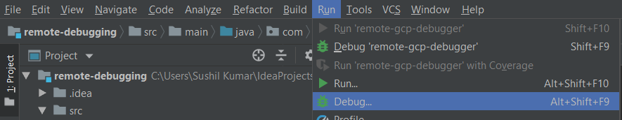
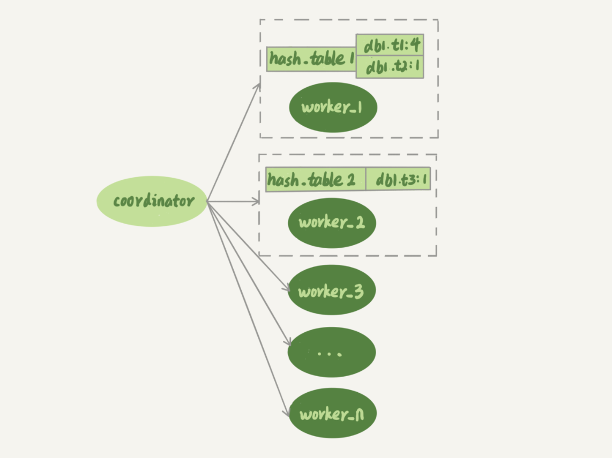

<script type="text/javascript" src="http://cdn.mathjax.org/mathjax/latest/MathJax.js?config=default"></script>
# week24

---

# Algorithm [5. Longest Palindromic Substring](https://leetcode.com/problems/longest-palindromic-substring/)
## 1. 问题描述
最长回文子串问题。

给定一个字符串 s ,找到 s 中的最长回文子串。s 的最大长度为 1000.

示例1:
* 输入: "baba"
* 输出: "bab"
* 注意: "aba" 也是一个合法的答案

示例2:
* 输入: "cbbd"
* 输出: "bb"

## 2. 解题思路
### 算法1：暴力法
嵌套循环获取每一个子串，判断每个子串是否是回文字符串，找到最大的
* 时间复杂度: O(N<sup>3</sup>)
* 空间复杂度: O(1)
### 算法2: 动态规划
P(i,j) = true 如果 S<sub>i</sub>...S<sub>j</sub> 是回文字符串

P(i,j) = false 其他情况

因此 P(i,j) = (P(i+1,j-1) && S<sub>i</sub>==S<sub>j</sub>)

P(i,i) = true

P(i,i+1) = (S<sub>i</sub>==S<sub>i+1</sub>)

* 时间复杂度: O(N<sup>2</sup>)
* 空间复杂度: O(N<sup>2</sup>)

### 算法3: 优化算法2的空间复杂
可以从中心向两边扩散找，长度为 N 的字符串的 S 的中心共有 2N-1 个中心。

为什么不是 N 个中心，因为一个偶数位的回文字符串有2个中心，例如 "abba"，两个 b 都是中心

* 时间复杂度: O(N<sub>2</sub>)
* 空间复杂度: O(1)
### 算法4: Manacher 算法
后续补充
* 时间复杂度: O(N)

## 3. 代码
算法3 
```go
func longestPalindrome(s string) string {
	l,start,end := len(s),0,0
	if l <= 1 {
		return s
	}
	for i := 0; i < l; i++ {
		l1 := expandAroundCenter(s, i, i)
		l2 := expandAroundCenter(s, i, i + 1)
		len := l1
		if l2 > len {
			len = l2
		}
		if len > (end - start) {
			start = i - (len - 1)/2
			end = i + len/2
		}
	}
	return s[start:end + 1]
}

func expandAroundCenter(s string, left int, right int) int {
	l := len(s)
	for left >= 0 && right < l && s[left] == s[right] {
		left--
		right++
	}
	return right - left - 1
}
```

## 4. 复杂度分析
* 时间复杂度: O(N<sub>2</sub>)
* 空间复杂度: O(1)

---

# Review [Remote debugging a Java Application running in Docker container with Intellij Idea](https://medium.com/swlh/remote-debugging-a-java-application-running-in-docker-container-with-intellij-idea-efe54cd77f02)
如何远程调试 Java

创建一个 Java 应用
```java
package com.kaysush;

public class App {
    public static void main(String[] args) {
        System.out.println("Starting the remote debugging application");
        System.out.println("The application will be running inside a docker image");
        int i = 0;
        while(true){
            System.out.println("Value of i is " + i);
            try {
                Thread.sleep(5000);
            } catch (InterruptedException e) {
                e.printStackTrace();
            }
            i++;
        }

    }
}
```

打成 jar 包

创建 docker file
```dockerfile
FROM openjdk:8
WORKDIR /app
ENV JAVA_TOOL_OPTIONS -agentlib:jdwp=transport=dt_socket,address=8000,server=y,suspend=n
COPY remote-debugging-1.0-SNAPSHOT.jar  remote-debugging.jar
ENTRYPOINT ["java", "-cp", "remote-debugging.jar", "com.kaysush.App"]
```
重点在第三行，JAVA_TOOL_OPTIONS 的值告诉 JRE 开启 JPDA session 从而支持 JWDP(Java Debug Wire Protocol) 远程调试

制作 docker 镜像
```dockerfile
docker build -t remote-debugger:0.1 .
```
运行 docker 
```jshelllanguage
docker run -d -p 8000:8000 remote-debugger:0.1
```
打开 idea ， Run > Debug > Edit Configuration 



点击 + 增加远程配置


* 选择 Attach to remote JVM 的 Debugger Mode
* 输入 IP 地址和端口
* 点击 Apply

Run > Debug 开始进行调试


---

# Tip 使用 docker 部署 gitlab
## docker 换成国内的源
```jshelllanguage
sudo vim /etc/docker/daemon.json
```
配置：
```json
{
  "registry-mirrors" : [
    "http://ovfftd6p.mirror.aliyuncs.com",
    "http://registry.docker-cn.com",
    "http://docker.mirrors.ustc.edu.cn",
    "http://hub-mirror.c.163.com"
  ],
  "insecure-registries" : [
    "registry.docker-cn.com",
    "docker.mirrors.ustc.edu.cn"
  ],
  "debug" : true,
  "experimental" : true
}
```
重启docker
```jshelllanguage
sudo service docker restart
```
## 拉取镜像
```jshelllanguage
docker pull gitlab/gitlab-ce
```
## 启动 gitlab
```jshelllanguage
docker run --detach \
--publish 443:443 --publish 80:80  --publish 10022:22 \
--name gitlab \
--memory 4g \
--restart always \
--volume /srv/gitlab/config:/etc/gitlab \
--volume /srv/gitlab/logs:/var/log/gitlab \
--volume /srv/gitlab/data:/var/opt/gitlab \
gitlab/gitlab-ce:latest
```
其中：
* --publish 暴露 https 端口 443， http 端口 80， ssh 端口 22
* --memory 限制容器最大内存 4G
* --volume 指定挂在目录，便于我们在本地备份和修改容器的相关数据

## 修改配置
```jshelllanguage
# 打开挂载的配置目录
vim /srv/gitlab/config/gitlab.rb

###################################################
# 添加外部请求的域名(如果不支持https, 可以改成http)
external_url 'https://gitlab.dream.com'
# 修改gitlab对应的时区 
gitlab_rails['time_zone'] = 'PRC'
# 开启邮件支持 
gitlab_rails['gitlab_email_enabled'] = true
gitlab_rails['gitlab_email_from'] = 'gitlab@dream.com'
gitlab_rails['gitlab_email_display_name'] = 'Dream GitLab'
# 配置邮件参数
gitlab_rails['smtp_enable'] = true
gitlab_rails['smtp_address'] = "smtp.mxhichina.com"
gitlab_rails['smtp_port'] = 25
gitlab_rails['smtp_user_name'] = "gitlab@dream.com"
gitlab_rails['smtp_password'] = "xxxxxx"
gitlab_rails['smtp_domain'] = "dream.com"
gitlab_rails['smtp_authentication'] = "login"
gitlab_rails['smtp_enable_starttls_auto'] = true
gitlab_rails['smtp_tls'] = false        
###################################################
```

配置 https
```jshelllanguage
# 进入挂载配置目录
cd /srv/gitlab/config
# 创建密钥文件夹, 并放入证书
mkdir ssl
# 内容如下
```

将证书放入 ssl 目录下
```jshelllanguage
xxx.crt
xxx.key
```

重启服务
```jshelllanguage
# 方法一: 重启容器
docker restart gitlab

# 方法二: 登陆容器, 重启配置
docker exec -it  gitlab bash   
gitlab-ctl reconfigure
```

---
    
# Share 26 备库为什么会延迟好几个小时？—— 极客时间 MySQL实战45讲

主备流程图

图中黑色箭头表示并行度，真实情况是主库的并行度远远高于备库的。

主库中影响并发度的是各种锁，备库上影响并行度的是 sql_thread 的逻辑，如果是单线程，则并行度远低于主库。

MySQL 5.6 之前，只支持单线程复制，因此如果主库的并发度高、TPS 高就会导致严重的主备延迟


多线程模型

图中的 coordinator 就是 sql_thread，不过现在它只负责读取中转日志和分发事务，worker 线程负责更新日志。

slave_parallel_workers 参数决定 worker 的个数，在 32 核物理机的情况下，根据经验把这个值设置为 8-16 之间最优。

coordinator 在分发的时候，需要满足以下条件：
1. 不能造成更新覆盖。所以更新同一行的两个事务，必须被分发到同一个 worker 中
2. 同一个事务不能被拆开，必须放到同一个 worker 中

## MySQL 5.5 作者（林晓斌）自研的两个并行复制策略
5.5 版本 MySQL 官方不支持并行复制，在业务需要前提下，作者自研了两个版本的并行策略
### 按表分发策略
如果两个事务更新的是不同的表，就可以并行。

按表并行复制模型

每个 worker 对应一个 hash 表，用于保存当前这个 worker 的"执行队列"里的事务所涉及的表

hash 表的 key 是 "库名.表名"， value 是一个数字，表示有多少个事务修改这个表

事务分配给 worker 时，事务里面涉及的表会被加入到对应的 hash 表中，worker 执行完成后，这个表会从 hash 表中去掉。

图中 hash_table_1 表示在 worker_1 中有 4 个事务涉及 db1.t1，有 1 个事务涉及 db2.t2， hash_table_2 表示 worker_2 中有一个事务涉及 t3

假设此时，coordinator 从中转日志中读入一个新的事务 T ，此事务修改的行涉及 t1 和 t3 则分配规则：
1. 因为 T 涉及了 t1 ，而 worker_1 中有事务在修改 t1 ，所以 T 与 worker_1 冲突
2. 依次判断 T 与每个 worker 的冲突关系，T 与 worker_2 冲突
3. T 与大于 1 个 worker 冲突，coordinate 线程进入等待状态
4. 每个 worker 继续执行，同时修改 hash_table。假设 hash_table_2 里面涉及的 t3 的事务先完成，
则从 hash_table_2 中把 db1.t3 移除
5. coordinator 发现跟 T 冲突的只剩下 worker_1，因此将其分配给 worker_1
6. coordinator 继续读取下一个中转日志，继续分配事务

每个事务分发时，跟所有 worker 的冲突关系：
1. 如果跟所有 worker 都不冲突，coordinator 就会把这个事务分配给最空闲的 worker
2. 如果跟多个 worker 冲突，则 coordinator 进入等待状态，直到只有一个冲突的 worker 为止
3. 如果只跟一个 worker 冲突，则把这个事务分配给这个 worker

按表分配在多表负载的情况下效果良好。但是，如果碰到热点表，则很有可能在某一时刻所有事务都被分配给同一个 worker ，退化成单线程复制。

### 按行分发策略
如果两个事务没有更新相同的行，它们在备库上可以并行执行。因此此模式要求 binlog 必须为 row 格式。

判断 T 与 worker 是否冲突，需要看是否是"修改的同一行"

hash 表中的 key 为 "库名 + 表名 + 唯一键的值"

唯一键除了主键之外还要包含唯一索引

```sql
CREATE TABLE `t1` (
  `id` int(11) NOT NULL,
  `a` int(11) DEFAULT NULL,
  `b` int(11) DEFAULT NULL,
  PRIMARY KEY (`id`),
  UNIQUE KEY `a` (`a`)
) ENGINE=InnoDB;

insert into t1 values(1,1,1),(2,2,2),(3,3,3),(4,4,4),(5,5,5);
```
| session A | session B |
| --- | --- |
| update t1 set a=6 where id=1; | |
| | update t1 set a=1 where id=2; |

A B 如果分配到不同的 worker ，B 先执行就会报唯一键冲突错误

因此 hash 表中的 key 还需要考虑唯一键："库名 + 表名 + 索引a的名字 + a的值"

因此在 coordinator 解析这个语句的 binlog 时，这个事务的 hash 表就有三项：
1. key = hash_func(db1 + t1 + "PRIMARY" + 2), value=2;这里 value=2 是因为修改前后的行 id 值不变，出现了 2 次
2. key = hash_func(db1 + t1 + "a" + 2), value=1,表示会影响到这个表 a=2 的行
3. key = hash_func(db1 + t1 + "a" + 1), value=1, 表示会影响到这个表 a=1 的行

相比于按表分发策略，按行策略在决定线程分发时，需要消耗更多的计算资源。

这两个方案都有一些约束条件：
1. 要能够从 binlog 里面解析出表名、主键值和唯一索引的值。也就是说，主库的 binlog 格式必须是 row
2. 表必须有主键
3. 不能有外键。表上如果有外键，级联更新的行不会记录在 binlog 中，这样冲突检测就不准确了

对边按表和按行分发，按行分发并行度更高。不过，如果是要操作很多行的大事务的话，按行分发的策略有两个问题：
1. 耗费内存。比如一个语句要删除 100 万行数据，这时候 hash 表就要记录 100 万个项
2. 耗费 CPU。解析 binlog，然后计算 hash 值，对于大事务，这个成本还是很高的

所以需要设置一个阈值开关，比如如果单事务更新超过 10 万行，就暂时退化为单线程。

退化逻辑：
1. coordinator 暂时先 hold 住这个事务
2. 等待所有 worker 都执行完成，变成空队列
3. coordinator 直接执行这个事务
4. 恢复并行模式

## MySQL 5.6 版本的并行策略
按库并行

相比按表和按行分发的优势：
1. 构造 hash 时很快，只需要库名；而且一个实例上 DB 数也不会很多，不会出现需要构造 100 万个项这种情况
2. 不要求 binlog 格式。因为 statement 格式的 binlog 也可以很容易拿到库名

但是如果主库上的表都放到一个 DB 中这个策略就无效了，或者不同 DB 的热点不同，比如一个逻辑库，一个系统配置库

## MariaDB 的并行复制策略
redo log 组提交(group commit) 优化，MariaDB 的并行复制策略利用的就是这个特性：
1. 能够在同一组里提交的事务，一定不会修改同一行
2. 主库上可以并行执行的事务，备库上也一定是可以并行执行的

MariaDB 的做法：
1. 在一组里面一起提交事务，有一个相同的 commit_id, 下一组就是 commit_id + 1
2. commit_id 直接写到 binlog 里面
3. 传到备库应用的时候，相同 commit_id 的事务分发到多个 worker 执行
4. 这一组全部执行完成后，coordinator 再去取下一批

此策略目标是"模拟主库的并行模式"

但并没有真正模拟主库的并发度。在主库上一组事务在 commit 时，下一组事务是同时处于"执行中"状态的


主库并行事务

trx1、2、3 提交时，trx4、5、6 是执行的


MariaDB 并行复制，备库并行效果

要等第一组执行完成，第二组事务才能开始执行。

另外这个方案很容易被大事物拖后腿。

但是它对原系统的改造非常少，实现也很优雅。

## MySQL 5.7 的并行复制策略
MySQL 5.7 提供了类似于 MariaDB 功能。由参数 slave-parallel-type 来控制并行复制策略：
1. 配置为 DATABASE，表示使用 MySQL 5.6 版本的按库并行策略
2. 配置为 LOGICAL_CLOCK, 表示的就是类似于 MariaDB 的策略。不过，MySQL 5.7 这个策略，针对并行度做了优化。

同时处于"执行状态"的所有事务，是否可以并行？ 答案是：不能。因为可能有锁冲突。

而 MariaDB 的核心是"所有处于 commit"状态的事务可以并行。事务处于 commit 状态，表示已经通过了锁冲突的检验了。


两阶段提交细化过程图

到达 redo log prepare 阶段，就已经通过锁冲突的检验了

MySQL 5.7 并行复制策略的思想是：
1. 同时处于 prepare 状态的事务，在备库执行时是可以并行的
2. 处于 prepare 状态的事务，与处于 commit 状态的事务之间，在备库执行时也是可以并行的

1. binlog_group_commit_sync_delay 表示延迟多少微妙后才调用 fsync
2. binlog_group_commit_sync_no_delay_count 表示累积多少次以后才调用 fsync

这两个参数用于故意拉长 binlog 从 write 到 fsync 的时间，以减少写盘次数。在 MySQL 5.7 的并行复制策略里，
它们可以用来制造更多的"同时处于 prepare 阶段的事务"。从而增加备库复制的并行度。

## MySQL 5.7.22 的并行复制策略
基于 WRITESET 的并行复制

增加参数  binlog-transaction-dependency-tracking 用来控制是否启用这个新策略，有三个可选值：
1. COMMIT_ORDER，表示根据同时进入 prepare 和 commit 来判断是否可以并行的策略
2. WRITESET，表示是对事务涉及更新的每一行，计算出这一行的 hash 值，组成集合 writeset。如果两个事务没有操作相同的行，
也就是说 writeset 没有交集，就可以并行
3. WRITESET_SESSION ，是在 WRITESET 的基础上多了一个约束，即在主库上同一个线程先后执行的两个事务，在备库执行时，要保证相同的先后顺序

hash 值是通过"库名 + 表名 + 索引名 + 值"计算出来的。如果一个表除了主键外，还有其他唯一索引，那么对于每一个唯一索引，
insert 语句对应的 writeset 就要多增加一个 hash 值

比 5.5 版本的优势：
1. writeset 是在主库生成后直接写入到 binlog 里面的，这样在备库执行的时候，不需要解析 binlog 内容（event 里的行数据），节省了很多计算量
2. 不需要把整个事务的 binlog 都扫一遍才能决定分发到哪个 worker，更省内存
3. 由于备库的分发策略不依赖于 binlog 内容，所以 binlog 是 statement 格式也是可以的

对于"表上没有主键"和"外键约束"的场景，WRITESET 也是没法并行的，需要退化为单线程模型。

5.7 版本新增的备库并行策略，修改了 binlog 的内容，也就是说 binlog 协议并不是向上兼容的，在主备切换、版本升级的时候需要把这个因素也考虑进去。

## 问题：
假设一个 MySQL 5.7.22 版本的主库，单线程插入了很多数据，过了 3 个小时后，我们要给这个主库搭建一个相同版本的备库。

为了更快地让备库追上主库，要开并行复制，如何设置 binlog-transaction-dependency-tracking 参数？

* 答：
设置成 WRITESET 

由于主库是单线程压力模式，所以每个事务的 commit_id 都不同，那么设置 COMMIT_ORDER 模式的话，从库也只能单线程执行

同样地，由于 WRITESET_SESSION 模式要求在备库应用日志的时候，同一个线程的日志必须与主库上执行的先后顺序相同，也会导致主库单线程压力模式下
退化成单线程复制。


