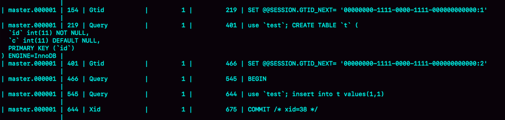
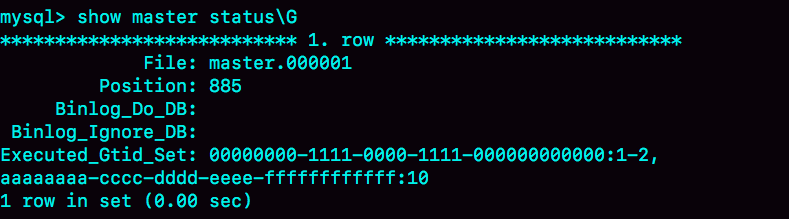

# week24

---

# Algorithm []()
## 1. 问题描述

## 2. 解题思路

## 3. 代码

## 4. 复杂度分析

---

# Review []()

---

# Tip

## 

---
    
# Share 27 主库出问题了，从库怎么办？—— 极客时间 MySQL实战45讲

一主多从基本结构

A和A'互为主备，从库 B、C、D 指向 A


一主多从基本结构 —— 主备切换

## 基于位点的主备切换
把 B 设置成节点 A' 的从库的时候，需要执行一条 change master 命令：
```sql
CHANGE MASTER TO 
MASTER_HOST=$host_name 
MASTER_PORT=$port 
MASTER_USER=$user_name 
MASTER_PASSWORD=$password 
MASTER_LOG_FILE=$master_log_name 
MASTER_LOG_POS=$master_log_pos  
```
6个参数：
* MASTER_HOST, MASTER_PORT, MASTER_USER, MASTER_PASSWORD 表示 A’的 IP，端口，用户名，密码
* MASTER_LOG_FILE, MASTER_LOG_POS 是同步点位，即主库对应的文件名和日志偏移量

以前 B 拥有 A 的同步点位，而没有 A' 的，所以切换时，首先需要找到切换点位。

但是这个点位只能取到一个大概的位置，很难精确取到

因为不能丢数据，所以找点位的时候要“稍微往前”，然后再跳过那些从库 B 上已经执行过的事务。

一种取同步点位的方法：
1. 等待新主库 A' 把中转日志(relay log)全部同步完成
2. 在 A' 上执行 show master status 命令，得到当前 A' 上最新的 File 和 Position
3. 取原主库 A 故障的时刻 T
4. 用 mysqlbinlog 工具解析 A' 的 File ，得到 T 时刻的点位

```sql
mysqlbinlog File --stop-datetime=T --start-datetime=T
```


end_log_pos = 123 表示 A' 在 T 时刻写入新的 binlog 的位置。
我们将 123 作为 $master_log_pos ,用在节点 B 的 change master 命令里。

为什么是不精确的？假设 T 时刻，A 已经执行完一个 insert 插入一行数据 R,并且已经将 binlog 传给了 A' 和 B，
然后传完瞬间 A 掉电。

此时的系统状态：
1. 在从库 B 上，由于同步了 binlog，R 这一行已经存在
2. 在新的主库 A' 上，R 这一行也已经存在，日志是写在 123 之后的
3. 我们在从库 B 上执行 change master 命令，指向 A' 的 File 文件的 123 位置，
就会把插入 R 这一行数据的 binlog 又同步到从库 B 去执行

这时候， B 同步线程报 Duplicate entry 'id_of_R' for key 'PRIMARY' 错误，提示主键冲突，然后停止

通常情况下，我们再切换任务的时候，要先主动跳过这些错误，有两种方法：
1. 主动跳过一个事务 
```sql 
set global sql_slave_skip_counter=1;
start slave;
```
2. 通过设置 slave_skip_errors 直接跳过指定错误
    * 1062 插入数据时唯一键冲突
    * 1032 删除数据时找不到行

slave_skip_errors="1062,1032"

主备同步关系建立完成后，并稳定执行一段时间之后，需要把这个参数设置为空

## GTID
MySQL 5.6 引入了 GTID (Global Transaction Identifier) 全局事务 ID，是一个事务提交的时候生成的，是这个事务的唯一标识。
由两部分组成：
```sql
GTID=server_uuid:gno
GTID=source_id:transaction_id  #MySQL 官方文档里的定义
```
* server_uuid 是一个实例第一次启动时自动生成的，是一个全局唯一的值
* gno 是一个整数，初始值是 1，每次提交事务的时候分配给这个事务，并加 1

启动 GTID 需要设置参数：
* gtid_mode=on
* enforce_gtid_consistency=on


在 GTID 模式下，每个事务都与一个 GTID 一一对应。GTID 有两种生成模式，取决于 session 的变量 gtid_next :
1. gtid_next=automatic 默认值，MySQL 会将 server_uuid:gno 分配给这个事务
    1. 记录 binlog 时，先记录一行 SET @@SESSION.GTID_NEXT='server_uuid:gno'
    2. 把此 GTID 加入到 GTID 集合中
2. 如果 gtid_next 是一个指定的 GTID 的值，比如 set gtid_next='current_gtid', 则有两种可能：
    1. 如果 current_gtid 已经存在与 GTID 集合中，接下来执行的这个事务会直接被系统忽略
    2. 如果 current_gtid 没有存在于实例的 GTID 的集合中，就将这个 current_gtid 分配给接下来要执行的事务，
    也就是说系统不需要给这个新事务生成新的 GTID，因此 gno 不用加 1
    
current_gtid 只能给一个事务使用，事务提交后，需要重新 set gtid_next 

MySQL 维护了一个 GTID 集合，用来对应"这个实例执行过的所有事务"

示例：在实例 X 上创建一个表 t
```sql
CREATE TABLE `t` (
  `id` int(11) NOT NULL,
  `c` int(11) DEFAULT NULL,
  PRIMARY KEY (`id`)
) ENGINE=InnoDB;

insert into t values(1,1);
```

事务 begin 之前有一条 SET @@SESSION.GTID_NEXT 命令。同步 binlog 到 X 的从库也会将这两个 GTID 同步过去。

假设 X 是 Y 的从库，Y 上执行了如下命令
```sql
insert into t values(1,1);
```
且 Y 上这条语句的 GTID=aaaaaaaa-cccc-dddd-eeee-ffffffffffff:10

这时 X 同步 Y 的 insert 语句时，会报主键冲突，这时我们需要在 X 库上这样处理：
```sql
set gtid_next='aaaaaaaa-cccc-dddd-eeee-ffffffffffff:10';
begin;
commit;
set gtid_next=automatic;
start slave;
```
执行完这个空事务之后 show master status 的结果


Y 上的 GTID 已经加入到了 Executed_Gtid_set 中，这时就不会报主键冲突了

## 基于 GTID 的主备切换
在 GTID 模式下，备库 B 要设置为新主库 A' 的从库的语法如下：
```sql
CHANGE MASTER TO 
MASTER_HOST=$host_name 
MASTER_PORT=$port 
MASTER_USER=$user_name 
MASTER_PASSWORD=$password 
master_auto_position=1 
```
master_auto_position=1 表示主备关系使用的是 GTID 协议。

假设此刻 A' 的 GTID 集合是 set_a ，B 的是 set_b。

在 B 上执行 start slave 命令，取 binlog 的逻辑：
1. B 指定主库 A'，基于主备协议建立连接
2. B 把 set_b 发给 A'
3. A' 算出 set_a 与 set_b 的差集，即存在于 set_a 且不存在于 set_b 的 GTID 集合，判断 A' 本地是否包含了这个差集需要的所有 binlog 事务：
    1. 如果不包含，表示 A' 已经把 B 需要的 binlog 给删了，直接返回错误
    2. 如果确认全部包含，A' 从自己的 binlog 文件里面，找出第一个不在 set_b 的事务，发给 B
4. 之后就从这个事务开始，往后读文件，按顺序取 binlog 发给 B 去执行

之后这个系统由新的主库A'写入，主库 A' 自己生成的 binlog 中的 GTID 集合格式是: server_uuid_of_A':1-M

如果之前 B 的 GTID 集合是 server_uuid_of_A:1-N, 切换之后变为：server_uuid_of_A:1-N, server_uuid_of_A':1-M

## GTID 和在线的 DDL
在双 M 结构下，备库执行的 DDL 语句也会传给主库，为了避免传回后对主库造成影响，要通过 set sql_log_bin=off 关掉 binlog

这样操作的话，数据库里是加了索引，但是 binlog 中并没有记录这个操作，会不会导致数据和日志不一致？

两个互为主备关系的库 X 、 Y ，且当前主库是 X，并且都打开了 GTID 模式。主备切换流程：
1. 在 X 上执行 stop slave
2. 在 Y 上执行 DDL 语句。这里并不需要关闭 binlog
3. 执行完成后，查出这个 DDL 语句的 GTID，并记为 server_uuid_of_Y:gno
4. 到 X 上执行
    ```sql
    set GTID_NEXT="server_uuid_of_Y:gno";
    begin;
    commit;
    set gtid_next=automatic;
    start slave;
    ```
    这样做既可以让 Y 的更新有 binlog，同时也可以确保不会在 X 上执行这条更新
5. 接下来,执行主备切换，然后照着上述流程再执行一遍

## 思考题
在 GTID 模式下，设置主从关系时，从库执行 start slave 命令后，主库发现需要的 binlog 已经被删掉了，
导致主备创建不成功，需要怎么处理？

* 答：
1. 如果业务允许主从不一致，那么可以在主库上先执行 show global variables like 'gtid_purged'，
得到主库上已经删除的 GTID 集合，假设是 gtid_purged1; 然后先在从库上执行 reset master，
再执行 set  global gtid_purged='gtid_purged1'; 最后执行 start slave，就会从主库先存的  binlog 
开始同步。binlog 缺失的那一部分，数据在从库上就可能会有丢失，造成主备不一致
2. 如果需要主从一致，最好还是通过重新搭建从库来做
3. 如果有其他的从库保留了全量的 binlog ，可以把新的从库先接到这个保留了全量 binlog 的从库，追上日志以后，如果需要，再接回主库
4. 如果 binlog 有备份的话，可以先在从库上应用缺失的 binlog，然后再执行 start slave


