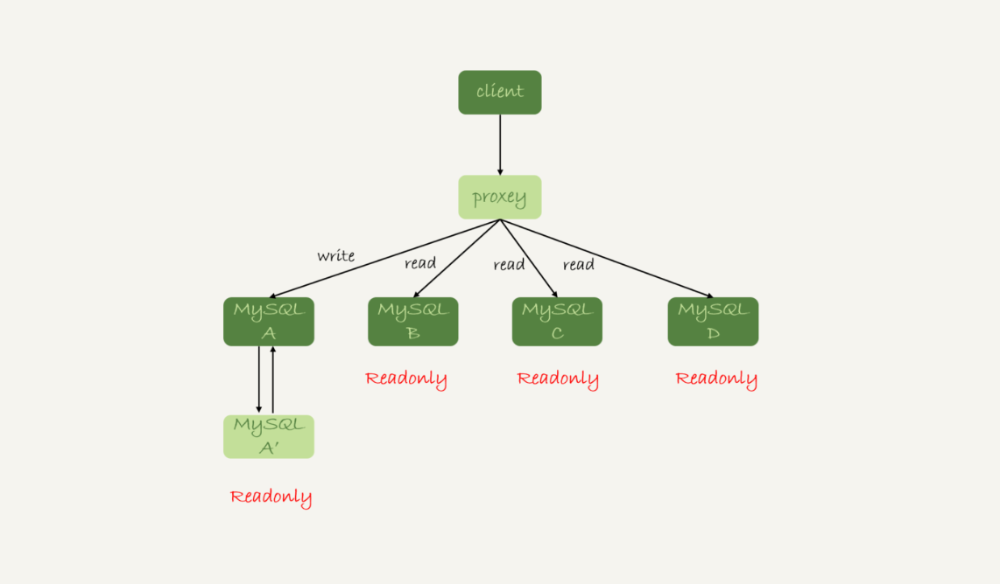
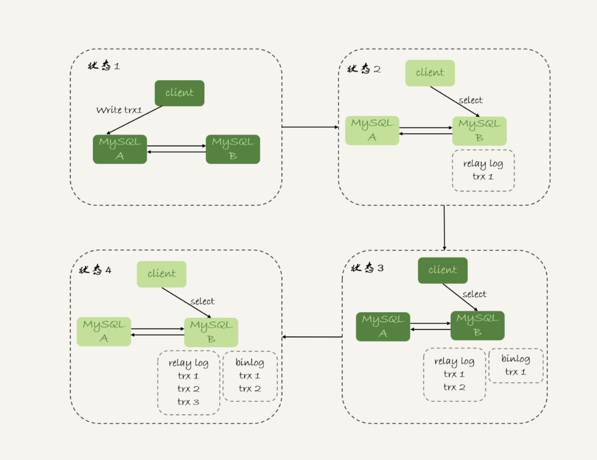

# week26

---

# Algorithm []()
## 1. 问题描述

## 2. 解题思路

## 3. 代码

## 4. 复杂度分析

---

# Review []()

---

# Tip 

## 

---
    
# Share 28 读写分离有哪些坑？—— 极客时间 MySQL实战45讲


读写分离结构，客户端主动做负载均衡



带有 proxy 层的读写分离结构

各自特点：
1. client 直连方案。性能优于 proxy，且整体架构简单，便于排查问题。但是出现准备切换、库迁移时，client 都是有感知的，需要进行调整。
此架构下一般会采用 zookeeper 管理后端组件，便于 client 调整。
2. proxy 架构。对 client 友好，不需要关注后端细节，连接维护、后端信息维护都由 proxy 完成。
但是对后端维护团队要对较高，proxy 需要高可用架构，proxy 架构相对复杂。

我们将 “在从库上会读到系统的一个过期状态”的现象，称为“过期读”

处理过期读的方案：
* 强制走主库
* sleep 方案
* 判断主备无延迟方案
* 配合 semi-sync 方案
* 等主库位点方案
* 等 GTID 方案
## 强制走主库
将查询请求分类:
1. 对于必须要拿到最新结果的请求，强制走主库
2. 允许读到旧数据的请求，发从库

此方案对于一些金融类的业务可能无效，因为金融类的业务有可能要求，所有查询都不能是过期读

## Sleep 方案
主库更新后，读从库之前先 sleep 一下
```sql
select sleep(1)
```
例如卖家发布商品，商品发布后，用 Ajax 直接把客户端输入的内容作为“新的商品”显示在页面上，
而不是去查数据库。等卖家刷新页面的时候再去查库，这时候相当于 sleep 了一段时间。

此方案不精确:
1. 如果本来 0.5 秒就能从从库上拿到结果，也要等 1 秒
2. 如果延迟超过 1 秒，就会出现过期读

## 判断主备无延迟方案
### 1. 通过 seconds_behind_master 判断
通过 show slave status 结果里的 seconds_behind_master 是否等于 0 判断。
如果不是 0 ，需要等到 0 再查询。

seconds_behind_master 单位是秒，如果精度要求较高，可以通过对比点位和 GTID 的方式
确保主备无延迟。
### 2. 对比点位
* a. Master_Log_File 和 Read_Master_Log_Pos, 表示的是读到的主库的最新点位
* b. Relay_Master_Log_File 和 Exec_Master_Log_Pos, 表示的是备库执行的最新点位

如果 a、b 的两组值一样，则表示无延迟 
### 3. 对比 GTID 集合
* Auto_Position=1 , 表示主备关系使用了 GTID
* Retrieved_Gtid_Set, 是备库收到的所有日志的 GTID 集合
* Executed_Gtid_Set, 是备库所有已经执行完成的 GTID 集合

如果这两个集合相同，表示备库已经同步完成

在执行查询请求之前，先判断从库是否同步完成的方法，相比于 sleep 方案，准确度确实提升了不少，但是还没有达到“精确”。

一个事务 binlog 在主备之间的状态：
1. 主库执行完成，写入 binlog，并反馈给 client
2. binlog 被从主库发送给备库，备库收到
3. 在备库执行 binlog 完成

我们上边的逻辑判断的是“备库收到的日志都执行完了”。但是，还有一部分日志，处于 client 已经
收到提交确认，而备库还没有收到日志的状态。


主库上执行完成了 trx1、2、3，
1. trx1 和 trx2 已经传到从库，并执行完成
2. trx3 在主库完成，并已经回复给 client，但还没有传到从库

如果此时在从库 B 上执行查询，从库认为已经没有主从延迟，但是查不到 trx3。即出现了过期读。

此问题需要通过 semi-sync 解决。
## 配合 semi-sync
半同步复制 : semi-sync replication

semi-sync 设计：
1. 事务提交的时候，主库把 binlog 发给从库
2. 从库收到 binlog 以后，发回给主库一个 ack，表示收到
3. 主库收到这个 ack 以后，才能给客户端返回“事务完成”的确认

如果主库掉电的时候，有些 binlog 还来不及发给从库，会不会导致系统数据丢失？

答案是，如果使用的是普通的异步复制，就可能会丢，但 semi-sync 就可以解决此问题。

但是 semi-sync + 位点判断的方案，只对一主一备场景成立。在一主多从的场景中，主库只要等到
一个从库的 ack ，就开始给 client 返回确认。此时，在从库上执行查询请求，有两种情况：
1. 查询落在了这个响应了 ack 的从库上，能够确保读到最新数据
2. 如果查询落到了其他从库上，可能会产生过期读

另外还有一个问题，在业务高峰期，主库位点或 GTID 集合更新很快，那么上面的两个位点等值判断
会一直不成立，导致从库无法响应查询请求，或请求超时。

实际上，当发起一个查询请求后，我们要得到准确的结果，其实并不需要等到“主备完全同步”


上图就是一个等待点位方案的一个 bad case。从状态1到状态4，一直处于延迟一个事务的状态。

如果必须等到无延迟才能查询，select 语句一直到状态4都不能被执行。

但是实际上我们只需要等到 trx1 更新完成后就可以执行 select 了。即状态3时，就可以得到正确的结果了。

semi-sync 存在的两个问题：
1. 一主多从时，在某些从库执行查询会存在过期读的现象
2. 在持续延迟的情况下，可能出现过度等待的现象

## 等待主库位点方案