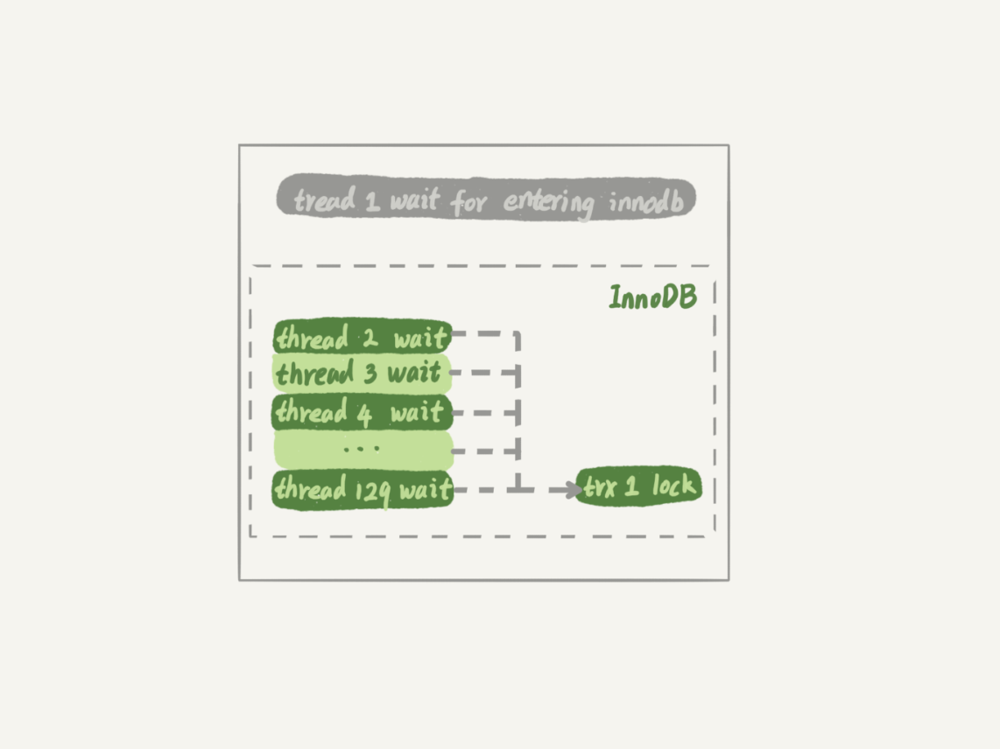

# week27

---

# Algorithm [32. Longest Valid Parentheses](https://leetcode.com/problems/longest-valid-parentheses/)
## 1. 问题描述
最长有效括号

给定一个字符串只包含 '(' 和 ')' , 找到最长有效括号子串。

##### 示例 1 :
* 输入 : "(()"
* 输出 : 2
* 解释 : 最长有效括号为 "()"

##### 示例 2 :
* 输入 : ")()())"
* 输出 : 4
* 解释 : 最长有效括号为 "()()"

## 2. 解题思路
#### 算法1：暴力法
1. 循环遍历每个子串 (O(n<sup>2</sup>))
2. 用一个栈(stack)判断字符串是否为合法括号串 (O(n))
* 时间复杂度 O(n<sup>3</sup>)
* 空间复杂度 O(n) 栈的空间

#### 算法2 : DP 动态规划


## 3. 代码

## 4. 复杂度分析

---

# Review []()

---

# Tip

## 

---
    
# Share 29 | 如何判断一个数据库是不是出问题了？ -- 极客时间 MySQL实战45讲
## select 1 判断
select 1 只能判断数据库的进程还在，并不能说明没有问题。
```sql
set global innodb_thread_concurrency=3;

CREATE TABLE `t` (
  `id` int(11) NOT NULL,
  `c` int(11) DEFAULT NULL,
  PRIMARY KEY (`id`)
) ENGINE=InnoDB;

 insert into t values(1,1)
```
|session A| session B | session C | session D|
|---|---|---|---|
|select sleep(100) from t;|select sleep(100) from t;|select sleep(100) from t;| |
| | | | select 1;(Query OK)<br/> select * from t;(blocked)|

innodb_thread_concurrency 设置 InnoDB 的并发线程上限。

innodb_thread_concurrency 默认是 0，建议设置为 64~128 之间。

并发连接和并发查询是两个概念。

将 innodb_thread_concurrency 设置成 128，如果出现同一行热点更新的问题，
是不是很快就会把 128 消耗完？

实际上，在线程进入锁等待以后，并发线程的计数会减一。也就是说等行锁（包括间隙锁）的线程
是不算在 128 里面的。

因为进入锁等待的线程已经不消耗 CPU 了。更重要的是必须这么设计才能避免整个系统锁死。

假设锁等待的线程也占用并发线程计数，可以想象以下场景：
1. 线程 1 执行 begin; update t set c=c+1 where id=1,启动事务 trx1，然后保持这个状态。
这时线程处于空闲状态，不算在并发线程中
2. 线程 2 到 129 都执行 update t set c=c+1 where id=1;由于等行锁，进入等待状态。
这样就有 128 个线程处于等待状态。
3. 如果处于锁等待状态的线程计数不减一，InnoDB 就会认为线程数满，会阻止其他语句进入引擎
执行，这样线程 1 不能提交事务。而另外 128 个线程又处于锁等待状态，整个系统堵住了。



这时候整个系统锁死，CPU 占用是 0，显然不合理，所以需要减一。

## 查表判断
定义一个健康检查表，然后定期查询
```sql
mysql> select * from mysql.health_check; 
```
此方法可以检测出并发线程满的情况，但是不能检查空间满的情况。

更新事务要写 binlog，而binlog 所在的磁盘满了之后，所有更新语句的 commit 会被堵住，
但是查询正常。

## 更新判断
```sql
mysql> update mysql.health_check set t_modified=now();
```
节点的可用性检测都需要包含主库和备库。

主备都要进行更新检查，那么备库也要写 binlog ，会往主库同步，如果主备更新的是同一行
可能会发生主键冲突。所以为了让主备之间的更新不产生冲突，我们可以在 mysql.health_check
表上存入多行数据，并用 A、B 的 server_id 做主键。

```sql
mysql> CREATE TABLE `health_check` (
  `id` int(11) NOT NULL,
  `t_modified` timestamp NOT NULL DEFAULT CURRENT_TIMESTAMP,
  PRIMARY KEY (`id`)
) ENGINE=InnoDB;

/* 检测命令 */
insert into mysql.health_check(id, t_modified) values (@@server_id, now()) on duplicate key update t_modified=now();
```

这里有个“判定慢”的问题。

如果系统的 IO 已经占用 100%。整个系统响应非常慢，已经需要做主备切换了。

我们检测的 update 语句需要的 IO 资源很少，所以只要拿到 IO 就能执行成功，并且在超时之前返回。

这样在检测系统看来数据库是正常的。

解决这个问题，需要采用内部检测法，MySQL内部发现数据库问题的方法。

## 内部统计
MySQL 5.6 版本以后提供了 performance_schema 库，就在 file_summary_by_event_name
表里统计了每次 IO 请求的时间。

file_summary_by_event_name 表中有很多行数据，先来看看
event_name='wait/io/file/innodb/innodb_log_file' 这一行


这一行统计的是 redo log 写入时间。

第一列 EVENT_NAME 表示统计类型。接下来的三组数据，显示的是 redo log 操作的时间统计。

* 第一组五列，是所有 IO 类型的统计。其中，COUNT_STAR 是所有 IO 的总次数，接下来四列是
具体的统计项，单位是皮秒。
* 第二组六列，是读操作的统计。最后一列 SUM_NUMBER_OF_BYTES_READ 统计是，总共从
redo log 里读了多少个字节。

* 第三组六列，统计的是写操作。

* 第四组最后几列，是对其他类型数据的统计。在 redo log 里，可以认为就是对 fsync 的统计。

event_name='wait/io/file/sql/binlog' 这一行统计的是 binlog 的统计信息。

因为每一次操作数据库，performance_schema 都需要额外统计信息，所以我们打开这个统计
功能是有性能损耗的。大概会下降 10% 的性能。

可以精确控制打开某一项统计，比如，打开 redo log 的统计：
```sql
mysql> update setup_instruments set ENABLED='YES', Timed='YES' where name like '%wait/io/file/innodb/innodb_log_file%';
```
可以通过 MAX_TIMER 的值来判断数据库是否出问题了。比如，可以设定阈值，单次 IO 请求时间
超过 200 毫秒属于异常。然后通过以下语句作为检测逻辑:
```sql
mysql> select event_name,MAX_TIMER_WAIT  FROM performance_schema.file_summary_by_event_name where event_name in ('wait/io/file/innodb/innodb_log_file','wait/io/file/sql/binlog') and MAX_TIMER_WAIT>200*1000000000;
```
取到信息后，可以通过以下语句把之前的统计信息清空：
```sql
mysql> truncate table performance_schema.file_summary_by_event_name;
```
## 思考题
在开发和维护过程中你是怎么判断业务系统的可用性的？
* 答：
    * 监控服务状态和服务质量。服务状态的监控，可以通过外部系统来做；服务质量的监控，可以通过接口的响应时间来统计。
    * healthCheck 检测
    * 按照监控对象不同，将监控分为基础监控、服务监控和业务监控。


