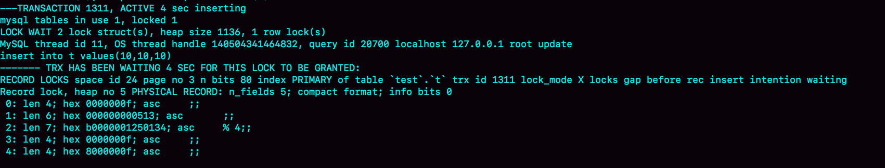

# week28

---

# Algorithm [44. Wildcard Matching](https://leetcode.com/problems/wildcard-matching/)
## 1. 问题描述
通配符匹配

给定一个字符串 s 和一个模式串 p，实现 '?' 和 '*' 的匹配
* '?' 匹配任意单一字符
* '*' 匹配任何字符串，包括空串

p 需要匹配 s 的整个串，而非部分
#### 示例 1 :
* 输入 : s="aa" , p="a"
* 输出 : false
#### 示例 2 :
* 输入 : s="aa" , p="*"
* 输出 : true
#### 示例 3 :
* 输入 : s="cb" , p = "?a"
* 输出 : false
#### 示例 4 :
* 输入 : s="adceb" , p = "*a*b"
* 输出 : true
#### 示例 5 :
* 输入 : s="acdcb" , p = "a*c?b"
* 输出 : false
## 2. 解题思路
动态规划

设 dp[i][j] 表示 p[0,j) 是否匹配 s[0,i) 

如果 p[j] == s[i] || p[j] == '?' , 则 dp[i][j] = dp[i-1][j-1]

如果 p[j] == '*' , 则 dp[i][j] = dp[i][j-1] || dp[i-1][j-1] || dp[i-2][j-1] || ... || dp[0][j-1] ;

推到 :
* (1) dp[i][j] = dp[i][j-1] || dp[i-1][j]
* (2) 根据(1) dp[i-1][j] = dp[i-1][j-1] || dp[i-1-1][j] = dp[i-1][j-1] ||dp[i-2][j]
* (3) dp[i][j] = dp[i][j-1] || dp[i-1][j] = dp[i][j-1] || dp[i-1][j-1] || dp[i-2][j]
= dp[i][j-1] || dp[i-1][j-1] || dp[i-2][j-1] || dp[i-3][j] = ...
= dp[i][j-1] || dp[i-1][j-1] || dp[i-2][j-1] || ... || dp[1][j-1] || dp[0][j]
* (4) 因为 p[j] == '*' , '*' 可以匹配空串，所以 dp[0][j] = dp[0][j-1]
* (5) 所以 dp[i][j] = dp[i][j-1] || dp[i-1][j-1] || dp[i-2][j-1] || ... || dp[0][j-1]

所以当 p[j] = '*' 时，状态转移方程可以简化为 dp[i][j] = dp[i][j-1] || dp[i-1][j]

初始化 dp[0][0] = true , 空串匹配空串为真


## 3. 代码
```go
func isMatch(s string, p string) bool {
	if s == p {
		return true
	}
	lens,lenp := len(s),len(p)
	var dp [][]bool
	dp = make([][]bool, lens + 1)
	for i := 0; i < lens + 1; i++ {
		dp[i] = make([]bool, lenp + 1)
	}

	dp[0][0] = true
	for j := 1; j <= lenp; j++ {
		if p[j-1] == '*' {
			dp[0][j] = dp[0][j-1]
		}
	}
	for i := 1; i <= lens; i++ {
		for j := 1; j <= lenp; j++ {
			if p[j-1] == '?' || s[i-1] == p[j-1] {
				dp[i][j] = dp[i-1][j-1]
			} else if p[j-1] == '*' {
				dp[i][j] = dp[i][j-1] || dp[i-1][j]
			}
		}
	}
	return dp[lens][lenp]
}
```
## 4. 复杂度分析
* 时间复杂度 : O(N*M) N 为字符串 s 的长度， M 为 p 的长度
* 空间复杂度 : O(N*M)

---

# Review [FP vs. OO](http://blog.cleancoder.com/uncle-bob/2018/04/13/FPvsOO.html)
一个好的函数式程序(FP)也应该是面向对象(OO)的，一个好的面向对象的程序也应该是函数式的。
## 什么是 OO （面向对象）
OO 与非 OO 程序之间的本质区别是多态。

多态性机制不能创建从调用者到被调用者的源代码依赖关系。

OO 的简单定义: 使用动态多态来调用函数的一种技术，它不依赖于调用者的源代码，而依赖于被调用者的源代码。

## 什么是 FP （函数式程序）
函数是引用透明的。

FP 的简单定义: 引用透明 —— 没有重新分配值

## FP vs OO
没有 FP vs OO

一个程序是可以同时拥有 FP 和 OO 的特性的。

基于OO和FP原则构建的系统将最大化灵活性、可维护性、可测试性、简单性和健壮性

排除一个而支持另一个只会削弱一个系统的结构。

---

# Tip
 

---
    
# Share 30 答疑文章（二）：用动态的观点看加锁 —— 极客时间 MySQL实战45讲
加锁规则，两个“原则”，两个“优化”，一个“bug” ：
* 原则 1 : 加锁的基本单位是 next-key lock, 是前开后闭区间
* 原则 2 : 查找过程中访问到的对象才会加锁
* 优化 1 : 索引上的等值查询，给唯一索引加锁的时候，next-key lock 退化为行锁
* 优化 2 : 索引上的等值查询，向右遍历时且最后一个值不满足等值条件的时候，next-key lock 退化为间隙所
* 一个 bug : 唯一索引上的范围查询会访问到不满足条件的第一个值为止。

```sql
CREATE TABLE `t` (
  `id` int(11) NOT NULL,
  `c` int(11) DEFAULT NULL,
  `d` int(11) DEFAULT NULL,
  PRIMARY KEY (`id`),
  KEY `c` (`c`)
) ENGINE=InnoDB;

insert into t values(0,0,0),(5,5,5),
(10,10,10),(15,15,15),(20,20,20),(25,25,25);
```
## 不等号条件里的等值查询
```sql
begin;
select * from t where id>9 and id<12 order by id desc for update;
```
语句的加锁范围是主键索引上的 (0,5],(5,10] 和 (10,15) 。 id=15 这一行并没有加上行锁。
因为这里用到了优化2，向右遍历到 id=15 不满足条件，所以 netx-key lock 退化为间隙锁 (10,15)

但是语句中只有大于和小于号，那么这里的“等值查询”是在哪里呢？

加锁动作是发生在语句执行过程中。


1. 这条语句的语义是 order by id desc , 要拿满足条件的所有行，优化器必须先找到
"第一个 id<12 的值"
2. 这个过程也是通过索引树的搜索过程得到的，在引擎内部，其实是要找到 id=12 的这个值，
只是最终没有找到，但是找到了(10,15) 这个间隙
3. 然后向左遍历，在遍历过程中，就不是等值查询了，会扫描到 id=5 这一行，所以会加一个
next-key lock (0,5]

在执行过程中，通过树搜索的方式定位记录的时候，用的是“等值查询”的方法

## 等值查询的过程
下面这条语句的加锁范围是什么？
```sql
begin;
select id from t where c in(5,20,10) lock in share mode;
```

使用了索引 c 并且 rows=3，说明这三个值都是通过 B+ 树搜索定位的

查找 c=5 时，先锁住 (0,5],因为 c 不是唯一索引，所以还要继续向后找有没有重复的 5，
向右遍历，找到 c=10，这个过程满足优化 2，所以加间隙锁 (5,10)

同样，c=10 的加锁范围是 (5,10] 和 (10,15); c=20 的加锁是 (15,20] 和 (20,25)

因此，这条语句是在索引 c 上先加 c=5 的记录锁，再加 c=10 的记录锁，最后加 c=20 的记录锁

这些锁是在执行过程中一个一个地加上的，而不是一次性地加上的

如果同时执行
```sql
select id from t where c in(5,20,10) order by c desc for update;
```
间隙锁是不互锁的，但是这两条语句都会在 c=5,10,20 这三行加记录锁

由于这里是 order by c desc 所以加锁顺序是先锁 c=20,然后是 10 ，最后是 5

因此这两条语句加锁资源相同，加锁顺序相反，并发执行时，是可能会出现死锁的

## 怎么看死锁
MySQL 只保留最后一个死锁的现场

出现死锁后执行 show engine innodb status ,其中输出中的 LATESTDETECTED DEADLOCK 一节，就是记录的最后一次死锁的信息

1. 结果分为三个部分
* (1) TRANSACTION ，是第一个事务信息
* (2) TRANSACTION , 是第二个事务信息
* WE ROLL BACK TRANSACTION(1)，是最终的处理结果，表示回滚了第一个事务

2. 第一个事务信息中
* WAITING FOR THIS LOCK TO BE GRANTED ,表示这个事务在等待的锁信息
* index c of table `test`.`t`,说明在等待的是表 t 的索引 c 上面的锁
* lock mode S waiting 表示这个语句要自己加一个读锁，当前状态是等待中
* Record lock 说明这是一个记录锁
* n_fields 2 表示这个记录是 2 列，即 c 和 id
* 0:len 4; hex 0000000a; asc;; 是第一个字段，即 c。值是十六进制 a，即 10
* 1:len 4; hex 0000000a; asc;; 是第二个字段，即 id=10
* 这两行中的 asc 表示接下来要打印出值里面的“可打印字符”，但 10 不是可打印字符，因此就显示空格
* 第一个事务信息就只显示出了等锁的状态，在等待(c=10,id=10)这一行的锁
* 既然出现了死锁，就说明这个事务也占有别的锁，但是没有显示出来，需要通过第二个事务推到出来

3. 第二个事务
* "HOLD THE LOCK(S)" 用来显示这个事务持有哪些锁
* index c of table `test`.`t` 表示锁是在表 t 的索引 c 上
* hex 0000000a 和 hex 00000014 表示这个事务持有 c=10 和 c=20 这两个记录的锁
* WAITING FOR THIS LOCK TO BE GRANTED 表示在等 (c=5,id=5) 这个记录锁

从上面的信息可以推到出
1. "lock in share mode" 这条语句，持有 c=5 的记录锁，在等 c=10 的锁
2. "for update"，持有 c=20 和 c=10 的记录锁，在等 c=5 的记录锁

因此导致了死锁。可以得到两个结论
1. 由于锁是一个个加上的，要避免死锁，对同一组资源，要尽量按照相同的顺序访问
2. 在发生死锁的时刻，for update 这条语句占有的资源更多，回滚成本更大，所以 
InnoDB 选择了回滚成本更小的 lock in share mode 语句，来回滚

## 怎么看锁等待
| session A | session B |
| --- | --- |
| begin;<br>select * from t where id>10 and id <=15 for update; | |
| | delete from t where id=10;<br>(Query OK)<br><br>insert into t values(10,10,10);<br>(blocked) |

由于 A 并没有锁住 c=10 这条记录，所以 B 删除 id=10 是可以的，但是再 insert 就不行了

用 show engine innodb status 查看 TRANSACTIONS 这一节

1. index PRIMARY of table `test`.`t` 表示这个语句被锁住是因为表 t 主键上的某个锁
2. lock_mode X locks gap before rec insert intention waiting 
    * insert intension 表示当前线程准备插入一条记录，这是一个插入意向锁
    * gap before res 表示这是一个间隙锁，不是记录锁
3. 那么 gap 在哪个记录之前呢？接下来的 0~4 这 5 行的内容就是这个记录的信息
4. n_fields 5 也表示了，这一记录有 5 列
    * 0: len 4; hex 0000000f; asc ;; 第一列主键 id 字段，十六进制 f 即 id=15,
    所以，这个间隙是 id=15 之前，以为 id=10 已经不存在了，所以它表示(5,15)
    * 1: len 6; hex 000000000513; asc ;; 第二列长度为 6 字节的事务 id，表示
    最后修改这一行的是 trx id 为 1299 的事务
    * 2: len 7;hex b0000001250134;asc % 4;; 第三列长度为7字节的回滚信息，
    因为此字节可以打印，所以 asc 后面是 % 和 4
    * 后面两列是 c 和 d 的值，都是 15

由于 delete 把 id=10 删除，所以原来的两个间隙 (5,10),(10,15) 变成了一个 (5,15)

考虑以下两个现象的关联:
1. A 执行完 select 后，什么都没做，但它的加锁范围突然变大了
2. 执行 select * from t where c>=15 and c<=20 order by c desc lock in share mode;
向左扫描到 c=10 的时候，要把(5,10]锁起来

也就是说，所谓的"间隙"，其实就是由"这个间隙右边的那个记录" 定义的

## update 的例子
| session A | session B |
| --- | --- |
| begin;<br> select c from t where c>5 lock in share mode; | |
| | update t set c=1 where c=5;<br>(Query OK)<br><br> update t set c=5 where c=1;<br>(blocked)|

A 的加锁范围是在索引 c 上的 (5,10],(10,15],(15,20],(20,25],(25,supremum]

根据 c>5 找到的第一个记录是 c=10，因此不会加 (0,5] 这个 next-key lock

B 的第一个 update ，要把 c=5 改成 c=1 ，可以理解为两步
1. 插入 (c=1,id=5) 这个记录
2. 删除 (c=5,id=5) 这个记录

索引 c 上 (5,10) 间隙是由这个间隙右边的记录，即 c=10 这个记录定义的。所以通过这个操作之后
A 的加锁范围变为


接下来 B 的 update t set c=5 where c=1 一样可以拆成两步:
1. 插入 (c=5,id=5) 这个记录
2. 删除 (c=1,id=5) 这个记录

第一步试图在已经加了间隙锁的 (1,10) 中插入数据，所以就堵住了

## 思考题
所谓"间隙"，其实根本就是由"这个间隙右边的那个记录"定义的。

那么，一个空表有间隙吗？这个间隙由谁定义的？怎么验证？

* 答：
一个空表只有一个间隙 (-∞,supremum]

在空表上执行
```sql
begin;
select * from t where id>1 for update;
```
这个查询语句的加锁范围是 next-key lock (-∞,supremum]

验证方法
| session A | session B |
| --- | --- |
| create table t(id int primary key) engine=innodb;<br>begin;<br>select * from t where id>1; | |
| | insert into t values(2);<br>(blocked)|
| show engine innodb status; | |


