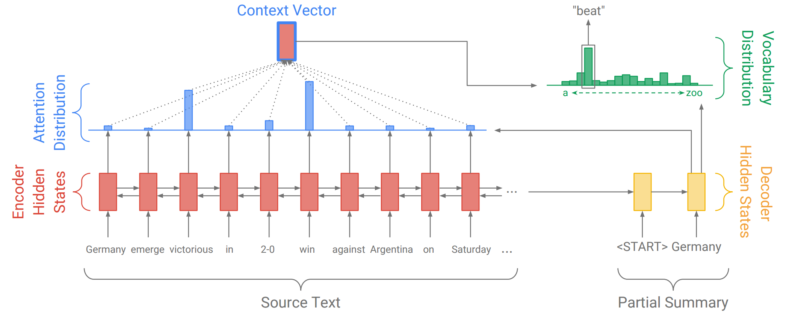
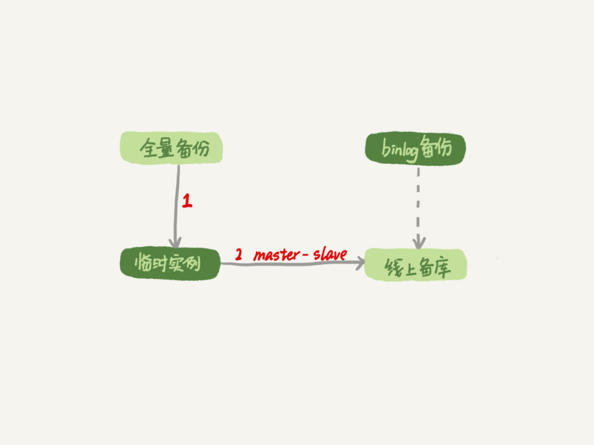

# week29

---

# Algorithm [53. Maximum Subarray](https://leetcode.com/problems/maximum-subarray/)
## 1. 问题描述
子数组最大和

给定一个整数数组 nums，找到子数组（必须是连续的且至少包含一个元素）最大和。

#### 示例
* 输入 : [-2,1,-3,4,-1,2,1,-5,4]
* 输出 : 6
* 解释 : 子数组为 [4,-1,2,1] 和为 6
## 2. 解题思路
动态规划

设 dp[i] 表示已 nums[i] 结尾的子数组的最大和

那么 dp[i] = max(nums[i], dp[i-1] + nums[i])

如果 dp[i-1] 是负数，那么 dp[i] = nums[i]

如果 dp[i-1] 是正数或者 0 ，那么 dp[i] = dp[i-1] + nums[i]

初始化 dp[0] = nums[0]

有一个额外的变量记录最大值 max，每次得到 dp[i] 之后都与最大值 max 做比较 max=max(max,dp[i])

返回 max

## 3. 代码
```golang 代码
func maxSubArray(nums []int) int {
	lenn := len(nums)
	if lenn == 0 {
		return 0
	}
	var dp []int
	dp = make([]int, lenn)
	max := nums[0]
	dp[0] = nums[0]
	for i := 1; i < lenn; i++ {
		dp[i] = dp[i-1] + nums[i]
		if dp[i] < nums[i] {
			dp[i] = nums[i]
		}
		if max < dp[i] {
			max = dp[i]
		}
	}
	return max
}
```
## 4. 复杂度分析
* 时间复杂度 : O(N) N 为 nums 数组长度，遍历一遍 nums
* 空间复杂度 : O(N) dp 的数组长度

---

# Review [Text Summarization using Deep Learning](https://towardsdatascience.com/text-summarization-using-deep-learning-6e379ed2e89c)
使用机器学习生成文本摘要

## 简介
摘要有两种类型：
1. 抽取式摘要——从段落中抽取内容并进行重排序
2. 抽象式摘要——理解含义，并用自己的语言描述

生成摘要的模型 ——  [Pointer Generator Network](https://arxiv.org/abs/1704.04368)

[Pointer Generator 博客](http://www.abigailsee.com/2017/04/16/taming-rnns-for-better-summarization.html) 

文本摘要的评估指标——Rouge score
* 突出显示摘要和文本中重叠的单词
* Rouge 1 测量摘要和文本中单个单词的重叠
* Rouge 2 测量摘要和文本之间的 bi 图重叠

## 机器学习生成摘要

seq2seq 模型
1. 编码 —— Bi-directional LSTM 层（红色部分）从文本中提取信息。每次读取一个单词。
2. 解码 —— Uni-directional LSTM 层（黄色部分）每次生成一个单词的摘要
3. 注意机制

此模型存在两个问题：
1. 有时摘要不准确
2. 摘要自我重复

pointer generator 模型可以解决这些问题。

pointer-generator 与 seq2seq 模型相比具有以下优点：
* 使得从文本中复制单词更简单
* 可以从文本中复制词汇表以外的单词
* 更快的迭代速度，更少的迭代次数，就能达到与 seq2seq 同样的性能

## 结果
用 Tensorflow 实现的这个模型，用 CNN/Daily Mail 数据集进行训练，获得的 Rouge-1 评分为 0.38

[代码](https://github.com/abisee/pointer-generator)

---

# Tip 


---

# Share 31 误删数据后除了跑路，还能怎么办？ —— 极客时间 MySQL实战45讲
MySQL 误删数据分类：
1. 使用 delete 语句误删数据行
2. 使用 drop table 或者 truncate table 语句误删数据表
3. 使用 drop database 语句误删数据库
4. 使用 rm 命令误删整个 MySQL 实例

## 误删行
误删行可以通过把 Flashback 工具通过闪回把数据恢复回来。

Flashback 恢复的原理是，修改 binlog 的内容，拿回原库重放。使用这个方案的前提是，确保
binlog_format=row 和 binlog_row_image=FULL

具体恢复数据时，对单个事务做如下处理：
1. 对于 insert 语句，对应的 binlog event 类型是 Write_rows event,把它改成 Delete_rows event 即可
2. 同理，对于 delete 语句，也将 Delete_rows event 改为 Write_rows event
3. 而如果是 Update_rows 的话，binlog 中记录了修改前和修改后的值，对调这两行的位置即可

误操作
```roomsql
(A) delete ...
(B) insert ...
(C) update ...
```
用 Flashback 工具解析 binlog 写回主库
```roomsql
(reverse C) update ...
(reverse B) delete ...
(reverse A) insert ...
```
涉及事务的话，需要把顺序调过来

* 不建议直接在主库上执行这些操作

比较安全的做法是恢复一个备份，或者找一个临时库，在这个临时库上执行操作，然后确认后再恢复回主库

因为主库的数据变更往往是有关联的，可能发现的晚了一点就会在误操作的基础上又修改了数据，如果没有经过确认，而单独恢复这几行，
就会导致对数据的二次破坏

* 与其事后处理，不如事前预防

1. 把 sql_safe_updates 参数设置为 on。这样如果 delete 或 update 中没有写 where，或者 where 中没有包含索引，
执行时就会报错
2. 代码上线前，必须经过 SQL 审计

如果确实需要删除一张小表，可以用 delete ... where id>=0 

但是由于 delete 需要生产回滚日志、写 redo、写 binlog ，所以性能会比较差。
建议使用 truncate table 或 drop table 命令。

当 binlog_format=row 时，执行这三个命令时，记录 binlog 还是 statement 格式。
binlog 里面只有一个 truncate/drop 语句，所以 Flashback 是不能通过这些信息恢复数据的。

## 误删 库/表
这种情况要恢复数据，需要使用全量备份，加增量日志的方式。
这种方案要求线上有定期的全量备份，并且实时备份 binlog

假如中午 12 点误删了一个库，恢复流程如下：
1. 取最近一次全量备份，假设这个库是一天一备，上次备份是当前 0 点
2. 用备份恢复出一个临时库
3. 从日志备份里面，取出凌晨 0 点之后的日志
4. 把这些日志，除了误删除数据的语句外，全部应用到临时库

恢复流程图


1. 为了加速恢复，如果这个临时库上又多个库，在使用 mysqlbinlog 时加上 database 参数，用来指定误删表的库。
这样可以避免恢复数据时还要应用其他库日志的情况。
2. 在应用日志的时候，需要跳过 12 点误操作的那个语句的 binlog
    * 如果原实例没有使用 GTID 模式，只能应用到包含 12 点的 binlog 文件的时候，先用 -stop-position 参数执行到误操作之前的日志，
    然后再用 -start-position 从误操作之后的日志继续执行
    * 如果使用了 GTID 模式，假设误操作的是 gtid1，那么只需要执行 set gtid_next=gtid;begin;commit; 先把这个 GTID 加入到临时实例
    的 GTID 集合，之后按照顺序执行 binlog 的时候，就会自动跳过误操作的语句
    
使用 mysqlbinlog 方法恢复数据不够快，主要原因：
1. 如果误删表，最好只恢复这一张表，但是 mysqlbinlog 工具并不能只解析一个表的日志
2. 用 mysqlbinlog 解析出的日志应用，应用日志的过程就只能是单线程的

加速方法：在用备份恢复出临时实例之后，将这个临时实例设置成线上备库的从库：
1. 在 start slave 之前，先通过执行 change replication filter replication_do_table=(tbl_name) 命令，就可以让临时库只同步误操作表
2. 这样也可以用上并行复制技术，来加速整个数据恢复过程


图中虚线是指由于时间太久，备库上已经删除了临时实例需要的binlog的话，可以从备份中找回需要的binlog，再放回备库

假设我们需要的是从 master.000005 开始的，但是在备库上执行 show binlogs 显示最小的是 master.000007 ,需要从备份中找回少了的2个

把之前删掉的 binlog 放回备库的操作步骤：
1. 从备份中找到 master.000005 和 master.000006 这两个文件，放到备库的日志目录下
2. 打开 master.index 在文件开头加上 "./master.000005" 和 "./master.000006"
3. 重启备库，目的是要让备库重新识别这两个日志文件
4. 现在这个备库上就有临时库需要的所有 binlog 了，建立主备关系，就可以正常同步了

这两个方案的共同点：利用备份,再加上 binlog 的方式恢复数据

建议把上述两个方案做成自动化工具，并经常拿出来演练：
1. 万一出现了误删除，能够快速恢复，将损失降到最低
2. 如果临时手忙脚乱的操作，最后又误操作了，对业务造成二次伤害，那就更说不过去了

## 延迟复制备库
如果一个库特别大，全量备份是一周一备，然后误操作之后需要恢复6天的日志，那恢复时间可能需要按天计算了。

如何缩短备份时间？
* 搭建延迟复制备库

这个功能是 MySQL 5.6 引入的

一般的主备复制结构，如果主库上的表被误删了，那么命令很快会传到从库，从而导致从库的表也被删除。

延迟复制的备库是一种特殊的备库，通过  CHANGE MASTER TO MASTER_DELAY=N 命令，可以指定这个备库持续保持跟主库 N 秒的延迟

比如 N=3600 ，在 1 小时内发现的误操作，都可以在备库上执行 stop slave ，然后用上述步骤恢复数据。

## 预防误删库 / 表的方法
减少误操作的建议
* 1 账号分离，避免写错命令
    * 只给业务开发开放 DML 权限，而不给 truncate/drop 权限，如果开发有 DDL 的需求，可以通过开发管理系统得到支持
    * DBA 团队成员，日常规定只使用只读账号，必要的时候才使用更新权限账号
* 2 制定操作规范，避免写错要删除的表名
    * 再删除数据表之前，必须先对表做改名操作。然后，观察一段时间，确保对业务无影响以后再删除表
    * 改表名的时候，要求给表加固定后缀(如 _to_be_deleted),然后删除表的动作必须通过管理系统执行。
    并且，管理系统删除表的时候只能删除固定后缀的表
## rm 删除数据
对于一个有高可用机制的 MySQL 集群，如果只删掉了其中一个节点，HA 系统会发挥作用，选出一个新主库，从而保证整个集群可用。

这时，只需要把这个节点的数据恢复回来，然后再接入集群

如果 SA （系统管理员）自动化系统，批量下线机器导致整个集群全军覆没。

应对这种情况，只能尽量做好跨机房备份，甚至是跨城市备份。

* 预防比处理意义更大

## 讨论题：遇到的误操作以及如何处理
* 1 运维同学直接拷贝文本去执行，导致语句截断或乱码问题
    * 如何预防：脚本开发同学把脚本文件和文件的 md5 给运维同学，运维同学确保 md5 无误后再执行
* 2 “四脚本法”：备份脚本，执行脚本，验证脚本，回滚脚本。
    * 任何操作都需要这4个脚本
* 3 保护文件法：通过 chatrr +i 命令给所有重要的文件增加了 i 权限属性，这样哪怕 root 用户都无法直接删除文件
