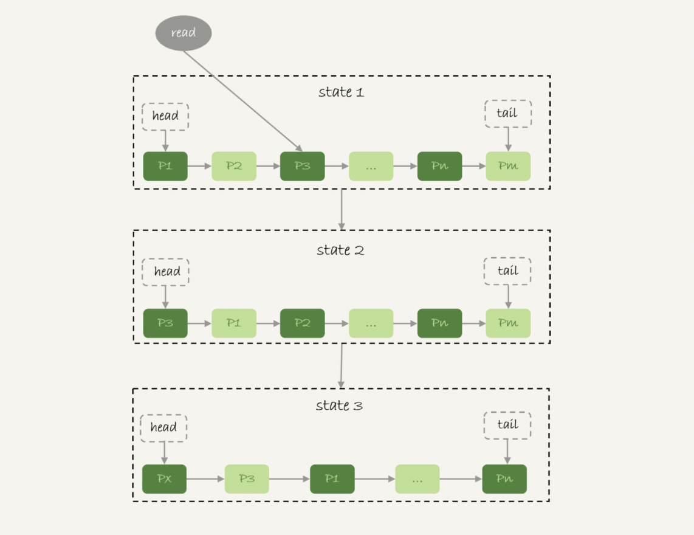

# week31

---

# Algorithm []()
## 1. 问题描述

## 2. 解题思路

## 3. 代码

## 4. 复杂度分析

---

# Review []()

---

# Tip
 

---
    
# Share 33 我查这么多数据，会不会把数据库内存打爆？ —— 极客时间 MySQL实战45讲
## 全表扫描对 server 层的影响
我们对一个 200G 数据的 InnoDB 表 db1.t 做全表扫描
```roomsql
mysql -h$host -P$port -u$user -p$pwd -e "select * from db1.t" > $target_file
```
执行流程：
1. 获取一行写到 net_buffer 中。net_buffer 的大小由参数 net_buffer_length 定义，默认是 16K
2. 重复获取行数据，直到 net_buffer 写满，然后调用网络接口发送
3. 如果发送成功，则清空 net_buffer，重复步骤1、2
4. 如果发送函数返回 EAGAIN 或 WSAEWOULDBLOCK，表示本地网络栈（socket send buffer） 写满了，进入等待。直到网络栈重新可写，再继续发送

流程图:

1. 一个查询在发送过程中，占用的 MySQL 内部的内存最大就是 net_buffer_length
2. socked send buffer 默认定义 /proc/sys/net/core/wmem_default), 如果 socket send buffer 被写满，就会暂停读数据的流程

MySQL 是边读边发的，如果客户端慢，就会导致服务端结果发不出去，会拖长这个事务的执行时间。

如果故意让客户端不读 socket receive buffer

State的值"Sending to client" 表示服务端的网络栈写满了

对于正常的线上业务来说，如果一个查询的返回结果不会很多的，都建议使用 mysql_store_result 这个接口，直接把查询结果保存到本地内存

还有一个 “Sending data” 的状态
* MySQL 查询语句进入执行阶段后，首先把状态设置成 "Sending data"
* 然后，发送执行结果的列相关的信息（meta data）给客户端
* 再继续执行语句的流程
* 执行完成后，把状态设置成空字符串

"Sending data" 并不一定是指"正在发送数据"，而可能处于执行器过程中的任意阶段。

| session A | session B |
|---|---|
| begin;<br/> select * from t where id=1 for update; | |
| | select * from t lock in share mode;<br/> (blocked) |


session B 是在等锁，但是状态显示为 "Sending data"

* 仅当一个线程处于 "等待客户端接收结果" 的状态，才会显示 "Sending to client"
* 显示成 "Sending data" 的意思是 "正在执行"

## 全表扫描对 InnoDB 的影响
内存的数据页是在 Buffer Pool（BP）中管理的，在 WAL 里 Buffer Pool 起到了加速更新的作用。
实际上，Buffer Pool 还有一个更重要的作用，就是加速查询。

Buffer Pool 对查询的加速效果，依赖于一个重要的指标：内存命中率

执行 show engine innodb status 查看系统当前的 BP 命中率。一个稳定的线上服务，要求命中率在 99% 以上。
可以看到 "Buffer pool hit rate" 行


InnoDB Buffer Pool 的大小参数 innodb_buffer_pool_size 确定，一般建议设置成物理内存的 60%~80%

InnoDB 的内存管理用的是 LRU 算法，用链表实现

1. 状态 1 中，链表头是 P1，表示 P1 是最近刚刚被访问过的数据页，假设内存里只能放下这么多数据页
2. 这时候如果有一个请求访问 P3，因此变成状态 2，P3 被移到最前面
3. 状态 3 表示，这次访问的数据页是不存在于链表中的，所以需要在 Buffer Pool 中新申请一个数据页 Px，加到链表头部。
但是由于内存已满了，不能申请新的内存。于是，会清空链表末尾 Pm 这个数据页的内存，存入 Px 的内容，然后放到链表头
4. 从效果上看，就是最久没被访问的数据页 Pm，被淘汰了

按照这个算法，扫描一个大表的时候，当前 BP 中的页都会被淘汰，然后存入新的数据。
BP 的命中率急剧下降，磁盘压力增加，SQL语句响应变慢。

实际上，InnoDB 对 LRU 算法做了改进


InnoDB 中，按照 5:3 的比例把整个 LRU 链表分成了 young 区域和 old 区域。图中 LRU_old 指向的就是 old 区域的一个位置，
是整个链表的 5/8 处。也就是说，靠近链表头部的 5/8 是 young 区域，靠近链表尾部的 3/8 是 old 区域。

改进后的 LRU 算法
1. 状态 1 ，要访问数据页 P3, 由于 P3 在 young 区域，因此和优化前的 LRU 算法一样；将其移到链表头部，变成状态 2
2. 之后要访问一个新的不存在于当前链表的数据页，这时候依然是淘汰掉数据页 Pm，但是新插入的数据页 Px，是放在 LRU_old 处
3. 处于 old 区域的数据页，每次被访问到的时候都要做下面这个判断：
    * 若这个数据页在 LRU 链表中存在的时间超过了 1 秒，就把它移动到链表头部；
    * 如果这个数据页在 LRU 链表中存在的时间短于 1 秒，位置保持不变。1 秒这个时间，是由参数
    innodb_old_blocks_time 控制的。其默认值是 1000 毫秒

改进后的 LRU 算法对大表扫描的处理：
1. 扫描过程中，需要新插入的数据页，都被放到 old 区域
2. 一个数据页里面有多条记录，这个数据页会被多次访问到，但由于是顺序扫描，这个数据页第一次被访问和最后一次被访问的时间间隔不会超过 1 秒，
因此还是会被保留在 old 区域
3. 再继续扫描后续的数据，之前的这个数据页之后也不会再被访问到，于是始终没有机会移到链表头部（也就是 young 区域），很快就会被淘汰出去

## 思考题：请给出由于客户端性能问题，导致对数据库影响很严重的例子
* 答：问题的核心是造成了“长事务”
    * 如果前面的语句有更新，意味着它们在占用着行锁，会导致别的语句更新被锁住
    * 当然读的事务也有问题，就是会导致 undo log 不能被回收，导致回滚段空间膨胀
