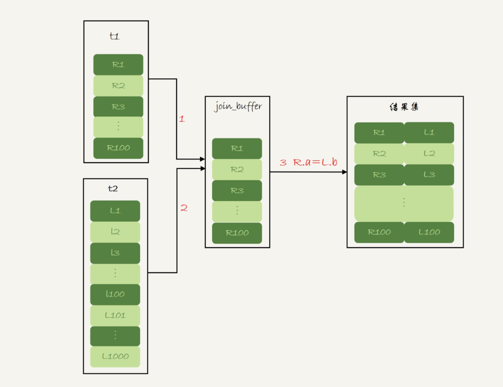

# week32

---

# Algorithm []()
## 1. 问题描述

## 2. 解题思路

## 3. 代码

## 4. 复杂度分析

---

# Review []()

---

# Tip
 

---
    
# Share 34 到底可不可以使用join？ —— 极客时间 MySQL实战45讲
关于 join 的常见问题：
1. DBA 不让用 join，为什么？
2. 两个大小不同的表做 join，应该用哪个做驱动表

新建两张表
```join

CREATE TABLE `t2` (
  `id` int(11) NOT NULL,
  `a` int(11) DEFAULT NULL,
  `b` int(11) DEFAULT NULL,
  PRIMARY KEY (`id`),
  KEY `a` (`a`)
) ENGINE=InnoDB;

drop procedure idata;
delimiter ;;
create procedure idata()
begin
  declare i int;
  set i=1;
  while(i<=1000)do
    insert into t2 values(i, i, i);
    set i=i+1;
  end while;
end;;
delimiter ;
call idata();

create table t1 like t2;
insert into t1 (select * from t2 where id<=100)
```
两张表都有一个主键索引 id 和一个索引 a，字段 b 上无索引。
t2 插入了 1000 行， t1 插入了 100 行。

## Index Nested-Loop Join (NLJ)
```roomsql
select * from t1 straight_join t2 on (t1.a=t2.a);
```
使用 join，MySQL 优化器可能会选择 t1 或者 t2 作为驱动表，straight_join 让 MySQL 使用固定连接方式执行查询。
t1 是驱动表，t2 是被驱动表。

join 用了被驱动表 t2 的 a 索引

1. 从表 t1 中读入一行数据 R
2. 从数据行 R 中，取出 a 字段表 t2 里去查找
3. 取出表 t2 中满足条件的行，跟 R 组成一行，作为结果集的一部分
4. 重复执行步骤 1~3，直到 t1 的末尾循环结束


1. 对驱动表 t1 做了全表扫描，这个过程需要扫描 100 行
2. 对于每一行 R，根据 a 字段去表 t2 查找，走的是树搜索过程。由于我们构造的数据都是一一对应的，因此每次只扫描一行，总共扫描 100 行
3. 整个流程扫描 200 行

### 能否使用 join ？
假设不能使用 join，要实现上述语句的执行流程：
1. 执行 select * from t1 查出表 t1 的所有数据，这里有 100 行
2. 循环遍历 100 行数据：
    * 从每一行 R 取出字段 a 的值 $R.a
    * 执行 select * from t2 where a=$R.a;
    * 把返回的结果和 R 构成结果集的一行

这个过程也是扫描了 200 行，但是总共执行了 101 条语句，比直接 join 多了 100 次交互。除此之外，客户端还要自己拼接 SQL。
因此不如直接 join

### 怎么选择驱动表
这个 join 中，驱动表走全表扫描，被驱动表走树搜索。

假设被驱动表的行数是 M，每次查询需要查索引 a ，然后查主键索引，每次搜索一棵树近似复杂度是以 2 为底 M 的对数 log2M，所以在被驱动表上
查一行的时间复杂度是 2*log2M

假设驱动表的行数是 N，执行过程要扫描 N 行，对每一行到驱动表上匹配一次。

这个过程的执行复杂度近似为 N + N*2*log2M

显然，N 对扫描行数的影响更大，因此应该让小表来做驱动表。（N扩大 1000 倍，扫描行数扩大 1000 倍，而 M 扩大 1000 倍，扫描行数扩大不到 10 倍）

结论（前提是可以使用被驱动表的索引）：
1. 使用 join 比强行拆成多个单表执行 SQL 语句的性能要好
2. 使用 join 需要让小表做驱动表

## Simple Nested-Loop Join (SNLJ)
```roomsql
select * from t1 straight_join t2 on (t1.a=t2.b);
```
t2 的字段 b 上没有索引，因此按照 NLJ 的流程执行的话需要扫描 100*1000=10万行，因此为此扫描 t2 都需要做一次全表扫描。

MySQL 没有使用 SNLJ，还有一个算法 BNLJ
## Block Nested-Loop Join (BNLJ)
这个时候被驱动表上没有可用索引，算法流程如下：
1. 把 t1 的数据读入线程内存 join_buffer 中，由于我们这个语句中写的是 select * ，因此是把整个表 t1 放入了内存
2. 扫描表 t2，把 t2 中的每一行取出来，跟 join_buffer 中的数据做对比，满足 join 条件的，作为结果集的一部分返回



explain 结果


BNLJ 和 SNLJ 都扫描了 10 万行，但是 BNLJ 算法的这 10 万次判断是在内存中操作的，速度上会快很多，性能也更好。

假设小表行数是 N， 大表行数是 M，这个算法里：
1. 两个表都做一次全表，所以总的扫描行数是 M + N
2. 内存中的判断次数是 M*N

如果 t1 是一个大表，join_buffer 放不下的话，可以调大 join_buffer ,如果还放不下可以分段放。join_buffer 大小是由
参数 join_buffer_size 设定的，默认值是 256k。

join_buffer 放不下的情况下（把 join_buffer_size 改成 1200），以下语句执行流程：
```roomsql
select * from t1 straight_join t2 on (t1.a=t2.b);
```
1. 扫描表 t1，顺序读取数据行放入 join_buffer 中，放完第 88 行 join_buffer 满了，继续执行第 2 步
2. 扫描表 t2，把 t2 中的每一行取出来，跟 join_buffer 中的数据做对比，满足 join 条件的，作为结果集的一部分返回
3. 清空 join_buffer
4. 继续扫描表 t1，顺序读取最后的 12 行数据放入 join_buffer 中，继续第 2 步

执行流程图

4、5 是清空 join_buffer 再复用的过程。

算法中的 Block 表示"分块去 join"

分析：
假设，驱动表的数据行数是 N，需要分 K 段才能完成算法流程，被驱动表的数据行数是 M

这里 K 不是常数，N 越大 K 越大，假设 K=x*N, x 取值为 (0,1)

1. 扫描行数是 N + x*N*M
2. 内存判断 N*M 次

内存的判断次数是不受哪个表作为驱动表影响的。而考虑到扫描行数，在 M 和 N 大小确定的情况下，N 小一些，真个算式的结果会更小。

所以，应该让小表作为驱动表。

在 N + x*N*M 中 x 是扫描行数的关键因素，x 越小越好

N 固定的时候 join_buffer_size 影响 K 的大小，join_buffer_size 越大，一次可以放入的行越多，分成的段数越少，对被驱动表全表扫描的次数就越少

因此，如果 join 语句很慢的话，可以调大 join_buffer_size

### 能否使用 join
1. 如果可以使用 Index Nested-Loop Join 算法，也就是说可以用上被驱动表上的索引，其实是没有问题的
2. 如果使用 Block Nested-Loop Join 算法，扫描行数就会过多。尤其是在大表上的 join 操作，这样可能要扫描被驱动表很多次，会占用大量的
系统资源。所以这种 join 尽量不要用。

所以，判断是否使用 join，要看 explain 结果里面，Extra 字段里有没有出现 "Block Nested Loop" 

### join 时用哪张表做驱动表
用小表做驱动表。这里的小表指的是相对较小的表。
#### 例1：
```roomsql
select * from t1 straight_join t2 on (t1.b=t2.b) where t2.id<=50;
select * from t2 straight_join t1 on (t1.b=t2.b) where t2.id<=50;
```
这两个语句的被驱动表都用不上索引，所以 join 字段都使用了没有索引的字段 b

但是第二个语句，join_buffer 只需要放入 t2 的前 50 行，显示更好。所以这里 t2 的前 50 行 是小表

#### 例2：
```roomsql
select t1.b,t2.* from  t1  straight_join t2 on (t1.b=t2.b) where t2.id<=100;
select t1.b,t2.* from  t2  straight_join t1 on (t1.b=t2.b) where t2.id<=100;
```
t1 和 t2 都是只有 100 行参加 join。但是，这两条语句放入 join_buffer 的数据是不一样的
* t1 只查询 b 字段，因此如果把 t1 放入 join_buffer 中，只需要放入 b 字段
* t2 需要所有字段，因此把 t2 放入 join_buffer 中，就需要放入全部字段 id、a、b

因此应该选择 t1 作为驱动表

* 在决定哪个表做驱动表的时候，应该是两个表按照各自的条件过滤，过滤完成之后，计算参与 join 的各个字段的总数据量，数据量小的那个表，
就是 "小表"，应该作为驱动表。

## 思考题
使用 Block Nested-Loop Join 算法，可能会因为 join_buffer 不够大，需要对被驱动表做多次全表扫描。

如果被驱动表是一个大表，并且是一个冷数据表，除了查询过程中可能会导致 IO 压力大以外，你觉得对这个 MySQL 服务还有什么更严重的影响吗？

* 答：
大表的 join 操作虽然对 IO 有影响，但是在语句执行结束后，对 IO 的影响也就结束了。但是，对 Buffer Pool 的影响就是持续性的，需要依靠
后续的查询请求慢慢恢复内存命中率