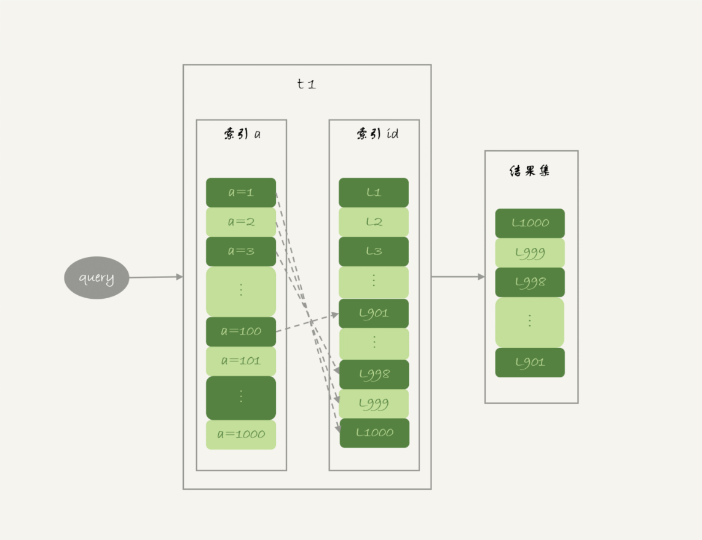
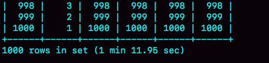

# week33

---

# Algorithm [72. Edit Distance](https://leetcode.com/problems/edit-distance/)
## 1. 问题描述
编辑距离

给定两个单词 word1 和 word2，找到一个最小操作步骤将 word1 转成 word2

在一个单词上有 3 个允许的操作：
1. 插入一个字符
2. 删除一个字符
3. 替换一个字符

示例 1:
* 输入：word1="horse",word2="ros"
* 输出：3
* 解释：
    * horse -> rorse
    * rorse -> rose
    * rose -> ros

示例 2：
* 输入: word1="intention",word2="execution"
* 输出: 5
* 解释：
    * intention -> inention
    * inention -> enention
    * enention -> exention
    * exention -> exection
    * exection -> execution

## 2. 解题思路
设 dp[i][j] 表示 w1[0,i) 和 w2[0,j) 的最短编辑次数

if w1[i] == w2[j] then dp[i][j] = dp[i-1][j-1]

if w1[i] != w2[j] then
* (1) 用 w2[j] 替换 w1[i] then dp[i][j] = dp[i-1][j-1] + 1
* (2) 删除 w1[i] then dp[i][j] = dp[i-1][j] + 1
* (3) 在 w1[i] 之后插入 w2[j] then dp[i][j] = dp[i][j-1] + 1

* 综上， dp[i][j] = min(dp[i-1][j-1],dp[i-1][j],dp[i][j-1]) + 1

初始化 dp[k][0] = dp[0][k] = k

最终求出 dp[m][n],其中 m=len(w1),n=len(w2)

## 3. 代码
```go
func minDistance(word1 string, word2 string) int {
	m,n := len(word1),len(word2)
	var dp [][]int
	dp = make([][]int, m+1)
	for i := 0; i < m+1; i++ {
		dp[i] = make([]int, n+1)
	}
	for i := 0; i < m+1; i++ {
		dp[i][0] = i
	}
	for j := 0; j < n+1; j++ {
		dp[0][j] = j
	}
	for i := 0; i < m; i++ {
		for j := 0; j < n; j++ {
			if word1[i] == word2[j] {
				dp[i+1][j+1] = dp[i][j]
			} else {
				min := dp[i][j]
				if min > dp[i+1][j] {
					min = dp[i+1][j]
				}
				if min > dp[i][j+1] {
					min = dp[i][j+1]
				}
				dp[i+1][j+1] = min + 1
			}
		}
	}
	return dp[m][n]
}
```
## 4. 复杂度分析
* 时间复杂度： O(m*n)
* 空间复杂度： O(m*n)

---

# Review [Why We Need Apache Spark](https://medium.com/better-programming/why-we-need-apache-spark-51c8a57aa57a)
为什么我们需要 Spark

根据 IDC 估计，在 2013 年，互联网总的数据量为 4.4ZB（1万亿GB）,并且以每年 40% 的
速度增长，预计到 2020 年将达到 44ZB

因此我们需要存储越来越多的数据，并采取措施防止由于硬件故障而造成的数据丢失。

因此我们需要 Hadoop 和 Spark

## 示例
我们有 500GB 的天气数据

国家 | 城市 | 数据 | 气温

假设我们需要按照国家/地区计算最高气温

```java
import java.io.*;
import java.util.HashMap;import java.util.HashSet;import java.util.Map;

public class MaxTemperature {
    public static void main(String[] args) throws FileNotFoundException,IOException {
        Map<String,Integer> maxTemps = new HashMap<>();
        String inputPath = "weather.csv";
        BufferedReader reader = new BufferedReader(new InputStreamReader(new FileInputStream(inputPath)));
        String line;
        while((line = reader.readLine()) != null) {
            String[] split = line.split("|");
            String country = split[0];
            Integer temp = Integer.valueOf(split[3]);
            if (temp != null) {
                updateTemp(country, temp, maxTemps);
            }
        }
        for (Map.Entry entry : maxTemps.entrySet()) {
            System.out.println(entry.getKey() + "|" + entry.getValue());
        }
    }
    
    private static void updateTemp(String country, int temp, Map<String,Integer> maxTemps) {
        Integer previousTemp = maxTemps.get(country);
        if (previousTemp == null) maxTemps.put(country, temp);
        if (previousTemp != null && temp > previousTemp) maxTemps.put(country, temp);
    }
}
```
对于 500GB 的数据量，这个程序需要运行大概 5 个小时

用 MapReduce 处理大概只需要 15 分钟

* MaxTemperatureMapper
```java
public class MaxTemperatureMapper extends Mapper<LongWritable, Text, Text, IntWritable> {
    @Override
    public void map(LongWritable key, Text value, Context context) {
        String line = value.toString();
        String[] split = line.split("|");
        String country = split[0];
        Integer temp = Integer.valueOf(split[3]);
        context.write(new Text(country), new IntWritable(temp));
    }
}
```
* MaxTemperatureReducer
```java
public class MaxTemperatureReducer extends Reducer<Text, IntWritable, Text, IntWritable> {
    @Override
    public void reduce(Text key, Iterable<IntWritable> values, Context context) {
        int maxTemperature = Integer.MIN_VALUE;
        for (IntWritable temp : values) {
            maxTemperature = Math.max(maxTemperature, temp);
        }
        context.write(key, new IntWritable(maxTemperature));
    }
}
```

MapReduce 之所以性能好，是因为它是并行执行的

## 问题
MapReduce 所需的数据,大多存储在 HDFS 中。

大部分 MapReduce 程序大约花费其 90% 的时间从硬盘中读取数据。

认识到这个问题之后，研究人员开发了新的框架，能够进行 ： 跨连接的机器集群进行内存计算

## 解决方案 —— Spark
```java
JavaRDD<String> weatherData = sc.textFile(inputPath);
JavaPairRDD<String,Integer> tempsByCountry = weatherData.mapToPair(new Function<String,String,Integer>() {
   public Tuple2<String,Integer> call(String line) {
       String[] split = line.split("|");
       String key = split[0];
       Integer temp = Integer.valueOf(split[3]);
       if (temp != null) temp = 0;
       return new Tuple2(key, temp);
   } 
});
JavaPairRDD<String,Integer> maxTempByCountry = tempByCountry.reduce(new Function2<Integer,Integer,Integer>() {
    public Integer call(Integer temp1, Integer temp2) {
        return Math.max(temp1, temp2);
    }
});
maxTempByCountry.saveAsHadoopFile(destPath, String.class, Integer.class, TextOutputFormat.class);
```
Spark 使用 RDDs 实现 MaxTemperatureMapper

由于 Spark 完全在内存中运行，因此对于可比较的任务，Spark 的迭代速度比 MapReduce 快 10 倍。


---

# Tip 计算机存储单位：Byte、KB、MB、GB、TB、PB、EB、ZB、YB、DB、NB
* 1Byte = 8 Bit 
* 1 KB(Kilobyte) = 2<sup>10</sup> Bytes = 1,024 Bytes 
* 1 MB(Megabyte) = 2<sup>20</sup> Bytes = 1,024 KB = 1,048,576 Bytes 
* 1 GB(Gigabyte) = 2<sup>30</sup> Bytes = 1,024 MB = 1,048,576 KB = 1,073,741,824 Bytes 
* 1 TB(Trillionbyte) = 2<sup>40</sup> Bytes = 1,024 GB = 1,048,576 MB = 1,073,741,824 KB = 1,099,511,627,776 Bytes 
* 1 PB(Petabyte) = 2<sup>50</sup> Bytes = 1,024 TB = 1,048,576 GB =1,125,899,906,842,624 Bytes （13107.2个80G的
* 1 EB(Exabyte) = 2<sup>60</sup> Bytes = 1,024 PB = 1,048,576 TB = 1,152,921,504,606,846,976 Bytes 
* 1 ZB(Zettabyte) = 2<sup>70</sup> Bytes = 1,024 EB = 1,180,591,620,717,411,303,424 Bytes 
* 1 YB(Yottabyte) = 2<sup>80</sup> Bytes = 1,024 ZB = 1,208,925,819,614,629,174,706,176 Bytes
* 1 BB(Brontobyte) = 2<sup>90</sup> Bytes = 1,024 YB = 1237940039285380274899124224 Bytes

---
    
# Share 35 join语句怎么优化？ —— 极客时间 MySQL实战45讲
主要看 NLJ(Index Nested-Loop Join) 和 BNL(Block Nested-Loop Join) 算法的优化

创建两张表 t1,t2
```roomsql

create table t1(id int primary key, a int, b int, index(a));
create table t2 like t1;
drop procedure idata;
delimiter ;;
create procedure idata()
begin
  declare i int;
  set i=1;
  while(i<=1000)do
    insert into t1 values(i, 1001-i, i);
    set i=i+1;
  end while;
  
  set i=1;
  while(i<=1000000)do
    insert into t2 values(i, i, i);
    set i=i+1;
  end while;

end;;
delimiter ;
call idata();
```
t1 插入了 1000 行数据，每一行的 a=1001-id，即 t1 中的 a 是逆序的。t2 插入了 100 万行数据。

## Multi-Range Read(MRR) 优化
MRR 优化主要目的是尽量顺序读盘。


回表流程

```roomsql
select * from t1 where a>=1 and a<=100;
```
回表主要是根据主键 id 一行行地搜索。id 的值越随机，那么回表用主键索引就会变成随机访问磁盘，影响性能。

因为大多数数据都是按照主键递增顺序插入得到的，所以我们可以认为，如果按照主键的递增顺序查询的话，对磁盘的读比较接近顺序读，能够提升读性能。

这就是 MRR 的优化设计思路，因此语句的执行流程：
1. 根据索引 a，定位到满足条件的记录，将 id 值放入 read_rnd_buffer 中
2. 将 read_rnd_buffer 中的 id 进行递增排序
3. 排序后的 id 数组，依次到主键 id 索引中查记录，并作为结果返回

read_rnd_buffer 由 read_rnd_buffer_size 参数控制，如果步骤 1 中 read_rnd_buffer 放满，则会先执行 2、3，然后清空 read_rnd_buffer,
继续循环。

set optimizer_switch="mrr_cost_based=off" 稳定使用mrr，防止优化器关闭 mrr 优化。


MRR 能够提升性能的核心在于，这条语句是在 a 上的一个范围查询（即多值查询），可以得到足够多的 id。这样排序后再去主键索引查询，才能体现出
顺序性的优势。

## Batched Key Access
BKA 由 MySQL 5.6 引入

NLJ 流程

从驱动表 t1 一行行取出 a 的值，再到被驱动表 t2 去做 join。

BKA 流程

在 NLJ 的基础上使用 join_buffer,然后利用 MRR 优化，即 BKA 算法。

在 join_buffer 中放入 P1~P100，表示的是只会取查询需要的字段。

要使用 BKA 算法，需要先执行 SQL
```roomsql
set optimizer_switch='mrr=on,mrr_cost_based=off,batched_key_access=on';
```
## BNL 算法的性能问题
使用 BNL 算法时，可能对被驱动表做多次扫描。如果这个被驱动表示一个大的冷数据表，除了会导致 IO 压力以外，还会对系统有什么影响？

InnoDB 对 Buffer Pool 的 LRU 算法做了优化，即：第一个磁盘读入内存的数据页，会先放在 old 区。如果 1 秒之后这个数据不再被访问，就会
被移到 LRU 连表头。

但是，BNL 算法的 join 语句，多次扫描一个冷表，而且这个语句执行超过 1 秒，再次扫描冷表的时候就会把冷表的数据移动到 LRU 表头。

这种情况对应的，是冷表的数据量小于整个 Buffer Pool 的 3/8，能够完全放入 old 区域的情况。

如果这个冷表很大，就会出现另外一种情况：业务正常访问的数据页，没有机会进入 young 区域。

大表 join 操作虽然对 IO 有影响，但是在语句执行结束后，对 IO 的影响也就结束了。但是，对 Buffer Pool 的影响就是持续性的，需要依靠后续
的查询请求慢慢恢复内存命中率。

为了减少这种影响，可以增大 join_buffer_size,减少对被驱动表的扫描次数。

BNL 算法对系统影响：
1. 可能会多次扫描被驱动表，占用磁盘 IO 资源
2. 判断 join 条件需要执行 M*N 次对比(M、N 分别是两张表的行数)，如果是大表就会占用非常多的 CPU 资源
3. 可能会导致 Buffer Pool 的热数据被淘汰，影响内存命中率

优化方法：给被驱动表的 join 字段加上索引，把 BNL 转成 BKA 算法
## BNL 转 BKA
一些情况下，可以直接在被驱动表上建索引，这时就可以直接转成 BKA 算法。

但是有时候会碰到一些不是和建索引的情况，如
```roomsql
select * from t1 join t2 on (t1.b=t2.b) where t2.b>=1 and t2.b<=2000;
```
t2 中有 100 万行数据，结果 where 之后参与 join 的只有 2000 行。如果这个 SQL 是一个低频 SQL，那么在 t2 上建立索引就很浪费。

使用 BNL 做 join 的流程：
1. 把 t1 的所有字段取出来，存入 join_buffer。t1 只有 1000 行，join_buffer 默认 256k，可以完全存入
2. 扫描表 t2，取出每一行数据跟 join_buffer 中的数据进行对比
    * 如果不满足 t1.b=t2.b，则跳过
    * 如果满足，再判断 t2.b 是否处于 [1,2000] ，如果是则作为结果集返回，否则跳过

对于 t2 的每一行，判断 join 是否满足，都要遍历 join_buffer 所有行。因此等值条件判断次数是 1000*100万=10亿次

explain 结果

语句执行时间

使用临时表的大致思路：
1. 把表 t2 中满足条件的数据放在临时表 tmp_t 中
2. 为了让 join 使用 BKA，给临时表 tmp_t 的字段 b 加上索引
3. 让 t1 和 tmp_t 做 join 操作

对应的 SQL 写法
```roomsql
create temporary table temp_t(id int primary key, a int, b int, index(b))engine=innodb;
insert into temp_t select * from t2 where b>=1 and b<=2000;
select * from t1 join temp_t on (t1.b=temp_t.b);
```

执行结果

1. 执行 insert 语句构造 temp_t 并插入数据，对 t2 做全表扫描，扫描 100万 行
2. join语句，扫描 t1，扫描行数是 1000；join 比较过程中，做了 1000 次带索引的查询。
相比于优化前的 join 语句需要做 10 亿次条件判断来说，这个优化效果很明显。

## 扩展 -hash join
10 次操作，看上去有点傻。如果 join_buffer 里维护的不是一个无序数组，而是一个哈希表的话，那么就不是 10 亿次判断，
而是 100 万次 hash 查找。

但是 MySQL 不支持哈希 join。

但是这个优化思路可以自己在业务端实现：
1. select * from t1; 取 t1 的全部 1000 行数据，存入 hash 表
2. select * from t2 where b>=1 and b<=2000; 取 t2 满足条件的 2000 行数据
3. 把这 2000 行数据，一行行地取到业务端，到 hash 结构的数据表中寻找匹配的数据。
满足匹配条件的这行数据，就作为结果集的一行。

理论上这个方案比临时表的方案还要快。

1. BKA 优化是 MySQL 已经内置支持的，建议默认使用
2. BNL 算法效率低，建议尽量转成 BKA 。优化的方向就是给被驱动表的关联字段加上索引
3. 基于临时表的改进方案，对于能够提前过滤出小数据的 join 语句来说，效果还是很好的
4. MySQL 暂不支持 hash join，建议配合应用端模拟，理论上效果要好于临时表方案

## 思考题
三张表的 join
```roomsql

CREATE TABLE `t1` (
 `id` int(11) NOT NULL,
 `a` int(11) DEFAULT NULL,
 `b` int(11) DEFAULT NULL,
 `c` int(11) DEFAULT NULL,
  PRIMARY KEY (`id`)
) ENGINE=InnoDB;

create table t2 like t1;
create table t3 like t2;
insert into ... //初始化三张表的数据
```
```roomsql
select * from t1 join t2 on(t1.a=t2.a) join t3 on (t2.b=t3.b) where t1.c>=X and t2.c>=Y and t3.c>=Z;
```
为了得到最快的执行速度，如果在 t1,t2,t3 上建立索引？

如果用 straight_join 来重写这个语句，如何安排连接顺序？

* 答：
第一原则尽量使用 BKA 算法。注意，使用 BKA 时，不是先计算两张表的 join，再跟第三张表 join，而是直接嵌套查询。

具体实现：t1.c>=X、t2.c>=Y、t3.c>=Z 这三个条件里，选择一个经过过滤以后，数据最少的那个表，作为第一驱动表。
可能会出现以下两种情况：

一、如果选出来的是 t1 或 t3，那么剩下的部分就固定了
1. 如果驱动表是 t1,连接顺序是 t1->t2->t3,要在被驱动表字段上创建索引，也就是t2.a 和 t3.b
2. 如果驱动表示 t3,连接顺序是 t3->t2->t1,需要在 t2.b 和 t1.a 上创建索引

二、如果第一驱动表是 t2,则需要评估另外两个条件过滤效果

总体思路：尽量让每一次参与 join 的驱动表的数据集，越小越好，因为这样我们的驱动表就会越小。


