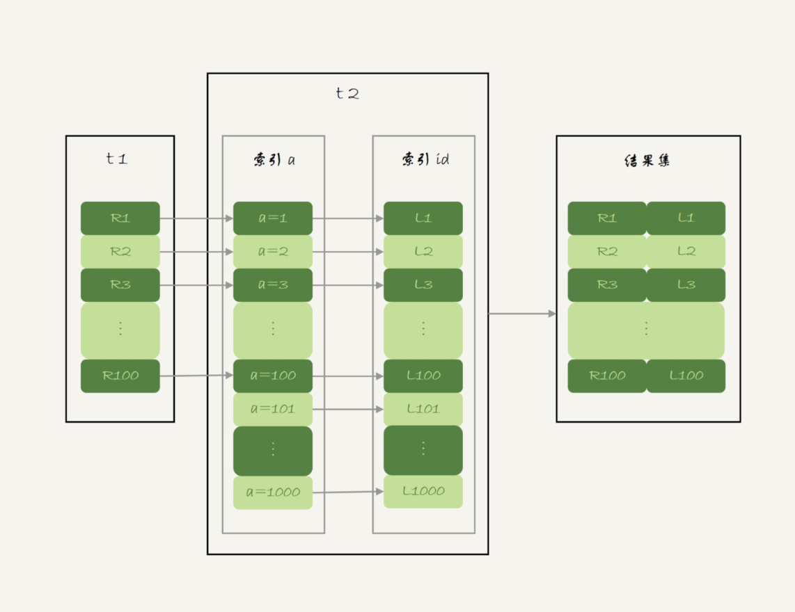

# week33

---

# Algorithm []()
## 1. 问题描述

## 2. 解题思路

## 3. 代码

## 4. 复杂度分析

---

# Review []()

---

# Tip
 

---
    
# Share 35 join语句怎么优化？ —— 极客时间 MySQL实战45讲
主要看 NLJ(Index Nested-Loop Join) 和 BNL(Block Nested-Loop Join) 算法的优化

创建两张表 t1,t2
```roomsql

create table t1(id int primary key, a int, b int, index(a));
create table t2 like t1;
drop procedure idata;
delimiter ;;
create procedure idata()
begin
  declare i int;
  set i=1;
  while(i<=1000)do
    insert into t1 values(i, 1001-i, i);
    set i=i+1;
  end while;
  
  set i=1;
  while(i<=1000000)do
    insert into t2 values(i, i, i);
    set i=i+1;
  end while;

end;;
delimiter ;
call idata();
```
t1 插入了 1000 行数据，每一行的 a=1001-id，即 t1 中的 a 是逆序的。t2 插入了 100 万行数据。

## Multi-Range Read(MRR) 优化
MRR 优化主要目的是尽量顺序读盘。


回表流程

```roomsql
select * from t1 where a>=1 and a<=100;
```
回表主要是根据主键 id 一行行地搜索。id 的值越随机，那么回表用主键索引就会变成随机访问磁盘，影响性能。

因为大多数数据都是按照主键递增顺序插入得到的，所以我们可以认为，如果按照主键的递增顺序查询的话，对磁盘的读比较接近顺序读，能够提升读性能。

这就是 MRR 的优化设计思路，因此语句的执行流程：
1. 根据索引 a，定位到满足条件的记录，将 id 值放入 read_rnd_buffer 中
2. 将 read_rnd_buffer 中的 id 进行递增排序
3. 排序后的 id 数组，依次到主键 id 索引中查记录，并作为结果返回

read_rnd_buffer 由 read_rnd_buffer_size 参数控制，如果步骤 1 中 read_rnd_buffer 放满，则会先执行 2、3，然后清空 read_rnd_buffer,
继续循环。

set optimizer_switch="mrr_cost_based=off" 稳定使用mrr，防止优化器关闭 mrr 优化。


MRR 能够提升性能的核心在于，这条语句是在 a 上的一个范围查询（即多值查询），可以得到足够多的 id。这样排序后再去主键索引查询，才能体现出
顺序性的优势。

## Batched Key Access
BKA 由 MySQL 5.6 引入

NLJ 流程

从驱动表 t1 一行行取出 a 的值，再到被驱动表 t2 去做 join。

BKA 流程

在 NLJ 的基础上使用 join_buffer,然后利用 MRR 优化，即 BKA 算法。

在 join_buffer 中放入 P1~P100，表示的是只会取查询需要的字段。

要使用 BKA 算法，需要先执行 SQL
```roomsql
set optimizer_switch='mrr=on,mrr_cost_based=off,batched_key_access=on';
```
## BNL 算法的性能问题
使用 BNL 算法时，可能对被驱动表做多次扫描。如果这个被驱动表示一个大的冷数据表，除了会导致 IO 压力以外，还会对系统有什么影响？

InnoDB 对 Buffer Pool 的 LRU 算法做了优化，即：第一个磁盘读入内存的数据页，会先放在 old 区。如果 1 秒之后这个数据不再被访问，就会
被移到 LRU 连表头。

但是，BNL 算法的 join 语句，多次扫描一个冷表，而且这个语句执行超过 1 秒，再次扫描冷表的时候就会把冷表的数据移动到 LRU 表头。

这种情况对应的，是冷表的数据量小于整个 Buffer Pool 的 3/8，能够完全放入 old 区域的情况。

如果这个冷表很大，就会出现另外一种情况：业务正常访问的数据页，没有机会进入 young 区域。

大表 join 操作虽然对 IO 有影响，但是在语句执行结束后，对 IO 的影响也就结束了。但是，对 Buffer Pool 的影响就是持续性的，需要依靠后续
的查询请求慢慢恢复内存命中率。

为了减少这种影响，可以增大 join_buffer_size,减少对被驱动表的扫描次数。

BNL 算法对系统影响：
1. 可能会多次扫描被驱动表，占用磁盘 IO 资源
2. 判断 join 条件需要执行 M*N 次对比(M、N 分别是两张表的行数)，如果是大表就会占用非常多的 CPU 资源
3. 可能会导致 Buffer Pool 的热数据被淘汰，影响内存命中率

优化方法：给被驱动表的 join 字段加上索引，把 BNL 转成 BKA 算法
## BNL 转 BKA
一些情况下，可以直接在被驱动表上建索引，这时就可以直接转成 BKA 算法。

但是有时候会碰到一些不是和建索引的情况，如
```roomsql
select * from t1 join t2 on (t1.b=t2.b) where t2.b>=1 and t2.b<=2000;
```
t2 中有 100 万行数据，结果 where 之后参与 join 的只有 2000 行。如果这个 SQL 是一个低频 SQL，那么在 t2 上建立索引就很浪费。

使用 BNL 做 join 的流程：
1. 把 t1 的所有字段取出来，存入 join_buffer。t1 只有 1000 行，join_buffer 默认 256k，可以完全存入
2. 扫描表 t2，取出每一行数据跟 join_buffer 中的数据进行对比
    * 如果不满足 t1.b=t2.b，则跳过
    * 如果满足，再判断 t2.b 是否处于 [1,2000] ，如果是则作为结果集返回，否则跳过

对于 t2 的每一行，判断 join 是否满足，都要遍历 join_buffer 所有行。因此等值条件判断次数是 1000*100万=10亿次

explain 结果

语句执行时间

使用临时表的大致思路：
1. 把表 t2 中满足条件的数据放在临时表 tmp_t 中
2. 为了让 join 使用 BKA，给临时表 tmp_t 的字段 b 加上索引
3. 让 t1 和 tmp_t 做 join 操作

对应的 SQL 写法
```roomsql
create temporary table temp_t(id int primary key, a int, b int, index(b))engine=innodb;
insert into temp_t select * from t2 where b>=1 and b<=2000;
select * from t1 join temp_t on (t1.b=temp_t.b);
```

执行结果

1. 执行 insert 语句构造 temp_t 并插入数据，对 t2 做全表扫描，扫描 100万 行
2. join语句，扫描 t1，扫描行数是 1000；join 比较过程中，做了 1000 次带索引的查询。
相比于优化前的 join 语句需要做 10 亿次条件判断来说，这个优化效果很明显。

## 扩展 -hash join
10 次操作，看上去有点傻。如果 join_buffer 里维护的不是一个无序数组，而是一个哈希表的话，那么就不是 10 亿次判断，
而是 100 万次 hash 查找。

但是 MySQL 不支持哈希 join。

但是这个优化思路可以自己在业务端实现：
1. select * from t1; 取 t1 的全部 1000 行数据，存入 hash 表
2. select * from t2 where b>=1 and b<=2000; 取 t2 满足条件的 2000 行数据
3. 把这 2000 行数据，一行行地取到业务端，到 hash 结构的数据表中寻找匹配的数据。
满足匹配条件的这行数据，就作为结果集的一行。

理论上这个方案比临时表的方案还要快。

1. BKA 优化是 MySQL 已经内置支持的，建议默认使用
2. BNL 算法效率低，建议尽量转成 BKA 。优化的方向就是给被驱动表的关联字段加上索引
3. 基于临时表的改进方案，对于能够提前过滤出小数据的 join 语句来说，效果还是很好的
4. MySQL 暂不支持 hash join，建议配合应用端模拟，理论上效果要好于临时表方案

## 思考题
三张表的 join
```roomsql

CREATE TABLE `t1` (
 `id` int(11) NOT NULL,
 `a` int(11) DEFAULT NULL,
 `b` int(11) DEFAULT NULL,
 `c` int(11) DEFAULT NULL,
  PRIMARY KEY (`id`)
) ENGINE=InnoDB;

create table t2 like t1;
create table t3 like t2;
insert into ... //初始化三张表的数据
```
```roomsql
select * from t1 join t2 on(t1.a=t2.a) join t3 on (t2.b=t3.b) where t1.c>=X and t2.c>=Y and t3.c>=Z;
```
为了得到最快的执行速度，如果在 t1,t2,t3 上建立索引？

如果用 straight_join 来重写这个语句，如何安排连接顺序？

* 答：
第一原则尽量使用 BKA 算法。注意，使用 BKA 时，不是先计算两张表的 join，再跟第三张表 join，而是直接嵌套查询。

具体实现：t1.c>=X、t2.c>=Y、t3.c>=Z 这三个条件里，选择一个经过过滤以后，数据最少的那个表，作为第一驱动表。
可能会出现以下两种情况：

一、如果选出来的是 t1 或 t3，那么剩下的部分就固定了
1. 如果驱动表是 t1,连接顺序是 t1->t2->t3,要在被驱动表字段上创建索引，也就是t2.a 和 t3.b
2. 如果驱动表示 t3,连接顺序是 t3->t2->t1,需要在 t2.b 和 t1.a 上创建索引

二、如果第一驱动表是 t2,则需要评估另外两个条件过滤效果

总体思路：尽量让每一次参与 join 的驱动表的数据集，越小越好，因为这样我们的驱动表就会越小。


