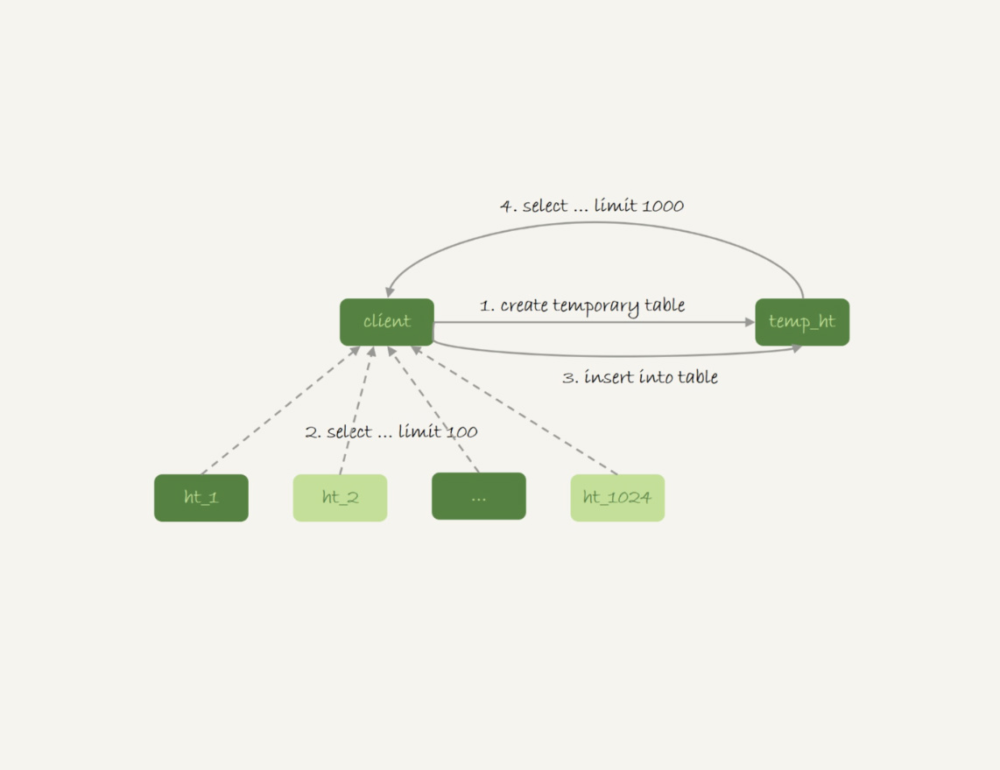

# week34

---

# Algorithm [617. Merge Two Binary Trees](https://leetcode.com/problems/merge-two-binary-trees/)
## 1. 问题描述
合并两个二叉树

合并规则是，将两个对应位置的节点相加，如果其中一个节点是 null，则新树为非 null 节点。

#### 示例:
* 输入:
```text
    Tree 1         Tree 2
       1             2
      / \           / \
     3   2         1   3
    /               \   \
   5                 4   7
```
* 输出 :
```text
Merged Tree
            3
           / \
          4   5
         / \   \
        5   4   7 
```

## 2. 解题思路
递归实现，前序遍历

## 3. 代码
```golang
type TreeNode struct {
    Val int
    Left *TreeNode
    Right *TreeNode
}

func merge(root *TreeNode, t1 *TreeNode, t2 *TreeNode) *TreeNode {
    if (root == nil) {
        root = new(TreeNode)
    }
    if (t1 != nil && t2 != nil) {
        root.Val = t1.Val + t2.Val
        root.Left = merge(root.Left, t1.Left, t2.Left)
        root.Right = merge(root.Right, t1.Right, t2.Right)
    } else if (t1 == nil && t2 != nil) {
        root.Val = t2.Val
        root.Left = merge(root.Left, nil, t2.Left)
        root.Right = merge(root.Right, nil, t2.Right)
    } else if (t1 != nil && t2 == nil) {
        root.Val = t1.Val
        root.Left = merge(root.Left, t1.Left, nil)
        root.Right = merge(root.Right, t1.Right, nil)
    } else {
        return nil
    }
    return root
}

func mergeTrees(t1 *TreeNode, t2 *TreeNode) *TreeNode {
    return merge(nil, t1, t2)
}
```
## 4. 复杂度分析
* 时间复杂度 : O(max(N,M)) N,M 分别为两棵树的节点数 
* 空间复杂度 : O(max(N,M))

---

# Review []()

---

# Tip
 

---
    
# Share 36 为什么临时表可以重名？ —— 极客时间 MySQL实战45讲
临时表和内存表是两个不同的概念
* 内存表：是使用 Memory 引擎的表，建表语法是 create table... engine=memory 表的数据保存在内存中，系统重启会被清空，但表结构还在。
* 临时表：可以使用各种引擎。如果使用的是 InnoDB 或 MyISAM 引擎，数据是写到磁盘的。临时表也可以使用 Memory 引擎。

## 临时表特性
| session A | session B |
| --- | --- |
| create temporary table t(c int) engine=myisam | |
| | show create table t;<br/>(Table 't' doesn't exist) |
| create table t(id int primary key) engine=innodb;<br/>show create table t;<br/>//create temporary table t(c int) engine=myisam;<br/>show tables;<br/>//只显示普通表t | |
| | insert into t values(1);<br/>select * from t;<br/>//返回 1 |
| select * from t;<br/>//Empty set; | |

临时表的特点：
1. 建表语法是 create temporary table ...
2. 一个临时表只能被创建它的 session 访问，对其他线程不可见。所以，A 创建的临时表 t 对 B 不可见
3. 临时表可以与普通表同名
4. A 内有同名的临时表和普通表的时候，show create 语句，以及增删改查语句访问的是临时表
5. show tables 命令不显示临时表

由于临时表只能被创建它的 session 使用，所以这个 session 结束时，会自动删除临时表。

```roomsql
create temporary table temp_t like t1;
alter table temp_t add index(b);
insert into temp_t select * from t2 where b>=1 and b<=2000;
select * from t1 join temp_t on (t1.b=temp_t.b);
```
由于这个特性，临时表特别适合上边的 join 优化场景，主要原因：
1. 不同 session 的临时表是可以重名的，如果有多个 session 同时执行 join 优化，不需要担心表明重复导致建表失败的问题
2. 不需要担心数据删除问题。如果使用普通表，在流程执行过程中客户端发生了异常断开，或者数据库发生异常重启，还需要专门来清理中间过程中生成的数据表。而临时表会被自动回收，所以不需要这个额外操作。

## 临时表的应用
由于不用担心线程之间的重名冲突，临时表经常会被用到复杂的查询优化中。

分库分表系统的跨库查询。

将一个大表 ht，按照字段 f，拆分成 1024 个分表，然后分不到 32 个数据库实例中。

```roomsql
select v from ht where f=N;
```
此条语句我们可以根据分表规则来确认需要的数据在哪个分表上，只需要访问一个分表即可。
```roomsql
select v from ht where k >= M order by t_modified desc limit 100;
```
这条语句没有用到分区字段 f，因此只能到所有的分区中去查找满足条件的所有行，然后统一做 order by 的操作。这种情况常见的思路：
### 在 proxy 层实现排序
优点是处理速度快，拿到分库的数据后直接在内存中计算。缺点：
1. 需要的开发工作量大。如果涉及到 group by 甚至 join，开发工作难度和工作量会更大。
2. 对 proxy 压力大，很容易出现 内存 和 cpu 瓶颈
### 把各分库拿到的数据，汇总到一个 MySQL 实例中的一个表中，然后在汇总实例中做操作
* 在汇总表上创建一个临时表 temp_ht,表里包含三个字段 v、k、t_modified;
* 在各分库上执行 
```roomsql
select v,k,t_modified from ht_x where k >= M order by t_modified desc limit 100;
```
* 把分库执行的结果插入到 temp_ht 表中
* 执行
```roomsql
select v from temp_ht order by t_modified desc limit 100; 
```

流程图

## 为什么临时表可以重命名
```roomsql
create temporary table temp_t(id int primary key)engine=innodb;
```
MySQL 会给这个 InnoDB 表创建一个 frm 文件保存表结构定义，然后还要有地方保存数据。

这个 frm 文件放在临时文件目录下，文件名的后缀是 .frm，前缀是 "#sql{进程id}_{线程id}_序列号"。
可以用 select @@tmpdir 命令，来显示实例的临时文件目录。

表中数据的存储方式，不同版本的处理方式不同：
* 5.6 及之前版本，MySQL 会在临时文件目录下创建一个相同的前缀、以 .ibd 为后缀的文件，用来存放数据文件
* 5.7 及其之后，MySQL 引入了一个临时文件表空间，专门用来存放临时文件的数据。因此，我们就不需要再创建 ibd 文件了。

| session A | session B |
| --- | --- |
| create temporary table t1 ...<br/>//#sql4d2_4_0.frm<br/>create temporary table t2 ...<br/>//#sql4d2_4_1.frm | |
| | create temporary table t1 ...//#sql4d2_5_0.frm |

MySQL 维护数据表，除了物理上要有文件外，内存里面也有一套机制区别不同的表，每个表都对应一个 table_def_key
* 一个普通表的 table_def_key 的值是由“库名 + 表名” 得到的，所以要在同一个库上创建两张同名的普通表，创建第二个表的过程就会发现
table_def_key 已经存在了
* 而对于临时表，table_def_key 在“库名 + 表名”基础上，又加入了“server_id + thread_id”

实现上，每个线程都维护了自己的临时表链表，这样每次 session 内操作表的时候，先遍历链表，检查是否有这个名字的临时表，如果有就优先操作，
如果没有则操作普通表；在 session 结束时，对链表中的每个临时表，执行“DROP TEMPORARY TABLE + 表名”

binlog 中也记录了 DROP TEMPORARY TABLE。临时表只有线程内部可以访问，为什么需要写到 binlog 里呢？——主备复制

## 临时表和主备复制
主库执行
```roomsql
create table t_normal(id int primary key, c int)engine=innodb;/*Q1*/
create temporary table temp_t like t_normal;/*Q2*/
insert into temp_t values(1,1);/*Q3*/
insert into t_normal select * from temp_t;/*Q4*/
```
如果binlog不记录临时表操作，那么备库就只有 Q1 和 Q4，在执行 Q4 时会报错。

binlog_format=row 时，binlog 不会记录临时表有关的语句，只有当 binlog_format=statment/mixed 时，binlog 中才会记录临时表的操作。

创建临时表的语句会传到备库上执行，因此备库的同步线程就会创建这个临时表。主库的线程退出时，会自动删除临时表，但是备库同步线程是持续在运行的。
所以，这个时候我们就需要在主库上再写一个 DROP TEMPORARY TABLE 传给备库执行。

主库上不同和的线程创建同名的临时表是没关系的，但是传到备库执行是怎么处理的？

实例 S 是 M 的备库
| | M 上 session A | M 上 session B | S 上的应用日志线程 |
| --- | --- | --- | --- |
| T1 | create temporary table t1 ...; | | |
| T2 | | | create temporary table t1 ...; |
| T3 | | create temporary table t1 ...; | |
| T4 | | | create temporary table t1 ...; |

主库 M 上的两个 session 创建了同名的临时表 t1， 这两个 create 语句都会被传到备库 S 上。

但是备库的日志线程是共用的，那么要在这个线程里执行两次创建临时表的语句。如何区分这两临时表呢？

MySQL 在记录 binlog 时，会记录主库执行这个语句的线程 id，在备库执行的时候就知道了每条语句的主库线程 id，并利用这个 id 来构造临时表
的 table_def_key :
1. session A 的临时表 t1,在备库的 table_def_key 是： 库名 + t1 + "M 的 serverid" + "session A 的 thread_id"
2. session B 的临时表 t1,在备库的 table_def_key 是： 库名 + t1 + "M 的 serverid" + "session B 的 thread_id"
## 思考题

为什么可以使用 alter table 修改临时表的表名，而不能使用 rename 的语法？
* 答：
在实现上，执行 rename table 语句的时候，要求按照 "库名 / 表名.frm" 的规则去磁盘找文件，但是临时表在磁盘上的 frm 文件是放在 tmpdir 
目录下的，并且文件名的规则是 "#sql{进程 id}_{线程 id}_序列号.frm",因此会报“找不到文件名”的错误

