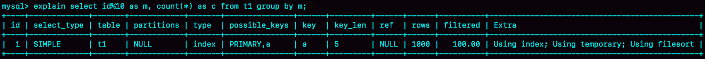
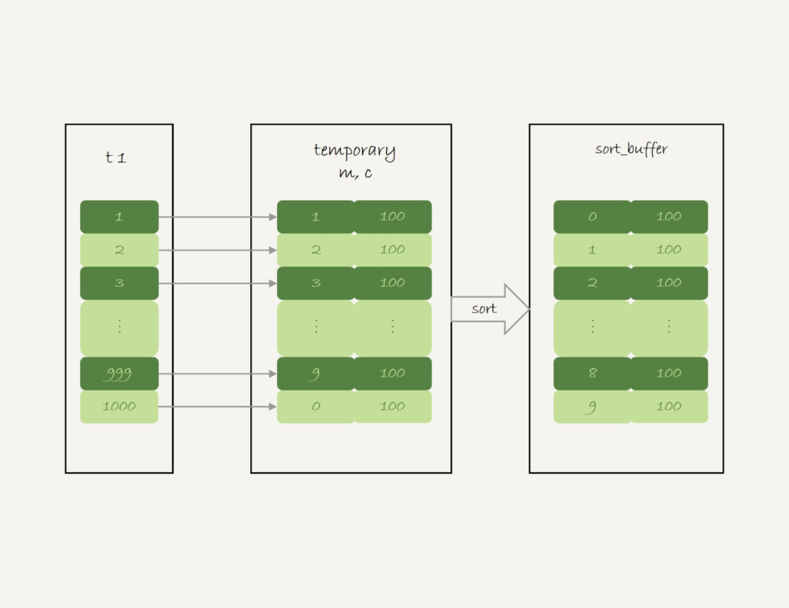
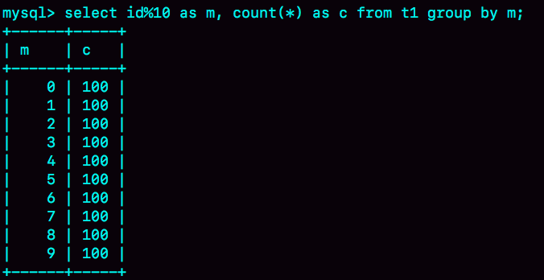
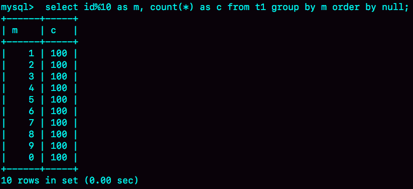

# week35

---

# Algorithm [87. Scramble String](https://leetcode.com/problems/scramble-string/)
## 1. 问题描述
混淆字符串

给定一个字符串 s1， 我们可以将其拆分为两个非空字符串并用二叉树表示，并且可以递归地拆分其子节点的字符串

下面是 s1="great" 的一种表示：
```text
    great
   /    \
  gr    eat
 / \    /  \
g   r  e   at
           / \
          a   t
```
在这棵树中我们可以选择任意一个非叶子节点，然后对换其两棵子树

比如我们选择 gr，然后对换 g 和 r，得到 rgeat
```text
    rgeat
   /    \
  rg    eat
 / \    /  \
r   g  e   at
           / \
          a   t
```
我们将 rgeat 称作 great 的混淆字符串

同样地，我们可以继续对换 eat 和 at 的子树，得到混淆字符串 rgtae
```text
    rgtae
   /    \
  rg    tae
 / \    /  \
r   g  ta  e
       / \
      t   a
```
rgtae 也是 great 的混淆字符串

给两个字符串 s1 和 s2,这两个字符串长度相同，判断 s2 是否是 s1 的混淆字符串

#### 示例 1 ：
* 输入 ： s1 = "great", s2 = "rgeat"
* 输出 ： true
#### 示例 2 ： 
* 输入 ： s1 = "abcde", s2 = "caebd"
* 输出 ： false


## 2. 解题思路

1. 首先判断两个字符串是否含有相同的字母及其数量，如果不是，则直接返回false
2. 如果 s1 和 s2 所含字母及其数量均相同
    * 2.1 判断 s2[0,i] 是否是 s1[0,i] 的混淆字符串 
    && s2[i,n] 是否是 s1[i,n] 的混淆字符串
    
    两个条件同时成立时 s2 是 s1 的混淆字符串
    
    * 或者 2.2 判断 s2[n-i,n] 是否是 s1[0,i] 的混淆字符串
    && s2[0,n-i] 是 s1[i,n] 的混淆字符串
    
    两个条件同时成立时 s2 是 s1 的混淆字符串

## 3. 代码
```gotemplate
func isScramble(s1 string, s2 string) bool {
    if s1 == s2 {
        return true
    }
    l := len(s1)
    var dic [26]int
    for i := 0; i < l; i++ {
      dic[s1[i]-'a']++
      dic[s2[i]-'a']--
    }

    for i := 0; i < 26; i++ {
      if dic[i] != 0 {
        return false
      }
    }

    for i := 1; i < l; i++ {
      if isScramble(s1[0:i],s2[0:i]) && isScramble(s1[i:l],s2[i:l]) {
        return true
      }
      if isScramble(s1[0:i],s2[l-i:l]) && isScramble(s1[i:l],s2[0:l-i]) {
        return true
      }
    }
    return false
}

```
## 4. 复杂度分析
* 时间复杂度 : 
    * 最好情况 : O(N)
    * 最坏情况 : O(N<sup>2</sup>)
* 空间复杂度 : O(log<sub>2</sub>N) 递归栈的深度

---

# Review [Java Spring Framework — Pros, Cons, Common Mistakes](https://medium.com/swlh/java-spring-framework-pros-cons-common-mistakes-d519b7caeeae)
## 什么是 Java Spring Framework
Spring 是一个 Java 框架，可以让开发企业级应用变得更简单。其受欢迎的主要原因是它适用于
各种场景

## Spring 的优点
* POJO(Plain Old Java Object) —— 普通的老的 Java 对象，轻量级框架
* 灵活的配置 —— 基于 XML 的，或者 properties 文件，或者 Java 注解
* AOP 模块
* 测试简单
## Spring 框架的缺点
* 复杂 —— 有大量的变量和复杂度
* 并行机制
* 没有具体准则
## 常见陷阱
设计 web 应用时尽量避免以下错误
* 错误处理不是优先事项
* 报告是从包含应用程序数据的表中创建的
* 试图重塑事物
* 在只读事务中查询实体
## 你的成功将取决于经验
尽管Spring提供了很多好处，但是你将需要经验丰富的开发人员，他们将知道如何利用它们。

---

# Tip Node.js 增加可使用的内存
Node.js 默认只能使用 2G 的内存，如果数据量太大就有可能导致 OOM，进而导致进程退出

node 提供了参数 max-new-space-size 来控制可以使用内存的大小，单位是 MB

以下表示 node 最多可以使用 8G 的内存
```nodejs
node --max-new-space-size=8192 app.js
```
 

---
    
# Share 37 | 什么时候会使用内部临时表？ —— 极客时间 MySQL实战45讲
需要使用内部临时表例子
## union 执行流程
```roomsql
create table t1(id int primary key, a int, b int, index(a));
delimiter ;;
create procedure idata()
begin
  declare i int;

  set i=1;
  while(i<=1000)do
    insert into t1 values(i, i, i);
    set i=i+1;
  end while;
end;;
delimiter ;
call idata();
```
```roomsql
(select 1000 as f) union (select id from t1 order by id desc limit 2);
```
union 表示去两个子查询的并集，合并之后去除重复行

* 第二行 key=PRIMARY，说明第二个句用到了索引
* 第三行 Extra 字段，表示在对子查询的结果集做 union 的时候，使用了临时表(Using temporary)

执行流程：
1. 创建一个内存临时表，这个临时表只有一个整型字段 f，并且 f 是主键字段
2. 执行第一个子查询，得到 1000 这个值，并存入临时表
3. 执行第二个子查询：
    * 拿到第一行 id=1000，试图插入临时表中。但是由于 1000 这个值已经存在于临时表了，违反了唯一性约束，所以插入失败，然后继续执行
    * 取第二行 id=999， 插入临时表成功
4. 从临时表中按行取出数据，返回结果，并删除临时表，结果中包含两行数据分别是 1000 和 999


如果使用 union all 则没有“去重”的语义了，这样执行的时候，就依次执行子查询，得到的结果就直接作为结果集的一部分，发送给客户端，
就不需要临时表了


## group by 执行流程
```roomsql
select id%10 as m, count(*) as c from t1 group by m;
```

在 Extra 字段里，可以看到三个信息
* Using index，使用了覆盖索引，索引 a， 不需要回表
* Using temporary，使用了临时表
* Using filesort，表示需要排序

语句的执行流程：
1. 创建内存临时表，表的字段包括 m 和 c，m 是主键
2. 扫描 t1 的索引 a，依次取出叶子节点上的 id 值，计算 id%10 的结果，记为 x
    * 如果临时表中没有主键为 x 的行，就插入一个记录 (x,1)
    * 如果表中有主键为 x 的行，就将 x 这一行的 c 值加 1
3. 遍历完成后，在根据字段 m 做排序，得到结果集返回给客户端


group by 执行流程

内存临时表排序过程


group by 执行结果

如果不需要对结果进行排序，在最后加上 order by null，这样就跳过了最后的排序阶段，直接从临时表中取数据返回
```roomsql
select id%10 as m, count(*) as c from t1 group by m order by null;
```


tmp_table_size 是控制内存临时表大小的，默认是 16M

```roomsql
set tmp_table_size=1024;
select id%100 as m, count(*) as c from t1 group by m order by null limit 10;
```
这时内存临时表无法放下全部数据，就会转成用磁盘临时表存储，磁盘临时表默认的引擎是 InnoDB


## group by 优化方法 —— 索引
group by 的语义是统计不同值的出现个数，而每一行 id%100 的结果是无序的，所以需要一个临时表。如果结果是有序的，是不是就简单很多呢？


可以看到如果可以确保输入的数据是有序的，那么计算 group_by 的时候，就只需要从左到右，顺序扫描，依次累加。
* 当碰到第一个 1 的时候，已经知道累积了 X 个 0，结果集里第一行就是 (0,X)
* 当碰到第一个 2 的时候，已经知道累积了 Y 个 1，结果集里第二行就是 (1,Y)

按照此逻辑，扫描到整个输入的数据结束，就可以拿到 group by 的结果，不需要临时表，也不需要额外排序

InnoDB 索引可以满足这个输入有序的条件

MySQL 5.7 支持了 generated column 机制，用来实现列数据的关联更新。可以用如下方法创建一个列 z，然后在 z 列上创建一个索引
(如果 MySQL 5.6 及之前版本，也可以创建普通列和索引，来解决)
```roomsql
alter table t1 add column z int generated always as(id % 100), add index(z);
```
这样 z 上的数据就类似了上图有序的图

group by 语句改为 
```roomsql
select z, count(*) as c from t1 group by z;
```

根据 Extra 可以看到，这条语句不需要临时表，也不需要排序
## group by 优化方法 —— 直接排序
如果不适合建索引，那么会使用内存临时表，发现内存不够用了再转成磁盘临时表，如果我们提前知道内存不够用（比如一张大表），那么可以直接跳过
内存临时表，直接使用磁盘临时表。

group by 语句加入 SQL_BIG_RESULT 这个提示 (hint),就可以告诉优化器：这个语句涉及的数据量很大，请直接使用磁盘临时表

MySQL 优化器发现磁盘临时表是 B+ 树，效率不如数组高，所以直接用数组来存

```roomsql
select SQL_BIG_RESULT id%100 as m, count(*) as c from t1 group by m;
```
这条语句的执行流程：
1. 初始化 sort_buffer, 确定放入一个整型字段，记为 m
2. 扫描表 t1 的索引 a，依次取出里面的 id 值，将 id%100 的值存入 sort_buffer 中
3. 扫描完成后，对 sort_buffer 的字段 m 做排序(如果 sort_buffer 内存不够用，就会利用磁盘临时文件辅助排序)
4. 排序完成后，就得到了一个有序数组


使用 SQL_BIG_RESULT 执行流程


使用 SQL_BIG_RESULT explain 结果

从 Extra 中可以看出没有使用临时表，而是直接使用了排序算法

MySQL 什么时候使用临时表：
1. 如果语句执行过程可以一边读数据，一边得到结果，是不需要额外内存的，否则就需要额外内存，来保存中间结果
2. join_buffer 是无序数组，sort_buffer 是有序数组，临时表是二维表结构
3. 如果执行逻辑需要用到二维表特性，就会优先使用临时表。比如，union 需要用到唯一索引约束，group by 还需要用到另一个字段来存累积计数

## 思考题
```roomsql
select id%10 as m, count(*) as c from t1 group by m order by null;
```
执行结果, 0 在最后一行

```roomsql
set tmp_table_size=1024;
select id%100 as m, count(*) as c from t1 group by m order by null limit 10;
```
执行结果 0 在第一行


为什么两个结果，一个 0 在最后一行，一个 0 在第一行？

* 答：
第一个用的是 内存表，使用的是 memory 引擎，内存表的数据是按照写入顺序存放的，因此是 0 在最后一行

第二个用的是 磁盘表，使用的是 InnoDB 引擎，采用的是 B+ 树索引，数据总是有序存放的，因此 0 在第一行
