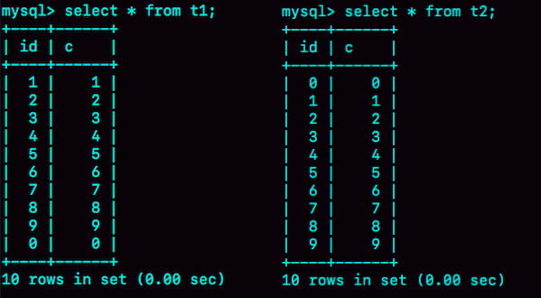
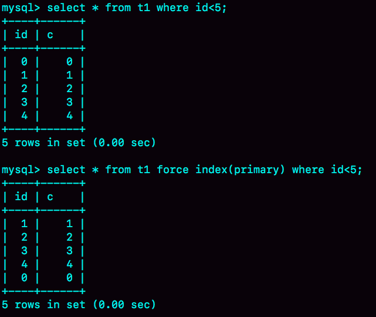
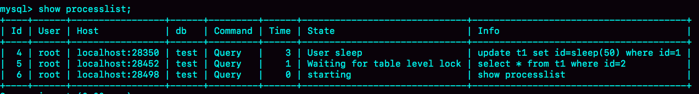

# week36

---

# Algorithm [96. Unique Binary Search Trees](https://leetcode.com/problems/unique-binary-search-trees/)
## 1. 问题描述
唯一的二叉搜索树

二叉搜索树：左子树的所有节点的值都小于根节点的值，右子树的所有节点的值都小于根节点的值

给定一个 n，有多少种唯一的 BST's 可以存储 1...n?

#### 示例：
* 输入：3
* 输出：5
* 解释： 给定 n=3,总共有 5 种 BST's:
```roomsql
   1         3     3      2      1
    \       /     /      / \      \
     3     2     1      1   3      2
    /     /       \                 \
   2     1         2                 3
```

## 2. 解题思路
dp[i] 表示从 1 到 i 的唯一的 BST's 的数量
dp[0] = 1 表示一棵空树
dp[1] = 1 表示只有根节点的树
dp[2] = dp[0]*dp[1]（1为根，2为右子树） + dp[1]*dp[0]（2为根，1为左子树）
dp[3] = dp[0]*dp[2] (1为根，2~3为右子树) + dp[1]*dp[1](2为根，1为左子树，3为右子树) + dp[2]*dp[0](3为根，1~2为左子树)
...
dp[n] = dp[0]*dp[n-1](1为根，2~n为右子树） + dp[1]*dp[n-2](2为根，1为左子树，3~n为右子树) + ... + dp[n-2]*dp[1](n-1为根，1~n-2为左子树，n为右子树) + dp[n-1]*dp[0](n为根，1~n-1为左子树)

## 3. 代码
func numTrees(n int) int {
    if n < 2 {
		return 1
	}
	var dp []int
	dp = make([]int,n+1)
	dp[0],dp[1] = 1,1
	for i := 2; i <= n; i++ {
		for j := 0; j < i; j++ {
			dp[i] += dp[j]*dp[i-j-1]
		}
	}
	return dp[n]
}
## 4. 复杂度分析
* 时间复杂度：O(N<sup>2</sup>)
* 空间复杂度：O(N)
---

# Review [How to read research papers](https://medium.com/lis-computer-vision-blogs/how-to-read-research-papers-6aac51632679)
如何阅读学术论文

## 1. 浏览
花 1~2 分钟找到兴趣点和相关性。阅读摘要、标题、图表等。查看作者、引用等。
## 2. 通过粗读来获取论文的核心观点
这个阶段的结果是使用2-3个句子来陈述问题，论文的新颖性以及结果的重要性。

花费 5~10 分钟在此阶段

并且尽量回答一下 6 个问题 (6Cs)
* Category (What type of paper?) 论文属于哪种类型
* Context (What other papers is it related to? How related to your work?)
它引用了哪些论文？与你的工作有多大的相关性？
* Contributions(Main contributions?) 主要贡献是什么？
* Credible (Dose it appear to have any credibility?) 它看起来可信吗？
* Care (i.e. the Who care's test) Given its valid, will anyone care? 
will it change anything? 是否有人在乎它，它改变了什么？
* Cost (How much time and effort will it cost you to read it carefully)
仔细阅读它会花费多少时间和精力？

## 3. 批判性阅读
仔细阅读，并相信一切，同时忽略细节。

此阶段将花费 20~60 分钟

检查作者的凭据和声誉。

记录下你的疑问

寻找可能是错误的假设

确保证据充分且准确

## 4. 创造性地阅读
本文的新颖性。它会向新的方向发展吗？

## 5. 深度阅读
仔细阅读

---

# Tip Google 大数据三驾马车 (三篇基础论文)
* [Google-File-System](TheGoogleFileSystem.pdf) 的开源实现：HDFS
* [Google-MapReduce](MapReduce_Simplified Data Processing on Large Clusters.pdf) 的开源实现：Hadoop MapReduce
* [Google-Bigtable](Bigtable_A Distributed Storage System for Structured Data.pdf) 的开源实现：HBase


---
    
# Share 38 | 都说InnoDB好，那还要不要使用Memory引擎？ —— 极客时间 MySQL实战45讲
## 内存表的数据结构
```roomsql
create table t1(id int primary key, c int) engine=Memory;
create table t2(id int primary key, c int) engine=innodb;
insert into t1 values(1,1),(2,2),(3,3),(4,4),(5,5),(6,6),(7,7),(8,8),(9,9),(0,0);
insert into t2 values(1,1),(2,2),(3,3),(4,4),(5,5),(6,6),(7,7),(8,8),(9,9),(0,0);
```
执行 
```roomsql
select * from t1;
select * from t2;
```

结果中，内存表 t1 返回结果里面 0 在最后一行，InnoDB 表 t2 返回结果里面 0 在第一行

InnoDB 表的数据放在主键索引树上，主键索引是 B+ 树

主键索引上的值是有序存储的，执行 select 时，就会按照叶子节点从左到右扫描，所以结果中 0 出现在第一行

Memory 引擎的数据表和索引是分开的。

内存表的数据部分按照数组的方式单独存放，而主键 id 存储数据的位置。
主键 id 是 hash 索引，key 无序

在表 t1 上 select 时，走全表扫描，顺序扫描这个数组，因此 0 在最后一行

InnoDB 和 Memory 引擎的存储方式不同：
* InnoDB 把数据放在主键索引中，其他索引上保存的是主键 id，这种方式称为 索引组织表(Index Organizied Table)
* Memory 引擎中数据单独存放，索引存储数据的位置，称为堆组织表 (Heap Organizied Table)

两个引擎的区别：
1. InnoDB 表的数据总是有序存放的，Memory 表的数据是按照插入数据存放的
2. 当数据文件有空洞时，InnoDB 插入新数据时，为了保证数据有序，只能在固定位置写入新值，而 Memory 表找到空位就可以插入
3. 数据位置发生变化是，InnoDB 只需要修改主键索引，而内存需要修改所有索引
4. InnoDB 表主键查询时需要走一遍主键索引，普通索引查询时需要走一遍普通索引，然后再走一遍主键索引，Memory 引擎中无此区别，所有的索引
地位都一样
5. InnoDB 支持变长数据类型，不同记录的长度可能不同；内存表不支持 Blob 和 Text 字段，并且即使定义了 varchar(N),实际上也当作 char(N)，
也就是固定长度字符串来存储，因此内存表的每行数据长度相同

由于内存表的这个特性，每行数据被删除后的空洞，都可以被后插入的数据复用
```roomsql
delete from t1 where id=5;
insert into t1 values(10,10);
select * from t1;
```
查询后，id=10 的这一行在 id=4 之后，替换以前 id=5 的位置

由于 t1 的主键索引是 hash 索引，所以在执行以下查询时，是用不上主键索引的，需要走全表扫描
```roomsql
select * from t1 where id<5;
```
## hash 索引和 B-Tree 索引
实际上内存表也是支持 B-Tree 索引的
```roomsql
alter table t1 add index a_btree_index using btree (id);
```


在执行范围查询时，优化器会选择 B-Tree 索引，所以返回结果是 0 到 4， 使用 force index 强行使用主键索引，结果 0 在最后一行

生产环境不建议使用内存表，主要有两个原因：
1. 锁粒度问题
2. 数据持久化问题

## 内存表的锁
内存表不支持行锁，只支持表锁。因此，一张表只要有更新，就会堵住其他所有这个表上的读写操作

这里的表锁与之前说的 MDL 不同，但都是表级锁

| session A | session B | session C |
| --- | --- | --- |
| update t1 set id=sleep(50) where id=1; | | |
| | select * from t1 where id=2;<br/>(wait 50s) | |
| | | show processlist; |



跟行锁相比，表锁对并发的支持不够好

## 数据持久性问题
数据库重启后，内存表的数据会被清空

在高可用的架构下，这个问题可以当作一个 bug 来看待

M-S 架构下，使用内存表存在的问题

看以下时序：
1. 业务正常访问主库
2. 备库硬件升级，备库重启，内存表 t1 内容被清空
3. 备库重启后，客户端发送一条 update 语句，修改表 t1 的数据行，这时备库应用线程就会报错“找不到要更新的行”

这会导致主备同步停止，如果这时发生主备切换，客户端会看到 t1 的数据“丢失”了

接下来内存表的这个特性会让使用现象显得更“诡异”了

由于 MySQL 知道重启之后，内存表的数据会丢失。所以，担心主库重启后，出现主备不一致，MySQL 在实现上做了这样一件事：在数据库重启之后，
往 binlog 里写入一行 DELETE FROM t1

如果使用的是双 M 结构

在备库重启的时候，备库 binlog 里的 delete 语句会传到主库。然后把主库的内存表删了，在正常使用时会发现，主库内存表的数据突然被清空了。

因此内存表不适合在生产环境使用
1. 如果你的表更新量大，那么并发度是一个很重要的参考指标，InnoDB 支持行锁，并发度比内存表好
2. 能放到内存表的数据量都不大。如果考虑的是读性能，一个读 QPS 很高并且数据量不大的表，即使是使用 InnoDB，数据也都是缓存在 
InnoDB Buffer Pool 里的，因此使用 InnoDB 表读性能也不会太差

建议把普通内存表都用 InnoDB 替换。但是，有一个场景例外

用户临时表，在数据量可控，不会耗费过多内存的情况下，可以考虑使用内存表

内存临时表可以无视内存表的两个不足，主要有三个原因：
1. 临时表不会被其他线程访问，没有并发性问题
2. 临时表重启后也需要删除，清空数据这个问题不存在
3. 备库的临时表也不会影响主库的用户线程

join 语句优化的例子
```roomsql
create temporary table temp_t(id int primary key, a int, b int, index(b))engine=innodb;
insert into temp_t select * from t2 where b>=1 and b<=2000;
select * from t1 join temp_t on (t1.b=temp_t.b);
```
这里使用内存临时表效果会更好，主要原因：
1. 相比于 InnoDB 表，使用内存表不需要写磁盘，往 temp_t 表中写数据的速度更快
2. 索引 b 使用 hash 索引，查询速度比 B-Tree 索引快
3. 临时表数据只有 2000 行，占用内存有限

改写语句如下：
```roomsql
create temporary table temp_t(id int primary key, a int, b int, index (b))engine=memory;
insert into temp_t select * from t2 where b>=1 and b<=2000;
select * from t1 join temp_t on (t1.b=temp_t.b);
```

可以看到，不论是导入数据的时间，还是执行 join 的时间，使用内存临时表的速度都比 InnoDB 临时表要更快一些

## 思考题
假设你刚接手的一个数据库上，发现了一个内存表。备库重启之后肯定是会导致备库的内存表数据被清空，进而导致主备同步停止。
这时，最好的做法是将它修改成 InnoDB 引擎表。

假设当时的业务场景暂时不允许修改引擎，那么可以加上什么自动化逻辑，来避免主备同步停止呢？

* 答：
对于每个内存表，执行
```roomsql
set sql_log_bin=off;
alter table tbl_name engine=innodb;
```
这样就能避免备库重启的时候，数据丢失的问题

由于主库重启后，会往 binlog 里写 "delete from tbl_name"，这个命令传到备库，备库的同名表数据也会被清空

因此，就不会出现主备同步停止的问题

如果由于主库异常重启，触发了 HA ，这时我们之前修改过引擎的备库变成了主库。而原来的主库变成了新的备库，在新的备库上把所有内存表
（这时候表里没有数据）都改成 InnoDB 表。

所以，如果我们不能直接修改主库上的表引擎，可以配置一个自动巡检的工具，在备库上发现内存表就把引擎改了

同时，跟业务开发同学约定好建表规则，避免创建新的内存表。


