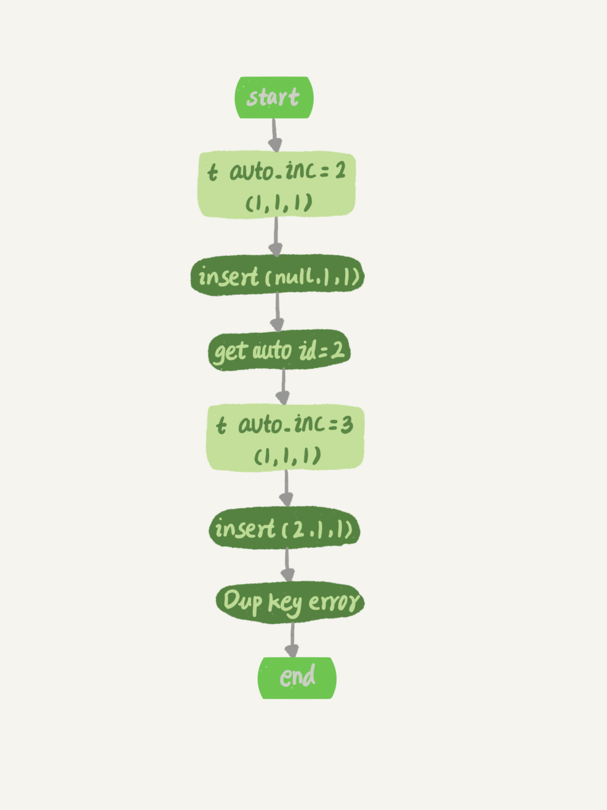
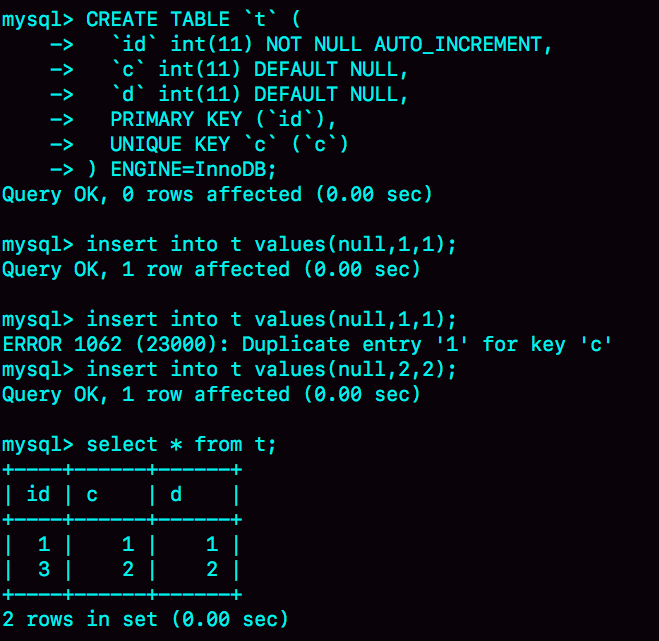

# week37

---

# Algorithm [95. Unique Binary Search Trees II](https://leetcode.com/problems/unique-binary-search-trees-ii/)
## 1. 问题描述
唯一搜索二叉树2

给定一个整数 n，生成所有结构的 BST's

#### 示例
* 输入: 3
* 输出:
```text
[
  [1,null,3,2],
  [3,2,null,1],
  [3,1,null,null,2],
  [2,1,3],
  [1,null,2,null,3]
]
```
* 解释:
```text
   1         3     3      2      1
    \       /     /      / \      \
     3     2     1      1   3      2
    /     /       \                 \
   2     1         2                 3
```
## 2. 解题思路
递归实现

每一层递归，循环从 s~e (s>=1,e<=n) 每个节点 i 作为根，计算左子树列表 letflist (s,i-1) 和 rightlist (i+1,n),然后组合
leftlist 和 rightlist 的每种组合的可能
## 3. 代码

## 4. 复杂度分析

---

# Review []()

---

# Tip
 

---
    
# Share 39 | 自增主键为什么不是连续的？ —— 极客时间 MySQL实战45讲
自增主键不能保证连续递增

创建表 t
```roomsql
CREATE TABLE `t` (
  `id` int(11) NOT NULL AUTO_INCREMENT,
  `c` int(11) DEFAULT NULL,
  `d` int(11) DEFAULT NULL,
  PRIMARY KEY (`id`),
  UNIQUE KEY `c` (`c`)
) ENGINE=InnoDB;
```
## 自增值保存在哪？
在 t 上执行 insert into t value(null,1,1); 然后执行 show create table

AUTO_INCREMENT=2 表示下一次插入，如果使用自增主键则会生成 id=2

表结构的定义保存在 .frm 文件中，并不保存自增值

不同的存储引擎对自增值的保存策略不同
* MyISAM 保存在数据文件中
* InnoDB 保存在内存里，MySQL 8.0  以后才有“自增值持久化”的能力：
    * 5.7 及之前，自增值保存在内存中，并没有持久化。每次重启后，第一次打开表，都会去找自增值的最大值 max(id)，然后将 max(id) + 1 
    作为表的当前的自增值
    * 8.0 将自增值存储在 redo log 中，重启的时候依靠 redo log 恢复
## 自增值修改机制
如果 id 定义为 AUTO_INCREMENT ，在插入数据时，自增值的行为如下：
1. 如果插入时，id 指定为 0，null 或未指定，那么就把这个表当前的 AUTO_INCREMENT 值填到自增字段
2. 如果 id 指定了具体值，则就使用指定的值

根据要插入值和当前自增值的大小关系，自增值变更结果也会有所不同。假设，要插入值是 X，当前的自增值是 Y ：
1. 如果 X < Y , 那么这个自增值不变
2. 如果 X >= Y, 就需要把当前的自增值修改为新的自增值

新增自增值的算法： 从 auto_increment_offset 开始，以 auto_increment_increment 为步长，持续叠加，直到找到第一个大于 X 的值，作为新的自增值

auto_increment_offset 和 auto_increment_increment 是两个系统参数，分别表示自增的初始值和步长，默认值都是 1

* 在双 M 结构里，不能使用默认值，将个的步长都设置为 2，其中一个初始值为 2 ，避免两个库生成的主键发生冲突

当两个参数都是 1 的时候，新增自增主键的逻辑：
1. 如果准备插入的值 >= 当前自增值，新的自增值就是“准备插入的值 +1”
2. 否则，自增值不变

## 自增值的修改时机
假设 t 中已经存在 (1,1,1) 这条记录，插入一条数据：
```roomsql
insert into t values(null, 1, 1); 
``` 
语句的执行流程：
1. 执行器调用 InnoDB 引擎接口写入一行，传入的这一行的值是 (0,1,1)
2. InnoDB 发现用户没有指定自增 id 的值，获取表 t 当前的自增值 2
3. 将传入的行的值改成 (2,1,1)
4. 将表的自增值改成 3
5. 继续执行插入数据操作，由于已经存在 c=1 的记录，所以报 Duplicate key error，语句返回

执行流程：

这时新记录没有插入成功，当时自增值改为了 3 ，并不会退回到 2 ，从而导致了自增主键不连续


导致自增主键 id 不连续的原因：
* 唯一键冲突
* 回滚

不连续的例子：
```roomsql
insert into t values(null,1,1);
begin;
insert into t values(null,2,2);
rollback;
insert into t values(null,2,2);
//插入的行是(3,2,2)
```
自增主键为什么不能回退

并行事务同时申请自增值的时候，为了避免获得相同的自增 id，肯定需要加锁，然后顺序申请
1. 假设 A 申请到了 id=2，B 申请到了 id=3，这时 t 的自增值到 4 
2. B 正确提交了，A 出现了唯一键冲突
3. 如果允许 A 的自增值回退，t 的自增值改为 2，就会出现当前表中已经存在了 id=3 的行，但自增值是 2
4. 接下来再插入时，申请到的自增值是2，然后再插入，获取 3，造成主键冲突

为了解决这个问题有两种办法：
1. 每次申请自增 id，先判断表里是否已经存在这个 id，如果存在就跳过。这个方法成本比较高，因为还需要去主键索引上判断 id 是否存在
2. 扩大自增 id 的锁范围，必须等到一个事务执行完成并提交，这样就会导致并发度下降

这两种方法的代价都比较大，所以 InooDB 放弃了这个设计。
## 自增锁的优化
MySQL 5.0 自增锁是语句级别，只有等这个语句执行完才释放锁，这样设计影响并发度

MySQL 5.1.22 引入一个新的策略，新增参数 innodb_autoinc_lock_mode 默认值是 1
1. 这个参数的值设置为 0 时，表示采用之前 MySQL 5.0 的策略
2. 值为 1 时：
    * 普通 insert 语句，自增锁在申请之后就马上释放
    * 类似 insert ... select 这样批量的插入语句，自增锁还是要等语句结束才被释放
3. 值为 2 时，所有的自增主键的锁都是申请后马上释放

默认值为 1 而不是 2 主要是考虑到数据一致性

| session A | session B |
| --- | --- |
| insert into t value(null,1,1);<br/>insert into t value(null,2,2);<br/>insert into t value(null,3,3);<br/>insert into t value(null,4,4); | |
| | create table t2 like t; |
| insert into t2 values(null,5,5); | insert into t2(c,d) select c,d from t; |
A 先往 t 中插入 4 行数据，然后 创建一个一样结构的表 t2,然后 A 和 B 同时往 t2 中插入数据

假设 B 申请了自增 id 后马上释放锁，那么可能出现以下情况：
* B 先插入了 (1,1,1), (2,2,2)
* 然后 A 来申请自增 id，得到 id=3, 插入 (3,5,5)
* 然后 B 继续执行，插入 (4,3,3),(5,4,4)

从而导致了与 B 的语义不符

如果此时我们的 binlog_format=statement ,由于 A，B 同时执行插入数据的命令，所以 binlog 中对 t2 的更新日志只有两种情况：要么先记 A 的，要么先记 B 的

但是不论哪种情况，这个 binlog 拿去备库执行，或者用来恢复临时实例，备库和临时实例里面 B 这个语句执行出来，生成的 id 都是连续的，这个库就发生了数据不一致

主要原因是因为 B 的 insert 语句，生成的 id 不连续，这个不连续的 id，用 statement 格式的 binlog 来串行执行，是执行不出来的

要解决这个问题有两个思路：
1. 让原库的批量插入数据语句，固定生成连续的 id 值。所以，自增锁直到语句执行结束才释放，就是为了达到这个目的
2. 在 binlog 中把插入数据的操作都如实记录进来，到备库执行的时候，不再依赖于自增主键去生成。这种情况，其实就是 innodb_autoinc_lock_mode 
设置为 2，同时 binlog_format 设置为 row

* 在生产上，尤其是有 inset ... select 这种批量插入数据的场景，从并发插入数据性能的角度考虑，建议这样设置： innodb_autoinc_lock_mode=2,
并且 binlog_format=row. 这样既能提升并发性，又不会出现数据不一致

批量插入数据包括： insert ... select , replace ... select 和 load data 语句

普通 insert 语句里面包含多个 value 值的情况下，即使 innodb_autoinc_lock_mode=1 也不会等语句执行完才释放锁。
这类语句申请自增 id 的时候，是可以精确计算出需要多少个 id 的，然后一次性申请，申请完成释放锁

批量插入语句由于不知需要提前申请多少个，所以不能这么做

对于批量插入语句，MySQL 批量申请自增 id 的策略：
1. 语句执行过程中，第一次申请 id，会分配 1 个
2. 1 个用完了以后，这个语句第二次申请，会分配 2 个
3. 第三次申请，会分配 4 个
4. 依此类推，同一个语句每次申请都是上次的 2 倍

例子
```roomsql
insert into t values(null, 1,1);
insert into t values(null, 2,2);
insert into t values(null, 3,3);
insert into t values(null, 4,4);
create table t2 like t;
insert into t2(c,d) select c,d from t;
insert into t2 values(null, 5,5);
``` 
inset ... select 实际插入 4 条记录

第一次获取 id=1，第二次获取 id=2,id=3, 第三次 id=4~7, 5~7 没有被使用所以就浪费了，再次插入申请到的是 id=8

* 这是主键 id 不连续的第三种原因

## 思考题
在最后一个例子中，执行 insert into t2(c,d) select c,d from t; 如果隔离级别是可重复读 (repeatable read), binlog_format=statement.
这个语句会对表 t 的所有记录和间隙加锁。为什么要这么做？
* 答：
假如原库不对t表所有记录和间隙加锁，如果有其他事物新增数据并先于这个批量操作提交，由于事物的隔离级别是可重复读，t2是看不到新增的数据的。但是记录的binlog是statement格式，备库或基于binlog恢复的临时库，t2会看到新增的数据，出现数据不一致的情况。

