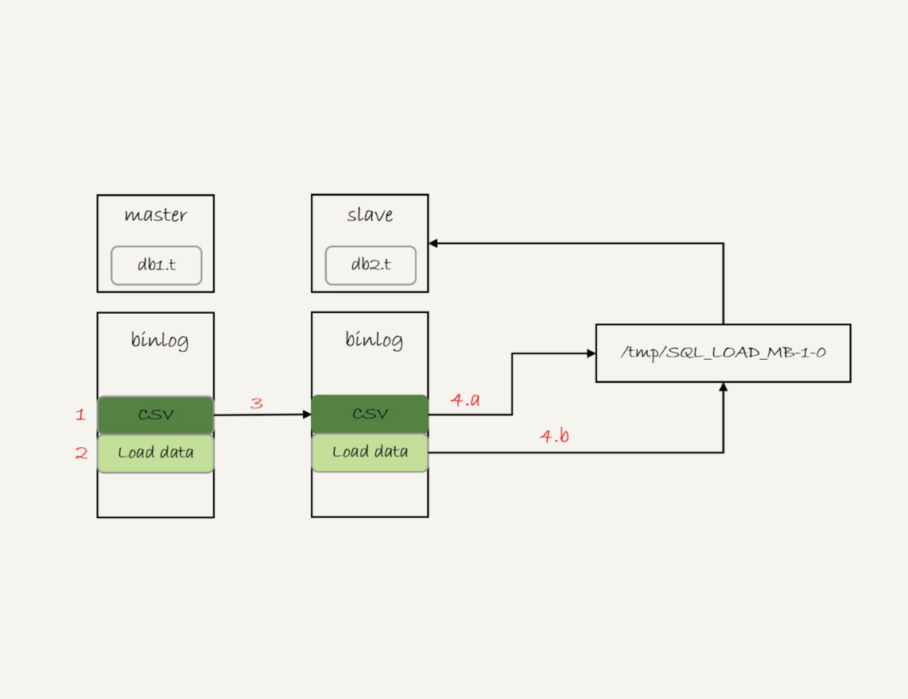
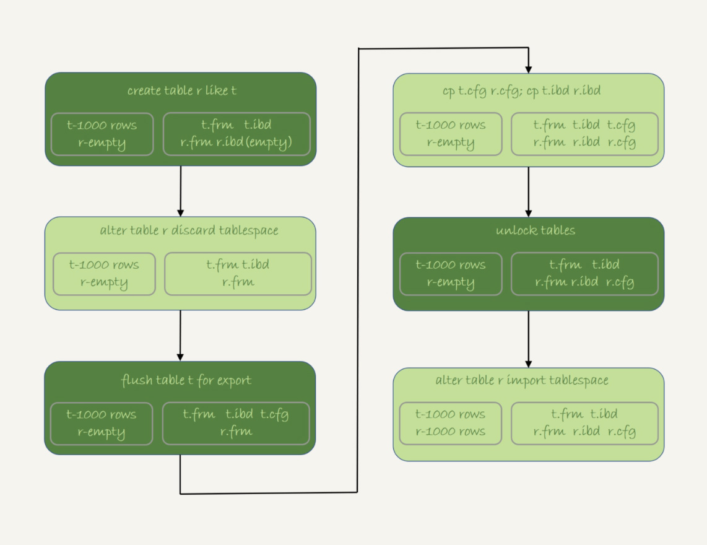

# week39

---

# Algorithm [132. Palindrome Partitioning II](https://leetcode.com/problems/palindrome-partitioning-ii/)
## 1. 问题描述
回文分割

给定一个字符串 s，对 s 进行分割，要求每一段都是回文字符串，求对 s 的最小分割数

#### 示例：
* 输入 ： "aab"
* 输出 ： 1
* 解释 ： ["aa","b"] 只需分割一次

## 2. 解题思路
dp[i] 表示字符串 s 中前 i 个字母(s[0:i-1])组成的子串的最小分割数

dp[n] 为最终所求

遍历 i，更新 dp[i+len+1] 和 dp[i+len+2]

dp[i+len+1] 其中 len 是以 i 为中心，总长度为 2*len+1 的回文串（奇数串），比如 aba

dp[i+len+2] 其中 len 是以 i 为中心之一，总长度为 2*len+2 的回文串（偶数串），比如 abba

i-len 正好是回文串（奇偶串）的起始位置

dp[i-len] 表示 s[0,i-len-1] 的最小分割数

状态转移方程：
* dp[end] = min(dp[end], dp[start - 1] + 1)

## 3. 代码
```go
const INT_MAX = int(^uint(0) >> 1)

func minCut(s string) int {
	n := len(s)
	dp := make([]int, n+1)
	for i:=0; i<n+1;i++ {
		dp[i] = INT_MAX
	}
	dp[0] = -1
	for i:=0; i<n; i++ {
		//palindrome of length 1,3,5...
		for len:=0;i-len>=0 && i+len<n && s[i-len] == s[i+len]; len++ {
			if dp[i+len+1] > dp[i-len]+1 {
				dp[i+len+1] = dp[i-len]+1
			}
		}
		//palindrome of length 2,4,6...
		for len:=0;i-len>=0 && i+len+1<n && s[i-len] == s[i+len+1]; len++ {
			if dp[i+len+2] > dp[i-len]+1 {
				dp[i+len+2]=dp[i-len]+1
			}
		}
	}
	return dp[n]
}
```
## 4. 复杂度分析
* 时间复杂度：O(n<sup>2</sup>)
* 空间复杂度：O(n)

---

# Review []()

---

# Tip
 

---
    
# Share 41 | 怎么最快地复制一张表？ —— 极客时间 MySQL实战45讲
在两张表中拷贝数据。如果可以控制对源表的扫描行数和加锁范围很小的话，可以简单地使用 insert ... select 即可。

为了避免对源表加读锁，更稳妥的方案是先将数据写到外部文件，然后再写回目标表。

创建表，并插入数据
```roomsql
create database db1;
use db1;

create table t(id int primary key, a int, b int, index(a))engine=innodb;
delimiter ;;
  create procedure idata()
  begin
    declare i int;
    set i=1;
    while(i<=1000)do
      insert into t values(i,i,i);
      set i=i+1;
    end while;
  end;;
delimiter ;
call idata();

create database db2;
create table db2.t like db1.t
```

我们要把 db1.t 中 a > 900 的数据导出，并插入到 db2.t 中

## mysqldump 方法
用 mysqldump 导出一组 insert 语句,放到临时文件中
```roomsql
mysqldump -h$host -P$port -u$user --add-locks=0 --no-create-info --single-transaction  --set-gtid-purged=OFF db1 t --where="a>900" --result-file=/client_tmp/t.sql
```
参数：
1. --single-transaction 在导出数据时不对 db1.t 加锁，而是使用 start transaction with consistent snapshot 方法
2. --add-locks=0 表示输出的文件结果中，不增加 "LOCK TABLES t WRITE;"
3. --no-create-info 不需要导出表结构
4. --set-gtid-purged=off 不输出跟 GTID 相关的信息
5. --result-file 指定了输出文件的路径，其中 client 表示生成的文件是在客户端机器上的


一个 insert 语句中包含多个 value，这在后续执行时速度会更快

如果希望一个 insert 一行，可以使用参数 --skip-extended-insert

导入数据
```roomsql
mysql -h127.0.0.1 -P13000  -uroot db2 -e "source /client_tmp/t.sql"
```
source 是一个客户端命令

MySQL 客户端的执行流程：
1. 打开文件，默认以分号为结尾读取一条条 SQL 语句
2. 将 SQL 语句发送到服务器端

服务端执行的并不是这个 SQL 文件，而是 insert 语句，所以 slow log 和 binlog 记录的都是被真正执行的 insert 语句

## 导出 CSV 文件
```roomsql
select * from db1.t where a>900 into outfile '/server_tmp/t.csv';
```
需要注意：
1. 这条语句会将结果保存在服务器端。如果执行的客户端和 MySQL 服务端不在同一机器上，
客户端的临时目录下是不会生成 t.csv 文件的
2. into outfile 指定了文件的生成位置(/server_tmp/),这个位置必须受参数 
secure_file_priv 的限制，这个参数的可选值和作用分别是:
    * empty 不限制文件生成的位置，这是不安全设置
    * 表示路径的字符串， 则要求生成的文件必须在这个目录或其子目录下
    * NULL 禁止在这个 MySQL 实例上执行 select ... into outfile 操作
3. 这条命令不会覆盖文件，所以需要确保文件不存在，否则报错
4. 生成的文件中，原则上一个数据行对应文件中的一行。但是如果字段中包含换行符，则生成的文本
也会有换行符。类似换行符、制表符等，前面会跟上 "\" 转义

用一下命令导入数据

```roomsql
load data infile '/server_tmp/t.csv' into table db2.t;
```

执行流程：
1. 打开文件 t.csv ，以制表符 \t 作为字段的分隔符，以换行符 \n 作为记录之间的分隔符，进行数据读取
2. 启动事务
3. 判断每一行的字段数与表 db2.t 是否相同：
    * 不相同， 直接报错，事务回滚
    * 相同，构造成一行，调用 InnoDB 引擎接口，写入到表中
4. 重复步骤 3， 直到整个文件读完为止，提交事务

如果 binlog_format=statement,这个 load 语句记录到 binlog 里以后，怎么在备库重放？

由于 t.csv 只保存主库所在的主机上，如果只把这条语句原文写到 binlog 中，在备库执行时，备库本地没有这个文件，就会导致主备同步停止

所以，这条语句的完整执行流程
1. 主库执行完后，将 t.csv 的内容直接写到 binlog
2. 在 binlog 中写入， load data local infile '/tmp/SQL_LOAD_MB-1-0' INTO TABLE `db2`.`t`
3. 把 binlog 传到备库
4. 备库 apply 线程在执行这个事务日志时
    a. 先将 binlog 中 t.csv 文件的内容读出来，写入到本地临时目录 /tmp/SQL_LOAD_MB-1-0 中
    b. 再执行 load data , 往备库的 db2.t 表中插入主库相同的数据
    


load data 有两种用法
1. 不加 local 是读取服务端的文件，这个文件必须在 secure_file_priv 指定的目录或子目录中
2. 加上 local 读取客户端的文件，只要 mysql 客户端有访问这个文件的权限即可。
客户端会先把文件传给服务端，然后执行 load data

select ... into outfile 方法不生成表结构

mysqldump 有一个 -tab 参数，可以同时导出表结构定义文件和 csv 数据文件

```text
mysqldump -h$host -P$port -u$user ---single-transaction  --set-gtid-purged=OFF db1 t --where="a>900" --tab=$secure_file_priv
```

## 物理拷贝法
InnoDB 除了生成 .frm 和 .ibd 文件外，还需要在数据字典中注册，所以只拷贝 2 个文件无法实现物理拷贝

MySQL 5.6 引入了可传输表空间(transportable tablespace)方法，可以通过导出+导入表空间的方式，实现物理拷贝表的功能

在 db1 下，复制一个跟 t 相同的表 r
1. 执行 create table r like t 创建一个相同的表结构
2. 执行 alter table r discard tablespace 删除 r.ibd 文件
3. flush table t for export 这时 db1 目录下生成 t.cfg 文件
4. db1 目录下执行 cp t.cfg r.cfg; cp t.ibd r.ibd; 这两个命令
5. unlock tables 删除 t.cfg
6. alter table r import tablespace 将 r.ibd 作为 r 的新的表空间，由于这个文件的数据内容和 t.ibd 相同，所以 r 中就有了和 t 相同的数据



需要注意：
1. 第 3 步 flush 之后，db1.t 处于只读状态，直到 unlock 才释放读锁
2. import tablespace 时，为了让文件里的表空间 id 和数据字典中的一致，会修改 r.ibd 的表空间 id。
而这个 id 存在于每一个数据页中。因此，如果是一个很大的文件（比如 TB 级别），每个数据页都需要修改，
所以 import 语句可能会执行较长一段时间。但是相比于逻辑导入，import 耗时非常短

## 思考题：
MySQL 解析 statement 格式的 binlog 时，对于 load data 解析出来为什么要加 local

* 答：
1. 为了确保备库应用 binlog 正常。因为备库可能配置了 secure_file_priv=null 。所以如果不用 local 可能会导入失败，造成主备同步延迟
2. 使用 mysqldump 解析 binlog 并应用到目标库的情况
```roomsql
mysqlbinlog $binlog_file | mysql -h$host -P$port -u$user -p$pwd
```
把日志直接解析出来发给目标库执行。增加 local 就能让这个方法支持非本地的 $host
