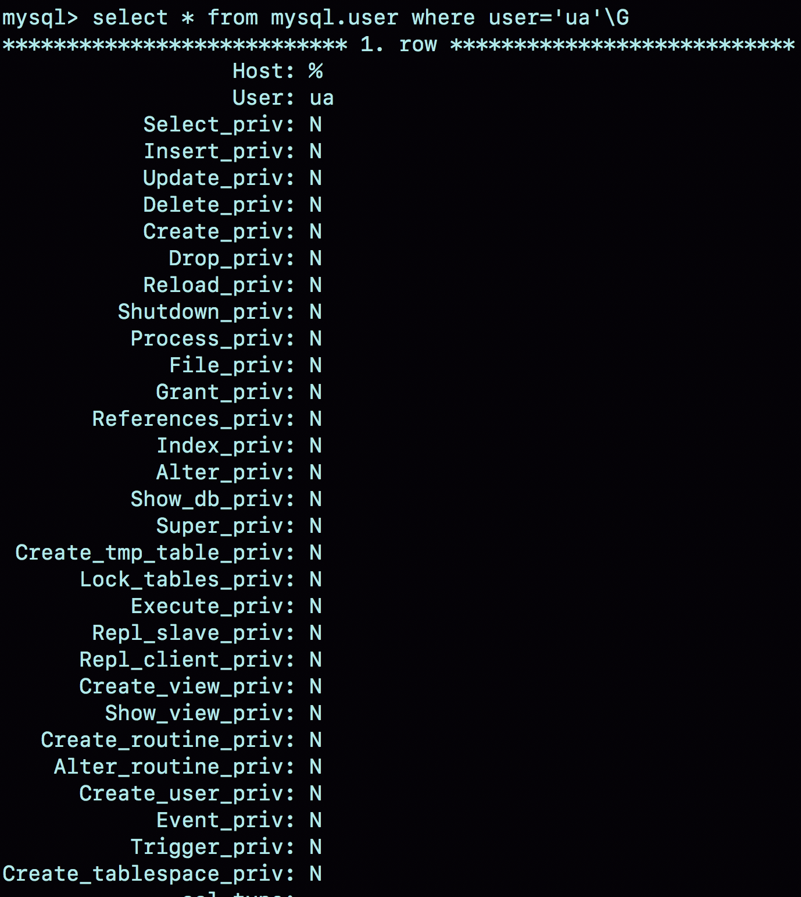
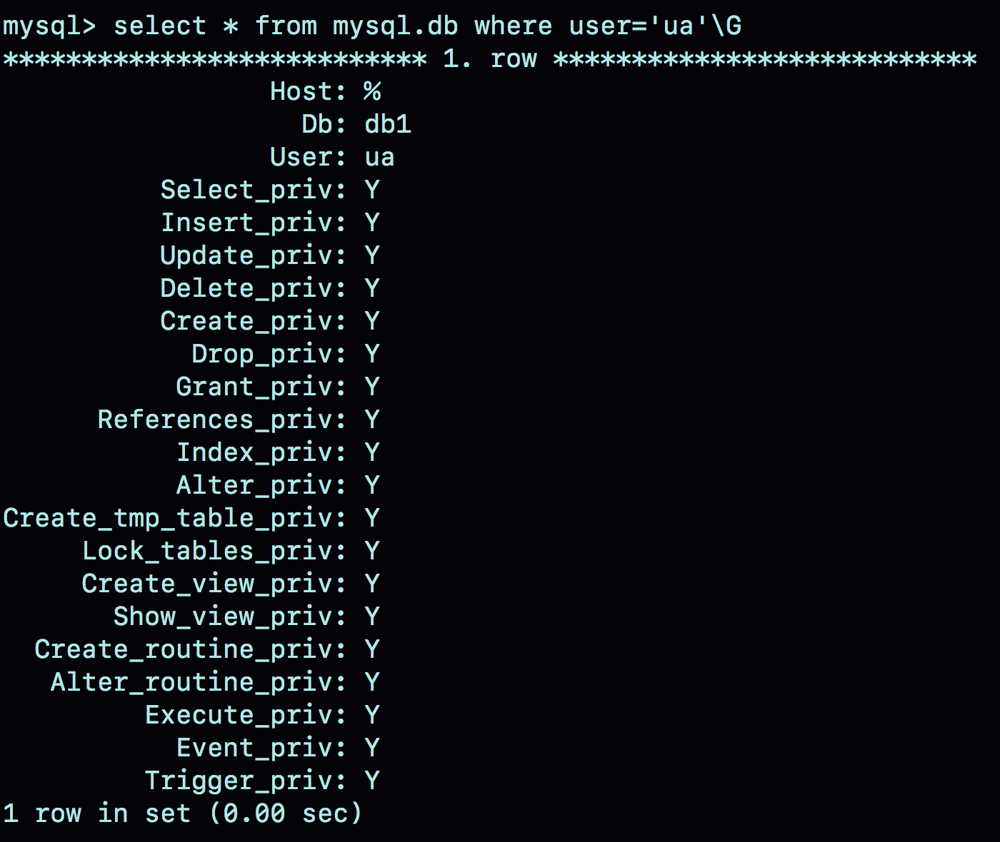

# week40

---

# Algorithm [140. Word Break II](https://leetcode.com/problems/word-break-ii/)
## 1. 问题描述
给定一个非空字符串 s 和一个字典 wordDict ，字典中包含若干个单词，在字符串 s 中插入空格，构造一个句子。
要求句子中所有的单词都在字典 wordDict 中，返回所有句子。

注意：
* 字典中的单词可以使用多次
* 假设字典中不包含重复的单词

#### 示例1：
* 输入：
    * s="catsanddog"
    * wordDict = ["cat", "cats", "and", "sand", "dog"]
* 输出：
```text
[
  "cats and dog",
  "cat sand dog"
]
```
#### 示例2：
* 输入：
    * s = "pineapplepenapple"
    * wordDict = ["apple", "pen", "applepen", "pine", "pineapple"]
* 输出：
```text
[
  "pine apple pen apple",
  "pineapple pen apple",
  "pine applepen apple"
]
```
#### 示例3：
* 输入：
    * s = "catsandog"
    * wordDict = ["cats", "dog", "sand", "and", "cat"]
* 输出 ： []
## 2. 解题思路
深度优先搜索


## 3. 代码

## 4. 复杂度分析

---

# Review []()

---

# Tip
 

---
    
# Share 42 | grant之后要跟着flush privileges吗？ —— 极客时间 MySQL实战45讲
```roomsql
create user 'ua'@'%' identified by 'pa';
```
创建一个用户 'ua'@'%', 密码是 pa。MySQL 中 用户名（user）+地址（host）代表一个用户

这条命令的两个动作：
1. 磁盘上，往 mysql.user 表里插入一行数据，由于没有指定权限，所以这行数据上所有表示权限的字段都是 N
2. 内存里，往数组 acl_users 里插入一个 acl_user 对象，这个对象的 access 字段值是 0



## 全局权限
全局权限作用于整个 MySQL 实例，保存在 mysql.user 表中，给用户赋最高权限：
```roomsql
grant all privileges on *.* to 'ua'@'%' with grant option;
```

此命令做了两个动作：
1. 磁盘上，将 mysql.user 表里，用户'ua'@'%' 这一行所有表示权限的字段的值都设置为 Y
2. 内存里，从数组 acl_users 中找到这个用户对应的对象，将 access 值（权限位）修改为二进制的 "全1"

这条命令执行完成后，如果新的客户端使用 ua 的登录，MySQL 会为新建连接维护一个线程对象，然后从 acl_users 数组里查到这个用户的权限，
并将权限值拷贝到这个线程对象中。之后这个连接中执行的语句，关于全局权限的判断，都直接使用线程对象内保存的权限位。

1. grant 命令对于全局权限，同时更新了磁盘和内存。命令完成后即时生效，接下来新创建的连接会使用新的权限。
2. 对于一个已存在的连接，它的全局权限不受 grant 命令的影响

收回权限
```roomsql
revoke all privileges on *.* from 'ua'@'%';
```

这条语句做了两个动作：
1. 磁盘上，将 mysql.user 表里，用户 'ua'@'%' 这一行的所有表示权限的字段的值都修改为 N
2. 内存里，从数组 acl_users 中找到这个用户对应的对象，将 access 的值修改为 0

## db权限
为 ua 赋予 db1 的所有权限
```roomsql
grant all privileges on db1.* to 'ua'@'%' with grant option;
```

库权限记录保存在 mysql.db 表中，在内存里则保存在数组 acl_dbs 中，这条命令做了两个动作：
1. 磁盘上，往 mysql.db 表中插入了一行记录，所有权限位字段设置为 Y
2. 内存里，增加一个对象到数组 acl_dbs 中，这个对象的权限位全 1



grant 对已存在的连接的影响，在全局权限和基于 db 的权限效果不同

| | session A | session B | session C |
| --- | --- | --- | --- |
| T1 | connect(root,root)<br/>create database db1;<br/><br/>create user 'ua'@'%' identified by 'pa';<br/>grant super on *.* to 'ua'@'%';<br/>grant all privileges on db1.* to 'ua'@'%'; | | |
| T2 | | connect(ua,pa)<br/>set global sync_binlog=1;<br/>(Query OK)<br/>create table db1.t(c int);<br/>(Query OK) | connect(ua,pa)<br/> use db1; |
| T3 | revoke super on *.* from 'ua'@'%'; | | |
| T4 | | set global sync_binlog=1;<br/>(Query OK)<br/>alter table db1.t engine=innodb;<br/>(Query OK) | alter table t engine=innodb;<br/>(Query OK) |
| T5 | revoke all privilieges on db1.* from 'ua'@'%'; | | |
| T6 | | set global sync_binlog=1;<br/>(Query OK)<br/>alter table db1.t engine=innodb;<br/>(ALTER command denied) | alter table t engine=innodb;<br/>(Query OK) |

set global sync_binlog 需要 super 权限

T3 ua 的 super 被 revoke 收回了，但是在 T4 执行 set global 权限验证通过，因为 super 是全局权限，这个权限信息在线程对象中，
而 revoke 操作影响不到这个线程对象

T5 去掉了 ua 对 db1 库的所有权限， T6 B 操作 db1 库的表，就报 “权限不足”。这是因为 acl_dbs 是一个全局数组，所有线程判断 db 权限
都用这个数组，这样 revoke 操作马上就会影响到 session B

如果当前会话已经处于某一个 db 里面，之前 user 这个库的时候拿到的库权限会保存在会话变量中

T6 中 B 和 C 对 t 的操作一样，但是 B 失败，C 成功。这是因为 C 在 T2 时刻执行 use db1 拿到这个库的权限，在切换出 db1 之前，C 对这个库一直有权限

## 表权限和列权限
表权限定义存放在表 mysql.tables_priv 中，列权限定义存放在表 mysql.columns_priv 中。
这两类权限组合起来存放在内存中 hash 结构 column_priv_hash 中

赋权命令：
```roomsql
create table db1.t1(id int, a int);

grant all privileges on db1.t1 to 'ua'@'%' with grant option;
GRANT SELECT(id), INSERT (id,a) ON mydb.mytbl TO 'ua'@'%' with grant option;
```

这两类权限操作，也会马上影响到已存在的连接。

grant 语句都是即时生效的，不需要执行 flush privileges 语句

flush privileges 命令会清空 acl_users 数组，然后从 mysql.user 表中读取数据重新加载，重新构造一个 acl_users 数组。以数据表中的数据为准，
将全局权限内存数组重新加载一遍。

正常情况下，grant 命令之后，没有必要跟着执行 flush privileges 命令

## flush privileges 使用场景
当数据表中的权限数据与内存中的权限数据不一致时，flush privileges 语句可以用来重建内存数据。

这种不一致往往是因为不规范的操作导致的，比如直接 DML 操作系统权限表

| | client A | client B |
| --- | --- | --- |
| T1 | connect(root,root)<br/>create user 'ua'@'%' identified by 'pa'; | |
| T2 | | connect(ua,pa)<br/>(connect ok)<br/>disconnect |
| T3 | delete from mysql.user where user='ua'; | |
| T4 | | connect(ua,pa)<br/>(connect ok)<br/>disconnect |
| T5 | flush privileges; | |
| T6 | | connect(ua,pa)<br/>(Access Denied) |

T3 删除了 ua ，T4 仍然可以连接，因为内存中 acl_users 数组中还有这个用户

T5 flush 之后， T6 就无法连接了

直接操作系统表示不规范的，可能会导致更加诡异的现象发生

| | client A |
| --- | --- |
| T1 | connect(root,root)<br/>create user 'ua'@'%' identified by 'pa'; |
| T2 | |
| T3 | delete from mysql.user where user='ua'; |
| T4 | grant super on *.* to 'ua'@'%' with grant option;<br/> ERROR 1133 (42000): Can't find any matching row in the user table |
| T5 | create user 'ua'@'%' identified by 'pa';<br/> ERROR 1396 (HY000): Operation CREATE USER failed for 'ua'@'%' |

T3 直接删除了数据表记录，而内存的数据还存在，这就导致了：
1. T4 给用户赋权失败，因为 mysql.user 中找不到这行记录
2. T5 创建用户失败，因为内存判断的时候这个用户还在


