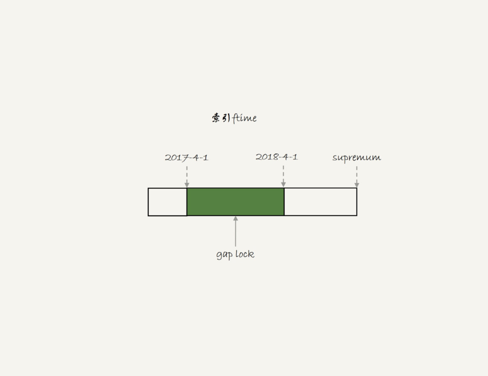
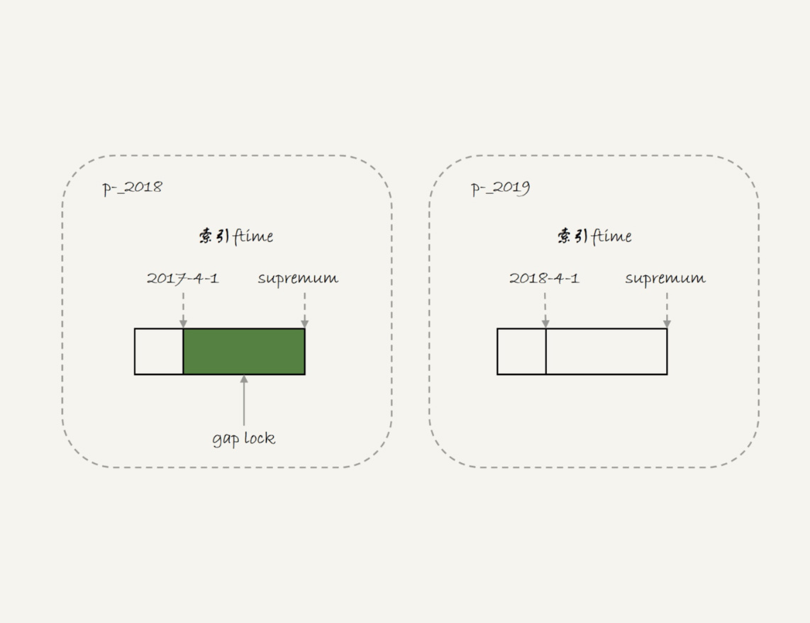
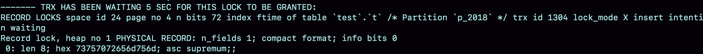
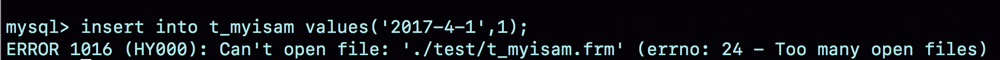

# week41

---

# Algorithm []()
## 1. 问题描述

## 2. 解题思路

## 3. 代码

## 4. 复杂度分析

---

# Review []()

---

# Tip
 

---
    
# Share 43 | 要不要使用分区表？ —— 极客时间 MySQL实战45讲
## 分区表是什么
```roomsql
CREATE TABLE `t` (
  `ftime` datetime NOT NULL,
  `c` int(11) DEFAULT NULL,
  KEY (`ftime`)
) ENGINE=InnoDB DEFAULT CHARSET=latin1
PARTITION BY RANGE (YEAR(ftime))
(PARTITION p_2017 VALUES LESS THAN (2017) ENGINE = InnoDB,
 PARTITION p_2018 VALUES LESS THAN (2018) ENGINE = InnoDB,
 PARTITION p_2019 VALUES LESS THAN (2019) ENGINE = InnoDB,
PARTITION p_others VALUES LESS THAN MAXVALUE ENGINE = InnoDB);
insert into t values('2017-4-1',1),('2018-4-1',1);
```


表包含了 1 个 .frm 文件和 4 个 .ibd 文件，每个分区对应一个 .ibd 文件
* 对于引擎层来说，这是 4 个表
* 对于 Server 层来说，这是 1 个表
## 分区表的引擎层逻辑
加间隙锁的例子，说明对于 InnoDB 来说是 4 个表

| | session A | session B |
| --- | --- | --- |
| T1 | begin;<br/>select * from where ftime='2017-5-1' for update; | |
| T2 | |insert into t values('2018-2-1',1);<br/>(Query OK)<br/>insert into t values('2017-12-1',1);<br/>(blocked) |

A 的 select 对索引 ftime 上两条记录之间的间隙加了锁。如果是一个普通表，T1 时刻，在表 t 的 ftime 的索引上，间隙和加锁状态是：



对于普通表来说，B 的两条 insert 应该都要进入锁等待。但是第一条执行成功了，主要是因为对于引擎来说 p_2018 和 p_2019 是两张不同的表，
也就是说 2017-4-1 的下一条记录并不是 2018-4-1 ，而是 p_2018 分区的 supremum，因此 T1 间隙锁如下



show engine innodb status



MyISAM 分区表的例子

alter table t engine=myisam

| session A | session B |
| --- | --- |
| alter table t engine=myisam;<br/>update t set c=sleep(100) where ftime='2017-4-1';| |
| | select * from t where ftime='2018-4-1';<br/>(Query OK)<br/>select * from t where ftime='2017-5-1';<br/>(blocked)|

A 中 sleep 了 100 秒，MyISAM 引擎只支持表锁，所以 A 锁住了整张表。

B 的第一条语句执行正常，第二条进入锁等待。主要是因为 MyISAM 的表锁是引擎层实现的， A 加了表锁，是锁在分区表 p_2018 上。

分区表和手工分区，一个是由 server 层来决定使用哪个分区，一个是由应用层代码来决定使用哪个分区。因此，从引擎层来看没有差别。

这两种方式的主要区别在于 server 层打开表的行为
## 分区策略
第一次打开分区表时，MySQL 需要把所有的分区都访问一遍。一个典型的报错情况：一个分区表的分区很多，比如超过了 1000 个，而 MySQL 启动
的时候 open_files_limit 参数默认是 1024 ，那么会在访问表的时候，导致打开文件数量超限。



这张表是 MyISAM 引擎，如果是 InnoDB 引擎就不会有这个问题

MyISAM 分区策略是 通用分区策略(generic partitioning),每次访问都由 server 层控制。这个策略是 MySQL 一开始支持分区表的时候就存在的，
在文件管理、表管理的实现上很粗糙，因此有比较严重的性能问题。

从 MySQL 5.7.9 开始，InnoDB 引擎引入了 本地分区策略(native partitioning)。这个策略是 InnoDB 内部自己管理打开分区的行为。

MySQL 从 5.7.17 开始，MyISAM 分区表标记为即将弃用(deprecated)

MySQL 8.0 开始，就不允许创建 MyISAM 分区表了。只允许创建已经实现了本地分区策略的引擎。目前来看，只有 InnoDB 和 NDB 这两个引擎支持
了本地策略。

## 分区表 server 层行为
从 server 层看，一个分区表就是一张表

分区表的 MDL 锁

| session A | session B |
| --- | --- |
| begin;<br/>select * from t where ftime='2018-4-1'; | |
| | alter table t truncate partition p_2017;<br/>(blocked) |


B 只操作了 p_2017 这个分区，但是由于 A 持有整张表 t 的 MDL 锁，就导致了 B 的 alter 语句被堵住了。

分区表，在做 DDL 的时候，影响会更大。如果使用的是普通分表，那么在 truncate 一个分表的时候，肯定不会跟另外一个分表上的查询语句，
出现 MDL 锁冲突。

1. MySQL 在第一次打开分区表的时候，需要访问所有的分区
2. 在 server 层，认为这是同一张表，因此所有分区共用同一个 MDL 锁
3. 在引擎层，认为这是不同的表，因此 MDL 锁之后的执行过程，会根据分区表规则，只访问必要的分区

关于“必要的分区”的判断，就是根据 SQL 语句中的 where 条件，结合分区规则来实现的。比如，where ftime='2018-4-1',根据分区规则 year 
函数算出来的值是 2018，那么就会落在 p_2019 这个分区

但是，如果这个 where 条件改成 where ftime>='2018-4-1',虽然查询结果相同，但是这时候根据 where 条件，就要访问 p_2019 和 p_others 
这两个分区


