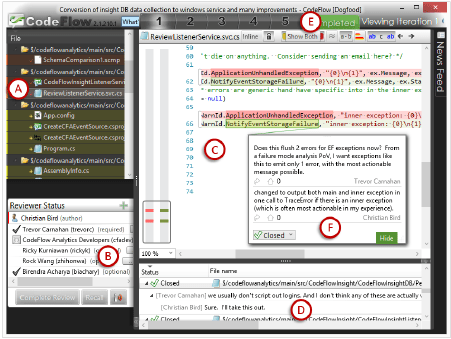
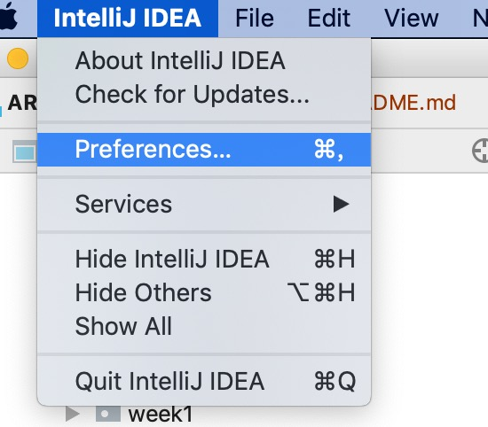
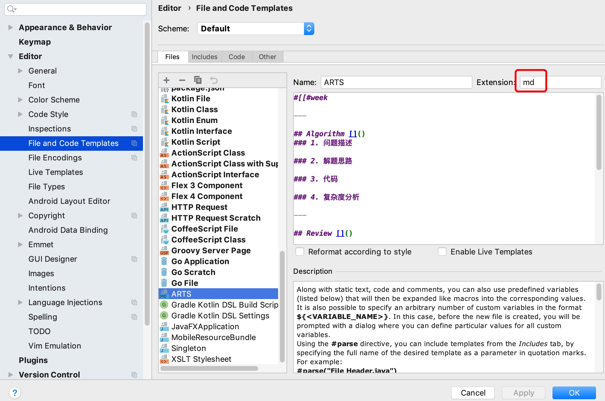

#week5

---

## Algorithm [535. Encode and Decode TinyURL](https://leetcode.com/problems/encode-and-decode-tinyurl/)
### 1. 问题描述
将长url编码成短url，再将短url解码成长url
### 2. 解题思路
#### 算法1：使用hashmap
* 编码：
1. 生成一个随机字符串（比如6个字符），来代表长url
2. 短url = 短url前缀+随机字符串
3. 将短url和长url，已kv的方式存储在hashmap中
* 解码：
1. 直接以短url作为key从hashmap中获取长url
#### 算法2： 使用压缩算法

目前还没想出来一个好的压缩算法，可以考虑用zip将url后半段（去除前缀）进行压缩后用16进制表示
* 编码：
1. 设计一个压缩算法对长url做压缩
* 解码：
1. 直接利用解压算法解压短url
### 3. 代码
```java
public class Codec {
    private static final String ALPHABET = "0123456789abcdefghijklmnopqrstuvwxyzABCDEFGHIJKLMNOPQRSTUVWXYZ-_";
    private static final SecureRandom RANDOM = new SecureRandom();
    private Map<String,String> map = new ConcurrentHashMap();
    private String prefixUrl = "http://tinyurl.com/";

    public static String generate(int count) {
        StringBuilder sb = new StringBuilder();
        for (int i = 0; i < count; ++i) {
            sb.append(ALPHABET.charAt(RANDOM.nextInt(ALPHABET.length())));
        }
        return sb.toString();
    }

    // Encodes a URL to a shortened URL.
    public String encode(String longUrl) {
        String shortUrl = prefixUrl + generate(6);
        while (map.containsKey(shortUrl)) {
            shortUrl = prefixUrl + generate(6);
        }
        map.put(shortUrl, longUrl);
        return shortUrl;
    }

    // Decodes a shortened URL to its original URL.
    public String decode(String shortUrl) {
        return map.get(shortUrl);
    }

    public static void main(String[] args) {
        String[] urls = new String[]{
                "https://leetcode.com/problems/design-tinyurl"
        };
        Codec codec = new Codec();
        for (String url : urls) {
            System.out.println(codec.decode(codec.encode(url)));
        }
    }
}
```
### 4. 复杂度分析
* 时间复杂度：O(1) 只需要在hashmap中查询，最坏情况是O(N)，hash冲突，hash表退化成链表
* 空间复杂度：O(N) hash表存储url的个数N

---

## Review [How code reviews work at Microsoft](https://medium.freecodecamp.org/how-code-reviews-work-at-microsoft-4ebdea0cd0c0)

微软是如何做code review的

### Code Review 在微软是开发过程的主要的部分
大部分的高绩效团队都花大量的时间在code review上

### 调查微软的Code Review
为了理解code review在微软中是如何发挥作用的，作者调查了微软的900个工程师。

### 你能从code review中学到什么
你能通过此文了解微软是如何做code review的，可以借鉴到你自己的团队使用，或者跟你团队当前的code review流程做个对比

### 微软工程师code review的频率
* 39% : 至少每天一次
* 36% : 一天好几次
* 12% : 一周几次
* 13% : 过去一周没有做过

### code review提供了哪些好处
* 代码改进
* 找到缺陷
* 增加知识传承 
* 找到可替代的解决方案
* 改进开发过程
* 避免失败的构建
* 增强团队意识
* 分享代码
* 团队考核

### 开发者如何做code review
* 到同事的办公桌前一起看代码
* 组成小组看代码
* 通常是使用工具做code review

### 微软使用自己内部的工具进行code review
* CodeFlow 微软内部code review的工具

### 怎样发起一个code review
1. 写代码
2. 写注释，告诉review者这段代码是干什么的，为什么要这么做

### 选择review者
* 一般会选择有经验的同事做review，通常还会发送给经理
* 发给相关人员，比如你修改了页面的元素，可能需要发送给UI组的成员

### 从同事那里接收review的反馈
### 接收反馈是一个迭代的过程，可能需要反复多次
### 修改代码，最终形成一个改进后的新版本
### 所有review者都批准检入代码
最终检入代码，review过程结束
### 并非所有的团队都遵循同样的流程

#### Code review还可以包括以下内容
* 测试结果
* 用户接口
* 静态分析
#### 微软的code review工具
CodeFlow
* CodeFlow界面

* 评论功能

可以对单个字符进行评论
* 讨论功能

具有像Twitter或者Facebook一样的讨论区

* 比较代码版本的功能

可以比较2个不同版本的代码的区别

* code review 分析工具

所有的代码以及review过程，包括review者的讨论过程都会被存储起来，便宜以后学习分析之用。

#### 微软未来的code review
微软收到了Github之后，会逐步使用git作为代码的版本管理工具，code review过程也会逐步贴近于git的pull request形式。

---

## Tip

### 如何在idea中建立ARTS模板文件
已Mac版的idea为例

1. IntelliJ IDEA -> preferences


2. Editor -> File and Code Template


    Extension 中填写 md

3. 模板内容
* 需要注意，因为markdown中含有井号，所以整个的模板代码块需要用 #[[]]# 括起来
* 模板语法采用的是 [Velocity](http://velocity.apache.org/engine/devel/user-guide.html#Velocity_Template_Language_VTL:_An_Introduction)
```template
#[[#week

---

## Algorithm []()
### 1. 问题描述

### 2. 解题思路

### 3. 代码

### 4. 复杂度分析

---

## Review []()

---

## Tip

### 

---
    
## Share
### 

]]#
```

---
    
## Share
### 06 全局锁和表锁：给表加个字段怎么有这么多阻碍 —— 极客时间 MySQL实战45讲
数据库锁设计的初衷是为了处理并发问题。

* 根据加锁范围，MySQL中分为：全局锁、表锁和行锁 三类。

#### 全局锁

全局锁是对整个数据库加锁，命令为
```sql 
Flush tables with read lock; (FTWRL) 
```
让这个库处于只读状态，阻塞更新语句（增删改）、定义语句（建表、改表）和更新类事务提交语句。

* 全局锁的典型使用场景是，做全库逻辑备份
    * 如果你在主库备份，备份期间不能更新，业务基本停摆。
    * 如果你在从库备份，从库不能执行主库同步过来的binlog，导致主从延时。
* 不锁全库的情况下做备份有可能会发生业务逻辑错误：
    
        比如： 
         事务：(1)从账户表中扣除100元，（2）在课程表中加入新购买的课程
         备份：在（1）和（2）的中间进行的备份，则在从备份恢复数据后就会发现，钱被扣了，但是课程没买上
        为了解决此问题可以使用可重复读隔离级别，然后开启一个事务，但是前提是需要存储引擎支持可重复读的隔离级别。
        
* mysqldump使用--single-transation的时候，导数据之前会启动一个事务，来确保拿到一致性视图。而由于MVCC的支持，这个过程是可以正常更新数据的。
* single-transation方法只适用于所有表使用的是事务引擎的库。
* 为什么不能用 set global readonly=true的方式使全库只读，然后做备份呢：
    1. 有些业务系统会用readonly做主从库的区分，这样做会影响业务
    2. 异常处理机制有差异。如果由于客户端异常断开: FTWRL 会自动释放全局锁，整个库回归正常状态；而readonly会继续保持，需要主动设置。
        
#### 表级锁


