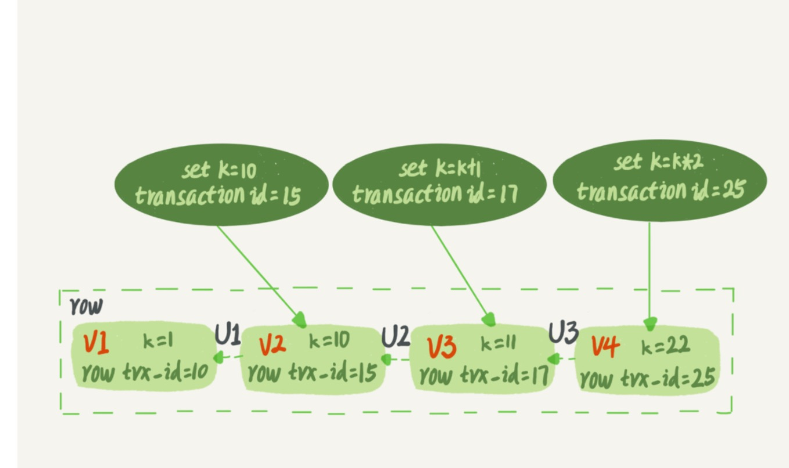
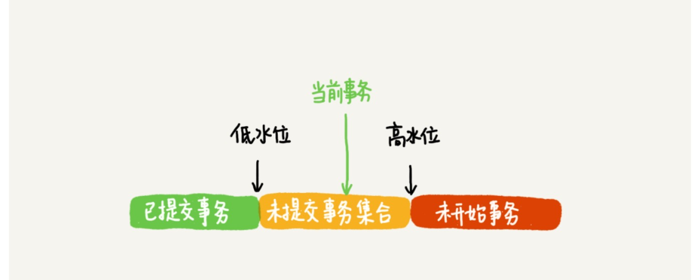

#week

---

## Algorithm [1038. Binary Search Tree to Greater Sum Tree](https://leetcode.com/problems/binary-search-tree-to-greater-sum-tree/)
### 1. 问题描述
给定一个二叉搜索树，且每个节点的值都是不同的。要求修改这棵二叉树，使得每个节点修改后的值等于原二叉树的所有大于等于此节点原值的所有节点的值的和。

二叉索索树定义：
* 左子树中所有节点的值都小于此节点
* 右子树中所有节点的值都大于此节点
* 左右子树分别都是二叉搜索树
### 2. 解题思路
按照从最大值到最小值的顺序计算，然后用一个变量存储所有已计算过的节点的值的和。当前节点的新值就等于当前节点的值加上变量中存储的和值。

中序遍历二叉搜索树可以达到从大到小依次遍历所有节点的目的。

中序遍历：先遍历右子树，再遍历根，最后在遍历左子树
### 3. 代码
```go
type TreeNode struct {
	Val int
	Left *TreeNode
	Right *TreeNode
}
//preVal记录的是所有遍历过的节点的和值
func bstToGstWithVal(root *TreeNode, preVal int) int {
	if root == nil {
		return preVal
	}
	//中序遍历
	//先遍历右子树
	res := bstToGstWithVal(root.Right, preVal)
	//计算当前节点的值
	root.Val += res
	//遍历左子树，此时root.Val是已经遍历过的所有节点的和值，所以将root.Val传下去
	return bstToGstWithVal(root.Left, root.Val)
}

func bstToGst(root *TreeNode) *TreeNode {
	bstToGstWithVal(root, 0)
	return root;
}
```

### 4. 复杂度分析
* 时间复杂度： O(n) 因为二叉树的每个节点都遍历且只遍历了一遍
* 空间复杂度： O(n) 只需要存储二叉树的空间

---

## Review [Software Architecture - The Difference Between Architecture and Design](https://codeburst.io/software-architecture-the-difference-between-architecture-and-design-7936abdd5830)
软件架构和软件设计的区别

### 软件架构的定义
软件架构是将软件特性（如灵活性，可扩展性，可行性，可重用性和安全性）转换成满足技术和业务预期的结构化解决方案的过程。

### 软件架构的特性
软件特性描述了软件在操作和技术层面的要求和期望。

### 软件架构模式
软件架构包括：微服务架构，分层架构，事件驱动架构和无服务架构等
#### 无服务架构
无服务架构是指依赖于第三方服务来管理服务器和后端的复杂性的应用解决方案。

无服务架构分为两大类：
* 后端即服务，BaaS(Backend as a service)
* 函数即服务，FaaS(Function as a service)

最有名的无服务API是AWS提供的"Lambda"
#### 事件驱动架构
此架构依赖于事件生产者和事件消费者。

其主要思想是解耦系统的各个部分。当一个部分被其事件触发时，它将触发系统的各个部分。
#### 微服务架构
微服务架构是近几年最流行的架构。

其主要思想是开发最小的独立的模块，每个模块只解决特定的问题，通过各个模块之间的相互协作完成整体业务。

### 软件设计
软件架构负责软件的骨架和高级别的基础架构。而软件设计负责代码级别的设计，如每个模块做什么，类的范围，函数的目的等。

SOLID原则：
* 单一职责原则（Single Responsibility Principle）：一个类只负责一个职责，不要存在多于一个导致类变更的原因。
* 开闭原则（Open Closed Principle）：一个类应该对扩展开放，对修改关闭
* 里氏替换原则（Liskov substitution principle）：所有引用基类的地方必须能透明地使用其子类的对象
* 接口隔离原则（Interface Segregation Principle）：客户端不应该依赖它不需要的接口；一个类对另一个类的依赖应该建立在最小的接口上。
* 依赖倒置原则（Dependency Inversion Principle）：高层模块不应该依赖低层模块，二者都应该依赖其抽象；抽象不应该依赖细节；细节应该依赖抽象。

### 设计模式
[23种设计模式](https://github.com/tjudream/DesignPatterns)

### 结论
* 软件架构师通常是经验丰富的团队领导者，他们对现有解决方案有很好的理解，帮助他们在规划阶段做出正确的决定。
* 软件开发者应该更多地了解软件设计，并且需要了解软件架构，以便于在团队中进行更好的内部沟通。


---

## Tip

### GCC 编译优化选项
-O 设置一共5种： -O0， -O1， -O2，-O3 和 -Os
* -O0 : 关闭所有优化选项。
* -O1 : 最基本的优化等级。编译器会在不花费太多编译时间的同时，试图生成更快更小的代码。
* -O2 : 推荐优化等级。编译器会试图提高代码性能而不会增大体积和大量占用编译时间。
* -O3 : 最高最危险的优化等级。会延长编译代码的编译时间。如非必要，不推荐使用。
* -Os : 用来优化代码尺寸。对于磁盘空间极其紧张或者CPU缓存较小的机器非常有用。如非必要，不推荐使用。

---
    
## Share
### 08 事务到底是隔离的还是不隔离的 —— 极客时间-MySQL实战45讲

在可重复读的隔离级别之下，启动事务的时候会创建一个一致性视图。注意事务的启动时机：
* 第一种启动方式，begin/start transaction; 一致性视图是在执行第一个快照读语句时创建的。
* 第二种启动方式，start transaction with consistent snapshot; 一致性视图是在执行这条语句时创建的。

MySQL中视图的概念：
* view。它是一个用查询语句定义的虚拟表，在调用的时候执行查询语句并生成结果。创建视图的语法是 create view ...，而它的查询方法与表一样。
* 一致性读视图，consistent read view，是InnoDB在实现MVCC是用到的。用于支持RC (Read Commited, 读提交) 和 
RR (Repeatable Read, 可重复读)隔离级别的实现。

#### "快照"在 MVCC 中是如何工作的
在可重复读的隔离级别下，事务启动时就"拍了个快照"，这个快照是基于整个库的。

InnoDB 中每个事务有一个唯一的 transaction id。它是在事务开始的时候向InnoDB系统申请的，是按申请顺序严格递增的。

数据库表中的一行记录可以有多个版本，每个版本都有自己的 row trx_id。row trx_id 记录的是这一次更新此行数据的事务的 transaction_id。

行状态变更图：


图中 U1、U2、U3 是 undo log; 而 V1、V2、V3 并不是物理上真实存在的，而是每次需要的时候根据当前版本 V4 和 undo log 计算出来的。

InnoDB 为每个事务构造了一个数组，用来保存这个事务启动瞬间，当前正在"活跃"的所有事务 ID。"活跃"指的是，启动了但尚未提交。

数组里事务 ID 的最小值记为低水位，当前系统中已经创建过的事务的 ID 的最大值加 1 记为高水位。

这个视图数组和高水位，就组成了当前事务的一致性视图。

而数据库版本的可见性规则，就是基于数据的 row trx_id 和这个一致性视图的对比结果得到的。

数据版本可见性规则：


对于当前事务的启动瞬间，一个数据版本的 row trx_id 有以下几种可能：
1. 如果落在绿色部分，表示这个版本是已经提交的事务或者是当前事务自己生成的，这个数据是可见的。
2. 如果落在红色部分，表示这个版本是有将来启动的事务生成的，是肯定不可见的。
3. 如果落在黄色部分，有以下2种情况：
    * 若 row trx_id 在数组中，表示这个版本是由还没提交的事务生成的，不可见。
    * 若 row trx_id 不在数组中，表示这个版本是已提交了的事务生成的，可见。
    
InnoDB 利用了"所有数据都有多个版本"的这个特性，实现了"秒级创建快照"的能力。

一个数据版本，对于一个事务视图来说，除了自己的更新总是可见以外，有三种情况：
1. 版本未提交，不可见。
2. 版本已提交，但是在视图创建后提交，不可见。
3. 版本已提交，且是在视图创建前提交的，可见。

#### 更新逻辑
更新数据都是先读后写的，而这个读，只能读当前的值，称为"当前读" (current read)。

##### 事务的可重复读的能力是怎么实现的：
可重复读的核心就是一致性读 (consistent read)； 而事务更新数据的时候，只能用当前读。
如果当前的记录的行锁被其他事务占用的话，就需要进入锁等待。

读提交的逻辑和可重复读的逻辑的主要区别：
* 在可重复读的隔离级别下，只需要在事务开始的时候创建一致性视图，之后事务里的其他查询都共用这个一致性视图
* 在读提交隔离级别下，每一个语句执行前都会重新算出一个新的视图

#### 小结
InnoDB 的行数据有多个版本，每个数据版本都有自己的 row trx_id， 每个事务或者语句都有自己的一致性视图。
普通查询语句是一致性读，一致性读会根据 row trx_id 和一致性视图确定数据版本的可见性。

* 对于可重复读，查询只承认在事务启动前就已经提交完成的数据。
* 对于读提交，查询只承认在语句启动前就已经提交完成的数据。

而当前读，总是读取已经提交完成的最新版本。

表结构不支持"可重复读"，因为表结构没有对应的行数，也没有 row trx_id， 因此只能遵循当前读的逻辑。

在 MySQL8.0 中，已经把表结构放入了 InnoDB 字典里，也许以后会支持表结构的可重复读。


