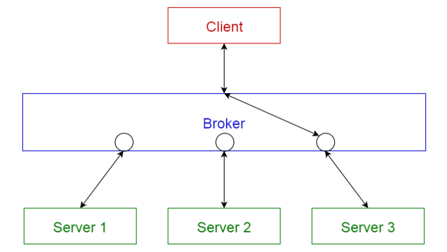
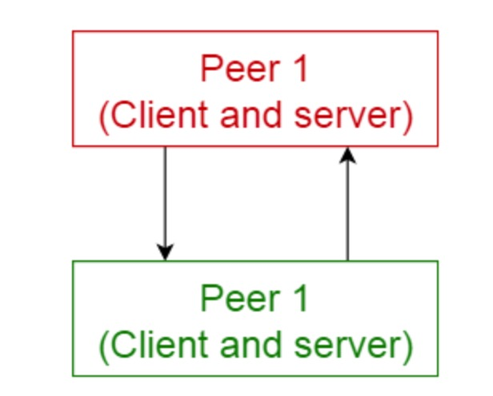
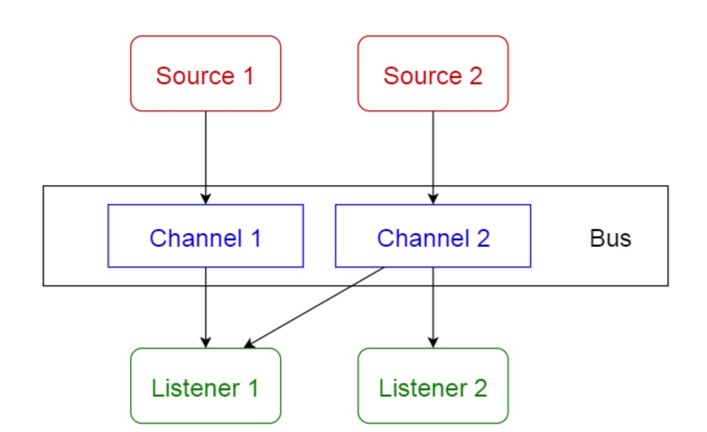
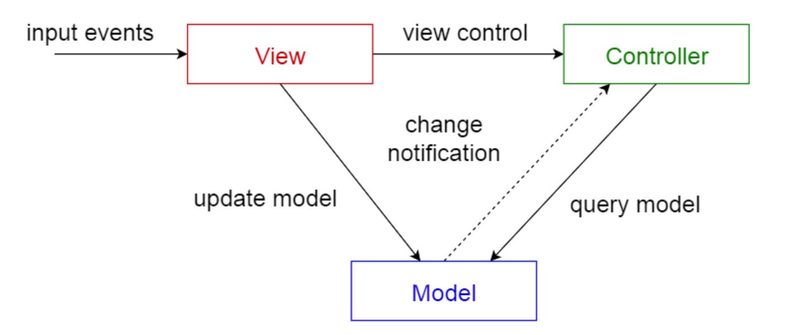

#week9

---

## Algorithm [804. Unique Morse Code Words](https://leetcode.com/problems/unique-morse-code-words/)
### 1. 问题描述
26个字母中每个字母都对应一个 morse 码。题目中给出了每个字母对应的 morse 码。
多个单词可能对应同一个 morse 码。

要求输入一个单词数组 words ，计算该数组中的单词一共对应几个不同的 morse 码。
### 2. 解题思路
将 words 数组中的每个单词都转换成 morse 码，然后用一个结合存储这些 morse 码，最后返回集合中元素的个数。
### 3. 代码
```go
var dict = []string{".-","-...","-.-.","-..",".","..-.","--.","....","..",".---","-.-",".-..","--","-.","---",".--.","--.-",".-.","...","-","..-","...-",".--","-..-","-.--","--.."}
func uniqueMorseRepresentations(words []string) int {
	morseMap := make(map[string]string)
	for _,word := range words {
		morse := ""
		for i := 0; i < len(word); i++ {
			morse = morse + dict[word[i] - 'a']
		}
		morseMap[morse] = word
	}
	return len(morseMap)
}
```
### 4. 复杂度分析
* 时间复杂度: O(S), 其中 S 为单词数组 words 中所有单词中字数个数的总和。
* 空间复杂度: O(S), 每个字母转成 morse 码，最多4个字符，所以集合 set 中最多占用 O(4S) 个空间
---

## Review [10 Common Software Architectural Patterns in a nutshell](https://towardsdatascience.com/10-common-software-architectural-patterns-in-a-nutshell-a0b47a1e9013)
10种常见的软件架构模式的概括
#### 架构模式的定义
架构模式是针对给定上下文的软件架构中的常见问题的通用的、可重用的解决方案。架构模式类似于软件设计模式，但是范围更广

本文将介绍如下10个架构模式的用法和优缺点:
1. Layered pattern 分层模式
2. Client-server pattern 客户端-服务器模式
3. Master-slave pattern 主从模式
4. Pipe-filter pattern 管道过滤模式
5. Broker pattern 代理模式
6. Peer-to-peer pattern 端到端模式
7. Event-bus pattern 事件总线模式
8. Model-view-controller pattern MVC模式
9. Blackboard pattern 黑板模式
10. Interpreter pattern 解释器模式

#### 1. 分层模式
此模式用于构建可以分解为子任务组的程序，每个子任务组都处于一个特定的抽象级别。每一层都对其上一层提供服务。

最常见的4层模型：
* 表现层（UI 层）
* 应用层(服务层)
* 业务逻辑层（领域层）
* 数据访问层（持久层）

使用场景：
* 一般的桌面应用
* 电子商务应用


#### 2. 客户端-服务器模式
此模式包含2个部分，一个服务器端和多个客户端。服务器组件为多个客户端组件提供服务。客户端向服务器端发送请求，服务器端提供
相应的服务给客户端。此外，服务器端持续监听客户端的请求。

使用场景：
* 在线服务，如：邮件，文档共享和银行等


#### 3. 主从模式
此模式包含2个部分，主服务和从服务。主服务将工作分发给各个从服务，然后将结果汇总。

使用场景：
* 数据库中的数据复制，主数据库中的数据是权威，所有的从数据库都要从主库中同步数据。
* 计算机总线连接的外围设备（主从驱动）


#### 4. 管道-过滤器模式
此模式可以用于构建生产和处理流数据的系统。每个处理步骤都包含在过滤器组件中。要处理的数据是通过管道传递的。这些管道可以
用于缓冲和同步。

使用场景：
* 编译器。通过连续的过滤器来执行词法分析、解析、语义分析和代码生成。
* 生物信息学的工作流。


#### 5. 代理模式
此模式用于构建具有解耦组件的分布式系统。这些组件之间可以通过远程服务调用进行互相通讯。
代理组件负责协调各个组件之间的通讯。

服务发布者将它们的能力（服务和特征）发布给代理。客户端向代理发送请求，然后代理将请求发送给相应的服务。

使用场景：
* 消息代理软件，如 Apache ActiveMQ, Apache Kafka, RabbitMQ 和 JBoss Messaging


#### 6. 端到端模式
此模式中，单个组件被称为端。端可以作为一个客户端，从其它端请求服务，也可以作为服务端，为其它端提供服务。
一个端可以同时既作为客户端也作为服务端，并且可以动态地切换角色。

使用场景：
* 像 Gnutella 和 G2 这样的文件共享网络
* 多媒体协议，如 P2PTV 和 PDTP


#### 7. 事件总线模式
此模式主要处理事件，包含4个组件：事件源、事件监听者、通道和事件总线。
事件源给一条事件总线上的特定通道发送消息。事件监听者订阅特定的通道。
监听者会收到发布到它们之前订阅的频道的消息的通知。

使用场景：
* Android 开发
* 通知服务


#### 8. MVC 模式
MVC 模式把一个交互式应用分成3个部分：
1. model 模型 —— 包含最核心的功能和数据
2. view 视图 —— 将信息展现给用户
3. controller 控制器 —— 处理来自用户的输入

这样做是为了将信息的内部表示与信息的呈现给用户并从用户接收的方式分开。它解耦了组件，并且允许有效代码复用。

使用场景：
* 主流语言开发的互联网应用架构
* web 框架，如 Django 和 Rails


#### 9. 黑板模式
此模式对于没有确定性解决方案策略的问题很有用。

黑板模式包含3个主要组件：
* 黑板 —— 包含了来自解决方案空间对象的结构化的全局内存
* 知识源 —— 具有自表述性的专业模块
* 控制组件 —— 选择、配置和执行模块

所有的模块都可以访问黑板。组件可以生产添加到黑板中的新的数据对象。
组件在黑板中寻找特定类型的数据，可以通过利用现有数据源进行正则匹配的方式找到这些数据。

使用场景：
* 语音识别
* 车辆识别和追踪
* 蛋白质结构识别
* 声呐信号的解释

[blackboard_pattern](blackboard_pattern.png)
#### 10. 解释模式
此模式用于设计用专用语言撰写的程序组件。它主要指定如何评估程序行，即用特定语言写的句子或表达式。
其基本思想是为语言的每个符号都设置一个类。

使用场景：
* 数据库查询语言，如 SQL
* 用于描述通讯协议的语言

[interpreter_pattern](interpreter_pattern.png)
#### 各架构模式对比

| 名称 | 优点 | 缺点 |
| --- | --- | --- | 
| 分层 | 

---

## Tip

### 

---
    
## Share
### 

