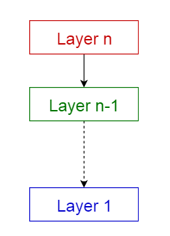
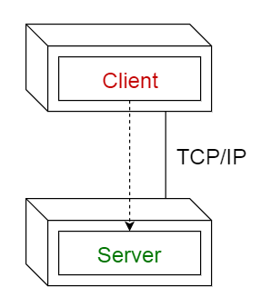
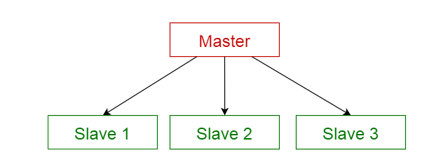
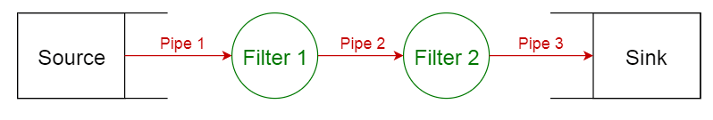

#week9

---

## Algorithm [804. Unique Morse Code Words](https://leetcode.com/problems/unique-morse-code-words/)
### 1. 问题描述
26个字母中每个字母都对应一个 morse 码。题目中给出了每个字母对应的 morse 码。
多个单词可能对应同一个 morse 码。

要求输入一个单词数组 words ，计算该数组中的单词一共对应几个不同的 morse 码。
### 2. 解题思路
将 words 数组中的每个单词都转换成 morse 码，然后用一个结合存储这些 morse 码，最后返回集合中元素的个数。
### 3. 代码
```go
var dict = []string{".-","-...","-.-.","-..",".","..-.","--.","....","..",".---","-.-",".-..","--","-.","---",".--.","--.-",".-.","...","-","..-","...-",".--","-..-","-.--","--.."}
func uniqueMorseRepresentations(words []string) int {
	morseMap := make(map[string]string)
	for _,word := range words {
		morse := ""
		for i := 0; i < len(word); i++ {
			morse = morse + dict[word[i] - 'a']
		}
		morseMap[morse] = word
	}
	return len(morseMap)
}
```
### 4. 复杂度分析
* 时间复杂度: O(S), 其中 S 为单词数组 words 中所有单词中字数个数的总和。
* 空间复杂度: O(S), 每个字母转成 morse 码，最多4个字符，所以集合 set 中最多占用 O(4S) 个空间
---

## Review [10 Common Software Architectural Patterns in a nutshell](https://towardsdatascience.com/10-common-software-architectural-patterns-in-a-nutshell-a0b47a1e9013)
10种常见的软件架构模式的概括
#### 架构模式的定义
架构模式是针对给定上下文的软件架构中的常见问题的通用的、可重用的解决方案。架构模式类似于软件设计模式，但是范围更广

本文将介绍如下10个架构模式的用法和优缺点:
1. Layered pattern 分层模式
2. Client-server pattern 客户端-服务器模式
3. Master-slave pattern 主从模式
4. Pipe-filter pattern 管道过滤模式
5. Broker pattern 代理模式
6. Peer-to-peer pattern 端到端模式
7. Event-bus pattern 事件总线模式
8. Model-view-controller pattern MVC模式
9. Blackboard pattern 黑板模式
10. Interpreter pattern 解释器模式

#### 1. 分层模式
此模式用于构建可以分解为子任务组的程序，每个子任务组都处于一个特定的抽象级别。每一层都对其上一层提供服务。

最常见的4层模型：
* 表现层（UI 层）
* 应用层(服务层)
* 业务逻辑层（领域层）
* 数据访问层（持久层）

使用场景：
* 一般的桌面应用
* 电子商务应用


#### 2. 客户端-服务器模式
此模式包含2个部分，一个服务器端和多个客户端。服务器组件为多个客户端组件提供服务。客户端向服务器端发送请求，服务器端提供
相应的服务给客户端。此外，服务器端持续监听客户端的请求。

使用场景：
* 在线服务，如：邮件，文档共享和银行等


#### 3. 主从模式
此模式包含2个部分，主服务和从服务。主服务将工作分发给各个从服务，然后将结果汇总。

使用场景：
* 数据库中的数据复制，主数据库中的数据是权威，所有的从数据库都要从主库中同步数据。
* 计算机总线连接的外围设备（主从驱动）


#### 4. 管道-过滤器模式
此模式可以用于构建生产和处理流数据的系统。每个处理步骤都包含在过滤器组件中。要处理的数据是通过管道传递的。这些管道可以
用于缓冲和同步。

使用场景：
* 编译器。通过连续的过滤器来执行词法分析、解析、语义分析和代码生成。
* 生物信息学的工作流。


#### 5. 代理模式


---

## Tip

### 

---
    
## Share
### 

